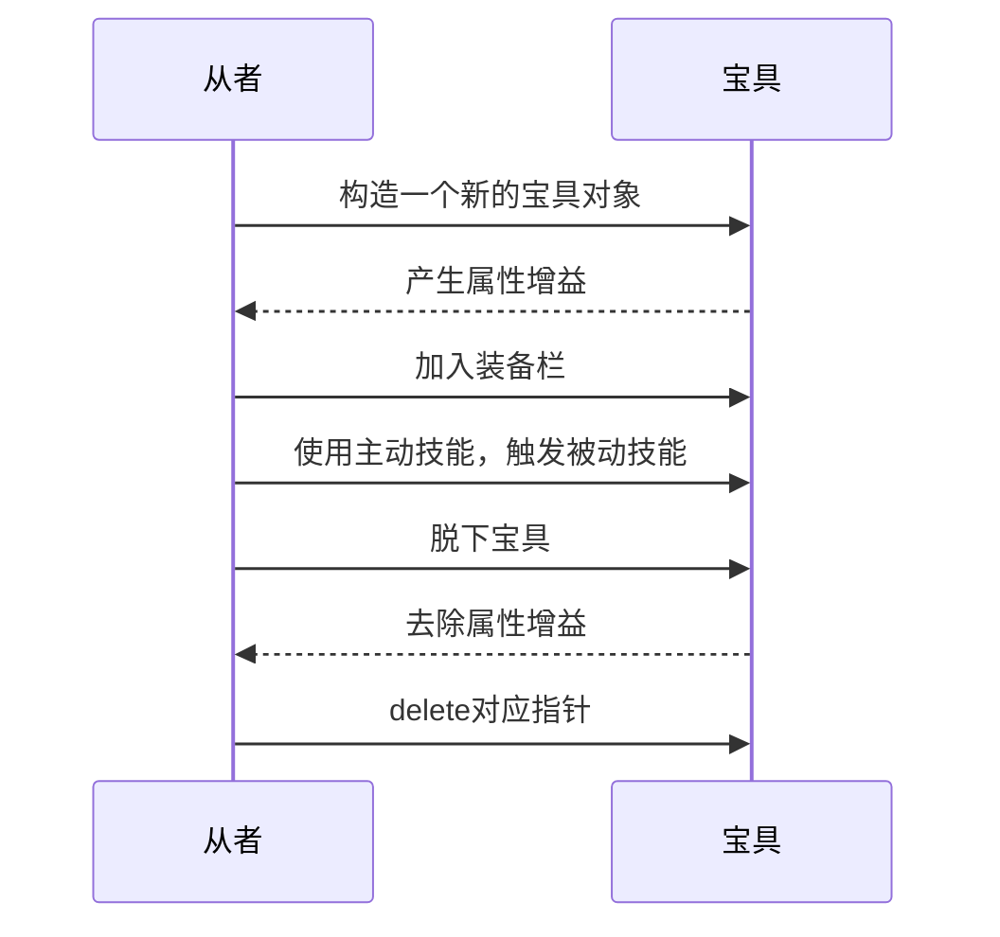
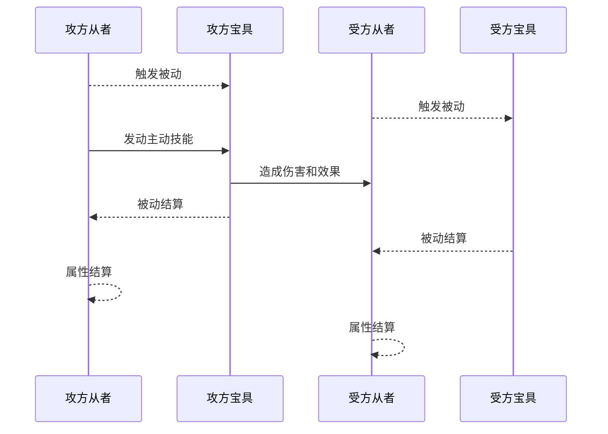
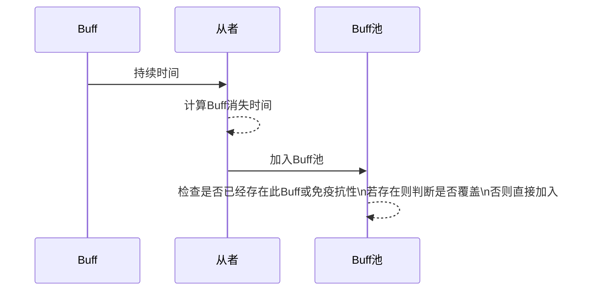

## 项目概况

项目名称：圣杯战争
项目介绍：实现一个游戏的英雄系统、战斗系统、装备系统、技能系统等，可模拟游戏从者间的相互对抗

## 游戏背景

圣杯战争是 TYPE-MOON 出品的《Fate/stay night》和《Fate/Zero》等 Fate 系列作品中出现的概念。广义上的圣杯战争，就是围绕着能实现持有者心愿的“圣杯”的争夺战。
本项目还原了这一概念，七名御主（Master，即玩家）操纵自己的从者（Servant）互相战斗，最后一名幸存的从者及其御主赢得胜利，获得圣杯。

## 需求分析

1. 项目任务书中直接要求实现英雄系统、战斗系统、装备系统。
2. 一个完整的游戏系统中，除上述系统之外，不可避免的还要包含**技能系统**，包括英雄主动使用的**主动技能**，和战斗时自动触发的**被动技能**。
3. 为游戏的可玩性、竞技性，增加 Buff/DeBuff 机制。

## 实现思路

### 从者

> 一开始有想过给从者加很多参数：暴击、格挡、闪避、命中……甚至包含一个根据经验值自动成长的属性系统。然而，这样过于复杂的系统，很难去平衡属性之间的数值平衡，也是**没有必要**的。例如，闪避过高会拖慢游戏的节奏，而暴击过高又容易使游戏失衡。
> 作为补充，设计了多样的宝具系统和 Buff/DeBuff 机制。如果要追求暴击、闪避、吸血之类的属性可以设计成宝具的被动技能或者 Buff/DeBuff。

从者（Servant）是 TYPE-MOON 世界观中的魔术现象。死后升格为超越人的存在的英雄之魂被称为“英灵”，他们通过仪式被召唤到现世，成为可以被使役的存在，即为“从者”。通常情况下召唤出的从者只是英灵本体的分身，完成任务后便会消失返回英灵之座。
设计的从者类`class Servant`包含属性见下表。

| 变量名 | 作用                                                        | 备注                                                                                                                                                 |
| ------ | ----------------------------------------------------------- | ---------------------------------------------------------------------------------------------------------------------------------------------------- |
| NAME   | 表示从者名称                                                | 仅在初始化时赋值                                                                                                                                     |
| HP     | 表示血量，范围[0,100]，0 表示从者死亡                       | 调用接口函数`addHP()`时，超出范围的生命值会被自动修正到上下界；某些 Buff/DeBuff 会对返回值产生影响（例如【必灭】，生命值回复效果减少一半，向上取整） |
| NP     | 表示能量，发动宝具主动技能的需要消耗的必要属性，范围[0,100] | 调用接口函数`addNP()`时，超出范围的能量值会被自动修正到上下界；某些 Buff/DeBuff 会对返回值产生影响（同上）                                           |
| ATK    | 表示攻击，造成伤害的必要属性                                | 调用接口函数`getATK()`时，某些 Buff/DeBuff 会对返回值产生影响(同上)                                                                                  |
| DEF    | 表示防御，攻击属性的抗性                                    | 调用接口函数`getDEF()`时，某些 Buff/DeBuff 会对返回值产生影响（例如【破魔】，防御降低 10%）                                                          |
| CLOCK  | 表示生物钟，用于计算技能冷却、宝具充能、BUFF 持续时间       |
| BUFF   | BUFF 池，存储被附加的增益状态以及对应的持续时间             |
| DEBUFF | DEBUFF 池，存储被附加的减益状态以及对应的持续时间           |
| BAR    | 装备栏，用于存储宝具的**指针**                              | 由于装备栏中存储了宝具的指针，因此**禁用**了`Servant`类的拷贝操作和赋值操作                                                                          |

### 宝具

> 设计一个新从者，只需要设计他的一件专属宝具，即可带来属性、技能、装备的多样化。

宝具，是 Servant 所持有的武装、象征、绝招，被称为“贵い幻想（尊贵的幻想，Noble Phantasm）”。
设计的宝具基类`class NoblePhantasm`包含如下特点：

- 装备时可为从者带来**属性增益**，脱下装备时减少相应增益。
- 可由从者使用**主动技能**。
- 战斗时自动触发**被动技能**。

目前代码中已经派生的宝具类见下表。

| 宝具                  | 被动技能                                                     | 主动技能                                         | 属性加成  |
| --------------------- | ------------------------------------------------------------ | ------------------------------------------------ | --------- |
| 誓约胜利之剑          | **远离尘世的理想乡**：触发时回复 1 点 HP                     | **魔力放出**：消耗所有 NP 并按比例对对手造成伤害 |           |
| 王之财宝              |                                                              |                                                  | 全属性+30 |
| 炽天覆七重圆环        | 免疫低于 7 的伤害                                            |                                                  |           |
| 十二试炼              | 每三次触发获得一层试炼，最多 11 层；每层试炼抵抗一点致命伤害 |                                                  |           |
| 万戒必破之符          | **高速神言**:触发时回复 5 点 NP                              | 造成伤害并清除增益效果                           |           |
| 穿刺死棘之枪          | 造成伤害，10%触发【逆转因果：99 点额外伤害】                 |                                                  |           |
| 破魔红蔷薇&必灭黄蔷薇 | 造成伤害，随机给对手附加 Debuff【破魔】【必灭】之一          |

本次大作业暂时只实现以上 7 件宝具。事实上，要加入新的宝具，只需增加一个`class NoblePhantasm`的派生类即可，详见`NoblePhantasm.cpp`中的具体实现。



### 战斗

> 单次战斗，定义成一名从者对另一从者使用**某个**宝具的**主动**技能。
> 特别地，当这件宝具没有自定义的主动技能时，将调用**宝具基类**的主动技能（普通攻击）。

战斗的流程如下（**参见下面的时序图**）：

1. 攻方从者触发 Buff、宝具被动。
2. 受方从者触发 Buff、宝具被动。
3. 攻方发动宝具对受方造成伤害和效果。
4. 攻方宝具被动、Buff 结算。
5. 受方宝具被动、Buff 结算。



### Buff/DeBuff

> Buff 池的代码实现使用了`map<string,int>`，来保存 Buff 和对应的**结束时间**。查找/插入一个 Buff 的时间复杂度为 O(logN)，其中 N 为 Buff 池中 Buff 的数量。

- Buff/DeBuff 机制的实现依赖于 Buff 池。
- 战斗中 Buff 的触发早于宝具被动触发；结算晚于宝具被动结算。

目前代码中已经实现的 Buff/DeBuff 见下表。

| 名称                         | 类别   | 效果                                                                  |
| ---------------------------- | ------ | --------------------------------------------------------------------- |
| 必灭                         | DeBuff | HP 回复效果降低 50%，向上取整                                         |
| 破魔                         | DeBuff | 战斗时防御为真实值的 90%                                              |
| 防御增益（懒得取名了，下同） | Buff   | 战斗时防御值为真实值的 110%，与【破魔】可叠加，效果为真实防御值的 99% |
| 攻击增益                     | Buff   | 同【防御增益】                                                        |
| 攻击减益                     | DeBuff | 同【破魔】                                                            |
| 能量回复减益                 | DeBuff | 同【必灭】                                                            |
| 增益免疫                     | DeBuff | Buff 附加抗性                                                         |
| 减益免疫                     | Buff   | 同【增益免疫】                                                        |

本次大作业暂时只实现以上 8 个 Buff。事实上，要加入新的 Buff，只需在`class Servant`中对应函数位置增加代码即可，详见`Servant.cpp`中的具体实现。



```mermaid
graph TB
st1=>start: 外部查询/修改从者属性
op1=>operation: 查询Buff/DeBuff池
cond1=>condition: 是否有相关Buff/DeBuff？
cond2=>condition: 是否在生效时间内？
e=>end: 查询/修改属性
op2=>operation: Buff/DeBuff生效
st1->op1
op1->cond1
cond1(yes)->cond2
cond1(no)->e
cond2(no)->e
cond2(yes)->op2->e
```

## 代码测试

文件夹中`main.cpp`中保存了一段用于测试的代码，运行后得到如下输出，符合预期：

```
【阿尔托莉雅】装备宝具【誓约胜利之剑】
【库丘林】装备宝具【穿刺死棘之枪】
【库丘林】装备宝具【破魔红蔷薇&必灭黄蔷薇】
【卫宫】装备宝具【王之财宝】
【卫宫】装备宝具【炽天覆七重圆环】
【美狄亚】装备宝具【万戒必破之符】
【赫拉克勒斯】装备宝具【十二试炼】

【阿尔托莉雅】当前状态：
【HP:100】【NP:100】
【ATK:100】【DEF:100】
【宝具】:【誓约胜利之剑】
【Buff】:
【DeBuff】:

【库丘林】对【阿尔托莉雅】释放宝具【破魔红蔷薇】，附加3回合DeBuff【破魔】，造成伤害【38】
【卫宫】对【赫拉克勒斯】造成伤害【40】
【赫拉克勒斯】对【卫宫】造成伤害【3】
【卫宫】发动宝具【炽天覆七重圆环】，免疫本次不高于【7】的伤害
【阿尔托莉雅】对【赫拉克勒斯】释放宝具【誓约胜利之剑】，造成伤害【50】
【赫拉克勒斯】对【阿尔托莉雅】造成伤害【43】

【阿尔托莉雅】当前状态：
【HP:21】【NP:0】
【ATK:100】【DEF:90】
【宝具】:【誓约胜利之剑】
【Buff】:
【DeBuff】:【破魔】

【美狄亚】对【美杜莎】释放宝具【万戒必破之符】，造成伤害【0】，并清除所有增益效果
【卫宫】对【赫拉克勒斯】造成伤害【40】
【赫拉克勒斯】发动宝具【十二试炼】，成功续命，剩余试炼数【0】
【库丘林】对【卫宫】释放宝具【穿刺死棘之枪】，造成伤害【8】，逆转因果，造成【99】点额外伤害！
【卫宫】死亡
【美狄亚】NP不足
```

## 代码接口

仅给出对应头文件，具体实现参照对应的 cpp 文件。
以下所有代码均写在`namespace wk`中，避免命名冲突。

### WkRandom.h

实现一个自用的伯努利概率分布函数。根据编译器版本不同，自动选择调用`<random>`库（C++11 以上）或`rand()`函数实现。前者的准确度要高于后者。

```cpp
bool getRand(double p);//产生随机数0/1，概率期望值为p
```

### Servant.h

```cpp
class Servant
{
public:
	Servant(const std::string NAME):
		NAME(NAME),
		HP(100),
		NP(0),
		ATK(100),
		DEF(100),
		CLOCK(0) {}
	~Servant();//要释放装备指针
	std::string getName();
	void print();//输出当前状态
	//下为属性相关函数会受(De)Buff影响
	int getHP();
	void addHP(int,bool buff=1);//修改血量，超过上限100或下限0时自动修正
	int getNP();
	void addNP(int,bool buff=1);//修改能量，超过上限100或下限0时自动修正
	int getATK();
	void addATK(int);
	int getDEF();
	void addDEF(int);
	//下为Buff/DeBuff相关
	int getClock();//外界不允许修改人物技能时钟，没有set/add函数
	bool hasBuff(const std::string&);
	bool hasDeBuff(const std::string&);
	void addBuff(const std::string&,int,bool buff=1);//附加持续时间t的Buff
	void addDeBuff(const std::string&,int,bool buff=1);//附加持续时间t的DeBuff
	void clearBuff();
	void clearDeBuff();
	//下为宝具/技能相关
	void equip(NoblePhantasm*);//装备宝具（到装备栏最后）
	void sold();//出售（最后一件）宝具
	void swapBar(int,int);//交换装备栏中宝具的次序
	void pre();//触发宝具被动
	void pos();//宝具被动结算
	void attack(Servant &defender,int k);//发动宝具k攻击敌方，k非法时退出
private:
	const std::string NAME;
	int HP,//血量
	    NP,//能量
	    ATK,//攻击力
	    DEF,//防御力
	    CLOCK;//记录人物时钟
	std::map<std::string,int> BUFF,DEBUFF;//Buff、DeBuff池
	std::vector<NoblePhantasm*> BAR;//装备栏
	Servant(const Servant&);//禁用拷贝构造函数
	Servant& operator=(const Servant&);//禁用赋值函数
};
```

### NoblePhantasm.h

实现了一个宝具基类 NoblePhantasm，并派生了七种各有特色的宝具类，其特性见代码注释。

```cpp
class NoblePhantasm//宝具基类
{
public:
	virtual std::string getName()=0;//纯虚函数，每件宝具都要有自己的名字
	virtual bool buy(Servant &user);//虚函数，装备宝具时的属性增益
	virtual bool sold(Servant &user);//虚函数，脱下宝具时的属性消减
	virtual bool act(Servant &attacker,Servant &defender);//虚函数，主动发动的技能
	virtual void pre(Servant &user) {} //虚函数，战斗前触发被动
	virtual void pos(Servant &user) {} //虚函数，战斗后被动结算
	virtual ~NoblePhantasm() {} //虚函数，析构函数需要用虚函数
};
class Excalibur:public NoblePhantasm
{
public:
	std::string getName();//誓约胜利之剑
	bool act(Servant &attacker,Servant &defender);//消耗自身所有NP并造成一定比例伤害
	void pre(Servant &user);//【远离尘世的理想乡】回复1点HP
};
class GateOfBabylon:public NoblePhantasm
{
public:
	std::string getName();//王之财宝
	bool buy(Servant &user);//无技能宝具，全属性加成30
	bool sold(Servant &user);
};
class LawAias:public NoblePhantasm
{
public:
	std::string getName();//炽天覆七重圆环
	void pre(Servant &user);//免疫低于7的伤害
	void pos(Servant &user);
private:
	int hp;//触发被动时记录血量，结算时伤害低于7则回复
};
class GodHand:public NoblePhantasm
{
public:
	GodHand():mp(0),last(0) {}
	std::string getName();//十二试炼
	void pos(Servant &user);//三回合充能一次，每层充能抵抗一点致命伤害，至多11层
private:
	int mp,last;//充能层数，前一次充能时间
};
class RuleBreaker:public NoblePhantasm
{
public:
	std::string getName();//万戒必破之符
	bool act(Servant &attacker,Servant &defender);//主动技能：造成伤害&消除增益效果
	void pre(Servant &user);//被动技能【高速神言】：NP恢复速度增加
};
class GaeBolg:public NoblePhantasm
{
public:
	std::string getName();//穿刺死棘之枪
	bool act(Servant &attacker,Servant &defender);//低NP消耗&&造成伤害&概率附加99点额外伤害
};
class GaeDeargBuidhe:public NoblePhantasm
{
public://【破魔】弱化防御；【必灭】弱化治疗
	std::string getName();//破魔红蔷薇&必灭黄蔷薇
	bool act(Servant &attacker,Servant &defender);//为对手附加Debuff【破魔】【必灭】之一
};
```
