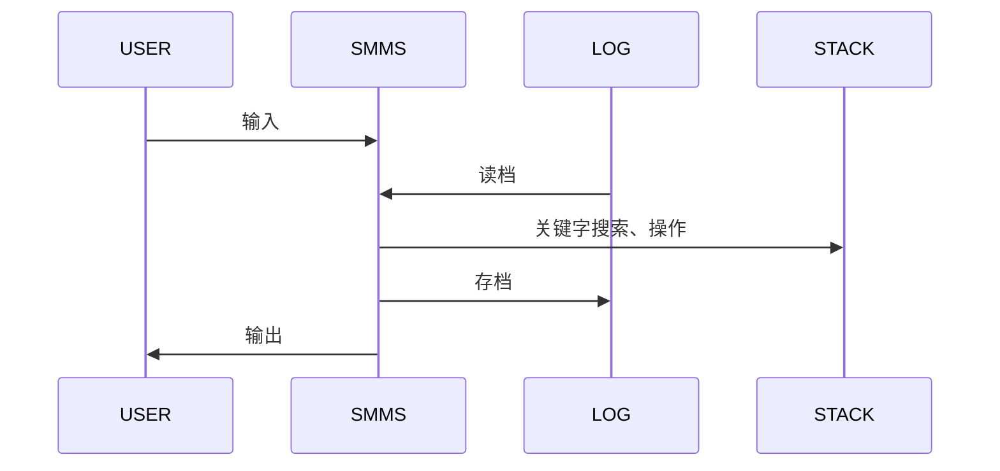

## 项目概况

项目名称：某科学的超会议议程管理系统（Scientific Meeting Management System）
项目介绍：基于命令行，实现添加(add)、删除(delete)、修改(modify)、查询(query)等议程管理功能。

## 需求分析

- 每次打开系统时，自动恢复上次的数据。
- 每次关闭系统时，将数据保存到本地。
- 向议程中加入一个会议，当会议与任何已有的议程都不冲突时成功加入议程，否则报错。
- 查询\修改\删除：根据关键字查询\修改\删除相关议程。
- 清空功能：将议程清空，以便重新读入。

## 实现思路

### 交互示意图

以下示意图中以**SMMS**（Scientific Meeting Management System）代表本系统，**LOG**代表本地缓存文件`log.txt`，**STACK**代表用于议程管理的栈结构（见后）。



### 使用高效的栈结构进行议程管理

增加会议时只需加入栈顶，时间复杂度为 O（1）。
修改或删除会议时，只需将该元素和栈顶元素交换，然后对栈顶元素进行操作，时间复杂度仍为 O（1）。
清空议程时，只需将栈顶指针指向栈底而无需在数组中擦除数据，时间复杂度仍为 O（1）。

### 关键字搜索

> 定义会议 n 和 m 相关，当且仅当满足下列任意条件：
>
> - n 和 m 同名
> - n 和 m 时间有重合部分，并且地点相同或有相同人员（换言之两场会议是否不能同时举行）

基于会议相关的定义，可以判断一个会议是否能够加入议程；也可以像下面一样进行高效严密的关键字搜索。
例如：

- 查询\修改\删除会议名为 NAME 的会议：搜索时仅需将 key.name 设置为"NAME"，其余设为-1。
- 查询\修改\删除地点为 ADDRESS 的会议：将 key.address 设为"ADDRESS"，起止时间分别设成负正无穷，其余设为-1。
- 查询\修改\删除含有参加人员 PERSON 的会议：将 key.num_of_participants 设为 1，key.participants[0]设为"PERSON，起止时间分别设成负正无穷，其余设为-1。多人同理。
- 查询\修改\删除含有以上多关键字的，可以类似地设置 key。

### 代码模块化，且接口全部使用文件流

所有函数接口均使用文件流`FILE*`，为快速切换文件\屏幕 IO 提供很大便利。
与此相对应的，所有的 IO 均通过函数 fscanf 和 fprintf 实现。
所有的 IO 均写有提示，方便使用。

## 项目测试

同文件夹下`log.txt`文档中保存了用于测试的数据，运行结果均符合预期。

## 代码接口与实现

代码实现分为数据结构和功能函数两个模块，分别对其展开介绍。所有头文件均写有头文件保护。

### 数据结构 meeting.h

- 定义了一个结构体 Meeting，用于描述一场会议，内容见下，未加注释。其中，`struct tm`是 c 标准库`<time.h>`中定义的用于保存时间的结构体。
- 定义了若干对 Meeting 结构体的操作。
- define 了一个常量 MAXN，暂定为 128，用来表示 Meeting 中所用数组的最大容量。实际使用时可根据需求修改 MAXN 的 define 并重新编译，十分方便。

```c
#define MAXN 128
typedef struct Meeting
{
	int num_of_participants;//参会人数
	char name[MAXN],//会议名称
	     address[MAXN],//会议地址
	     participants[MAXN][MAXN];//参会人员
	struct tm begin,end;//起止时间
} Meeting;

//从in中读入一个Meeting，并将输入时的提示信息输出到out
Meeting getMeeting(FILE *in,FILE *out);

//把m输出到out
void putMeeting(FILE *out,const Meeting *m);

//比较两个时间a和b的先后关系
int tmCmp(const struct tm *a,const struct tm *b);

//判断会议m和n是否冲突
int isRepel(const Meeting *m,const Meeting *n);
```

#### 实现 meeting.c

```c
Meeting getMeeting(FILE *in,FILE *out)
{
	Meeting tmp_m;
	fprintf(out,"Input the Meeting name.\n");
	fscanf(in,"%s",tmp_m.name);

	fprintf(out,"Input the Meeting address.\n");
	fscanf(in,"%s",tmp_m.address);

	fprintf(out,"Input the begin time(year month day hour minute).\n");
	fscanf(in,"%d%d%d%d%d",
	       &tmp_m.begin.tm_year,
	       &tmp_m.begin.tm_mon,
	       &tmp_m.begin.tm_mday,
	       &tmp_m.begin.tm_hour,
	       &tmp_m.begin.tm_min);

	fprintf(out,"Input the end time(year month day hour minute).\n");
	fscanf(in,"%d%d%d%d%d",
	       &tmp_m.end.tm_year,
	       &tmp_m.end.tm_mon,
	       &tmp_m.end.tm_mday,
	       &tmp_m.end.tm_hour,
	       &tmp_m.end.tm_min);

	fprintf(out,"Input the number of participants.\n");
	fscanf(in,"%d",&tmp_m.num_of_participants);

	for(int i=0; i<tmp_m.num_of_participants; ++i)
	{
		fprintf(out,"Input the name of participant %d.\n",i);
		fscanf(in,"%s",tmp_m.participants[i]);
	}

	return tmp_m;
}

void putMeeting(FILE *out,const Meeting *m)
{
	fprintf(out,"%s %s\n%d %d %d %d %d\n%d %d %d %d %d\n%d",
	        m->name,
	        m->address,
	        m->begin.tm_year,
	        m->begin.tm_mon,
	        m->begin.tm_mday,
	        m->begin.tm_hour,
	        m->begin.tm_min,
	        m->end.tm_year,
	        m->end.tm_mon,
	        m->end.tm_mday,
	        m->end.tm_hour,
	        m->end.tm_min,
	        m->num_of_participants);
	for(int j=0; j< m->num_of_participants; ++j)
		fprintf(out," %s",m->participants[j]);
	fprintf(out,"\n");
}

int tmCmp(const struct tm *a,const struct tm *b)
{
	if(a->tm_year != b->tm_year)
		return a->tm_year - b->tm_year;
	if(a->tm_mon != b->tm_mon)
		return a->tm_mon - b->tm_mon;
	if(a->tm_mday != b->tm_mday)
		return a->tm_mday - b->tm_mday;
	if(a->tm_hour != b->tm_hour)
		return a->tm_hour - b->tm_hour;
	return a->tm_min - b->tm_min;
}

int isRepel(const Meeting *p,const Meeting *q)
{
	if(!strcmp(p->name,q->name))
		return 1;
	if(tmCmp(&p->end,&q->begin)<0||tmCmp(&p->begin,&q->end)>0)
		return 0;
	if(!strcmp(p->address,q->address))
		return 1;
	for(int i=0; i < p->num_of_participants; ++i)
		for(int j=0; j < q->num_of_participants; ++j)
			if(!strcmp(p->participants[i],q->participants[j]))
				return 1;
	return 0;
}
```

### 功能函数 func.h

- 选用栈结构用于存储会议，用数组和记录栈顶下标的变量实现。除此之外**未用任何全局变量**。
- 实现了需求分析中的所有功能函数。
- 所有功能函数均有相同的接口`(FILE *in,FILE *out)`表示从 in 中获取数据，并通过 out 输出信息。这样的设计既方便了代码的调试，也方便了用户的交互。

```c
extern int top;
extern Meeting stack[MAXN];

//读入会议，若不产生冲突则加入议程，否则报错
void add(FILE *in,FILE *out);

//按关键字删除会议
void del(FILE *in,FILE *out);

//按关键字修改会议
void modify(FILE *in,FILE *out);

//按关键字查询会议
void query(FILE *in,FILE *out);

//读档
void fin(FILE *in,FILE *out);

//存档
void fout(FILE *in,FILE *out);

//清空
void clear(FILE *in,FILE *out);

//输出提示信息
void help(FILE *in,FILE *out);
```

#### 实现 func.c

```c
int top=0;
Meeting stack[MAXN];

void add(FILE *in,FILE *out)
{
	stack[top]=getMeeting(in,out);
	for(int i=0; i<top; ++i)
		if(isRepel(&stack[top],&stack[i]))
		{
			fprintf(out,"Error: Repel with Meeting %s.\n",stack[i].name);
			return;
		}
	fprintf(out,"Add %s successfully.\n",stack[top++].name);
}

void del(FILE *in,FILE *out)
{
	fprintf(out,"Input the key(-1 for no key).\n");
	Meeting key=getMeeting(in,out);
	for(int i=0; i<top; ++i)
		if(isRepel(&key,&stack[i]))
		{
			fprintf(out,"Delele %s successfully.\n",stack[i].name);
			stack[i--]=stack[--top];
		}
}

void modify(FILE *in,FILE *out)
{
	int t_len=top;
	del(in,out);
	while(top<t_len)
		add(in,out);
}

void query(FILE *in,FILE *out)
{
	fprintf(out,"Input the key(-1 for no key).\n");
	Meeting key=getMeeting(in,out);
	for(int i=0; i<top; ++i)
		if(isRepel(&key,&stack[i]))
		{
			fprintf(out,"Find ");
			putMeeting(out,&stack[i]);
		}
}

void fin(FILE *in,FILE *out)
{
	fprintf(out,"Start input from \'log.txt\'.\n");
	FILE *f=fopen("log.txt","r");
	if(f==NULL)
	{
		fprintf(out,"Error:Do not find \'log.txt\'\n");
		return;
	}
	int t_len;
	fscanf(f,"%d",&t_len);
	while(t_len--)
		add(f,out);
	fclose(f);
	fprintf(out,"Input from \'log.txt\' successfully.\n");
}

void fout(FILE *in,FILE *out)
{
	fprintf(out,"Start output to \'log.txt\'.\n");
	FILE *f=fopen("log.txt","w");
	fprintf(f,"%d\n",top);
	for(int i=0; i<top; ++i)
		putMeeting(f,&stack[i]);
	fclose(f);
	fprintf(out,"Output to \'log.txt\' successfully.\n");
}

void clear(FILE *in,FILE *out)
{
	top=0;
	fprintf(out,"Clear successfully.\n");
}

void help(FILE *in,FILE *out)
{
	fprintf(out,"fin : add new meetings from \'log.txt\' to memory if they do not repel.\n");
	fprintf(out,"fout : output all the meetings from memory to \'log.txt\'.\n");
	fprintf(out,"add : add a new meeting to memory if it does not repel.\n");
	fprintf(out,"delete : delete all the meetings which repel with the key.\n");
	fprintf(out,"modify : modify all the meetings which repel with the key.\n");
	fprintf(out,"clear : clear all the meetings from memory.\n");
	fprintf(out,"help : get available instructions.\n");
	fprintf(out,"EOF(Ctrl+Z in Windows) : exit.\n");
}
```

### 测试

```c
#include<stdio.h>
#include<string.h>
#include"func.h"

int main()
{
	FILE *in=stdin,*out=stdout;
	fprintf(out,"Scientific Meeting Management System by WuK&LSY\n\n");
	fprintf(out,"Input \'fin\' to read from log,or \'help\' to get other available instructions.\n\n");
	for(char s[MAXN]; fscanf(in,"%s",s)!=EOF; fprintf(out,"\n"))
	{
		if(!strcmp(s,"add"))
			add(in,out);
		else if(!strcmp(s,"delete"))
			del(in,out);
		else if(!strcmp(s,"modify"))
			modify(in,out);
		else if(!strcmp(s,"query"))
			query(in,out);
		else if(!strcmp(s,"fin"))
			fin(in,out);
		else if(!strcmp(s,"fout"))
			fout(in,out);
		else if(!strcmp(s,"clear"))
			clear(in,out);
		else if(!strcmp(s,"help"))
			help(in,out);
		else fprintf(out,"\'%s\' is not an available instruction,and you can in \'help\' to get available instructions.\n",s);
	}
}
```
