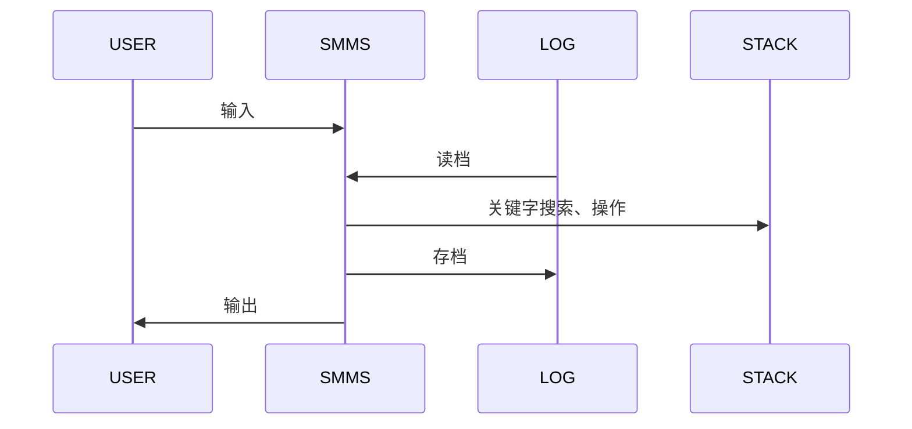

# 项目概况
项目名称：某科学的超会议议程管理系统（Scientific Meeting Management System）
项目介绍：基于命令行，实现添加(add)、删除(delete)、修改(modify)、查询(query)等议程管理功能。 
# 需求分析
 - 每次打开系统时，自动恢复上次的数据。
 - 每次关闭系统时，将数据保存到本地。
 - 向议程中加入一个会议，当会议与任何已有的议程都不冲突时成功加入议程，否则报错。
 - 查询\修改\删除：根据关键字查询\修改\删除相关议程。
 - 清空功能：将议程清空，以便重新读入。

# 实现思路
## 交互示意图
以下示意图中以**SMMS**（Scientific Meeting Management System）代表本系统，**LOG**代表本地缓存文件`log.txt`，**STACK**代表用于议程管理的栈结构（见后）。

## 使用高效的栈结构进行议程管理
增加会议时只需加入栈顶，时间复杂度为O（1）。
修改或删除会议时，只需将该元素和栈顶元素交换，然后对栈顶元素进行操作，时间复杂度仍为O（1）。
清空议程时，只需将栈顶指针指向栈底而无需在数组中擦除数据，时间复杂度仍为O（1）。
## 关键字搜索
>定义会议n和m相关，当且仅当满足下列任意条件：
 - n和m同名
 - n和m时间有重合部分，并且地点相同或有相同人员（换言之两场会议是否不能同时举行）

基于会议相关的定义，可以判断一个会议是否能够加入议程；也可以像下面一样进行高效严密的关键字搜索。
例如：

 - 查询\修改\删除会议名为NAME的会议：搜索时仅需将key.name设置为"NAME"，其余设为-1。
 - 查询\修改\删除地点为ADDRESS的会议：将key.address设为"ADDRESS"，起止时间分别设成负正无穷，其余设为-1。
 -  查询\修改\删除含有参加人员PERSON的会议：将key.num_of_participants设为1，key.participants[0]设为"PERSON，起止时间分别设成负正无穷，其余设为-1。多人同理。
 -  查询\修改\删除含有以上多关键字的，可以类似地设置key。
## 代码模块化，且接口全部使用文件流
所有函数接口均使用文件流`FILE*`，为快速切换文件\屏幕IO提供很大便利。
与此相对应的，所有的IO均通过函数fscanf和fprintf实现。
所有的IO均写有提示，方便使用。

# 项目测试
同文件夹下`log.txt`文档中保存了用于测试的数据，运行结果均符合预期。
# 代码接口与实现
代码实现分为数据结构和功能函数两个模块，分别对其展开介绍。所有头文件均写有头文件保护。
## 数据结构meeting.h
 - 定义了一个结构体Meeting，用于描述一场会议，内容见下，未加注释。其中，`struct tm`是c标准库`<time.h>`中定义的用于保存时间的结构体。
 - 定义了若干对Meeting结构体的操作。
 - define了一个常量MAXN，暂定为128，用来表示Meeting中所用数组的最大容量。实际使用时可根据需求修改MAXN的define并重新编译，十分方便。
```c
#define MAXN 128
typedef struct Meeting
{
	int num_of_participants;//参会人数
	char name[MAXN],//会议名称
	     address[MAXN],//会议地址
	     participants[MAXN][MAXN];//参会人员
	struct tm begin,end;//起止时间
} Meeting;

//从in中读入一个Meeting，并将输入时的提示信息输出到out
Meeting getMeeting(FILE *in,FILE *out);

//把m输出到out
void putMeeting(FILE *out,const Meeting *m);

//比较两个时间a和b的先后关系
int tmCmp(const struct tm *a,const struct tm *b);

//判断会议m和n是否冲突
int isRepel(const Meeting *m,const Meeting *n);
```
## 功能函数func.h
 - 选用栈结构用于存储会议，用数组和记录栈顶下标的变量实现。除此之外**未用任何全局变量**。
 - 实现了需求分析中的所有功能函数。
 - 所有功能函数均有相同的接口`(FILE *in,FILE *out)`表示从in中获取数据，并通过out输出信息。这样的设计既方便了代码的调试，也方便了用户的交互。
```c
extern int top;
extern Meeting stack[MAXN];

//读入会议，若不产生冲突则加入议程，否则报错
void add(FILE *in,FILE *out);

//按关键字删除会议
void del(FILE *in,FILE *out);

//按关键字修改会议
void modify(FILE *in,FILE *out);

//按关键字查询会议
void query(FILE *in,FILE *out);

//读档
void fin(FILE *in,FILE *out);

//存档
void fout(FILE *in,FILE *out);

//清空
void clear(FILE *in,FILE *out);

//输出提示信息
void help(FILE *in,FILE *out);
```