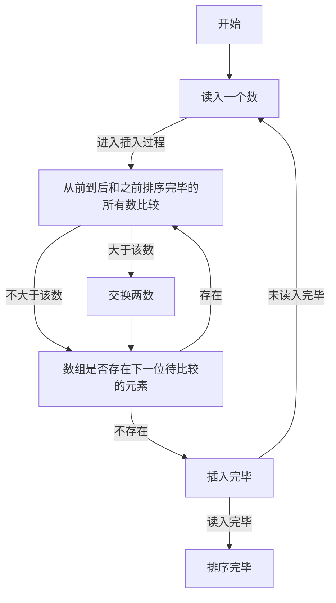

## 实验目的

1. 初步认识和掌握MIPS汇编语言程序设计的基本方法；
2. 熟悉PCSpim模拟器的使用。

## 实验内容

从键盘输入10个无符号字数或从内存中读取10个无符号字数并从大到小进行排序，排序结果在屏幕上显示出来。

## 实验器材

电脑一台，PCSpim仿真器软件一套。

## 实验过程与结果

十个数的排序，考虑使用插入排序实现。使用插入排序的好处，是能够在读入的同时完成排序。考虑对应的C语言代码（为了便于转成MIPS汇编语言，所有的循环使用`do while`语句）：

```c
#include<stdio.h>
int main()
{
	int a[10],i=0;
	do
	{
		scanf("%d",&a[i]);
		int j=0;
		do
		{
			if(a[j]<a[i])
			{
				int t=a[i];
				a[i]=a[j];
				a[j]=t;
			}
			++j;
		}
		while(j<i);
		++i;
	}
	while(i<10);
	i=0;
	do
	{
		printf("%d\n",a[i]);
		++i;
	}
	while(i<10);
}
```

算法的核心部分流程图：



将上述逻辑转为MIPS汇编语言后（详见【程序代码】），使用PCSimp打开该代码，按下F5运行，结果如图：可以看到，这段代码执行了预期的功能，成功将无序输入的十个数按降序输出。

## 实验心得

第一次上手汇编程序设计，因为不是很熟悉汇编设计中每做一步都要把操作的内容载入寄存器（甚至是每一条操作的指令）都载入寄存器的逻辑，用C语言几分钟就能实现的排序在MIPS中用了很久。

和C语言里方便实用的`for`循环相比，MIPS中的循环是用类似于`goto`语句的语法实现的；这恰恰是高级语言中所不提倡甚至是禁止的（著名算法科学家迪杰斯特拉曾提出“goto有害论”）。因此，既要用类似goto的语法实现条件分支和循环，又要尽量避免混乱的实现逻辑，对我个人来说是一个挑战。经过思考和摸索，考虑使用MIPS模拟C语言中的`do while`语句实现循环，模拟C语言中的`if(/*不满足条件*/)continue;`来近似实现条件分支（详见【程序代码】），使得最后的程序代码能够接近于C语言设计的逻辑，具有较强的可读性。

另外，上课所教的内容难度相较于作业浅了非常多（例如，上课说的内容几乎没有涉及条件结构和循环结构如何实现），因此要完成这次作业我参考了相当多的资料，例如博客、书籍、论坛等。感觉这门课程还是很有一定的难度的，希望老师上课能多给我们一些难度接近作业/考试的代码的实例分析，方便我们参考并学习。

## 程序代码

```nasm
#从键盘输入10个无符号字数或从内存中读取10个无符号字数并从大到小进行排序，排序结果在屏幕上显示出来。
#使用插入排序实现

.data
	array:.space 40
	inputTenIntergers:.asciiz "Input 10 Integers:\n"
	afterSort:.asciiz "After Sort:\n"
	endl:.asciiz "\n"
.text
.globl main
main:

la $a0,inputTenIntergers
li $v0,4
syscall

la $t9,array	#$t9是数组首地址
addi $t8,$zero,10       #$t8是数组长度

move $t0,$zero	#$t0是循环变量i
input:	#input代码块用于完成数组元素的输入并同时完成排序

	li $v0,5
	syscall

	move $t7,$t0
	mul $t7,$t7,4
	addu $t6,$t7,$t9
	sw $v0,0($t6)

	move $t1,$zero	#$t1是循环变量j
	insert:	#执行插入排序的循环

		move $t7,$t1
		mul $t7,$t7,4
		addu $t4,$t7,$t9
		lw $t3,0($t4)	#获取a[j]
		lw $t2,0($t6)	#获取a[i]

		blt $t2,$t3,continue #否则就执行下面这两句，交换两者的值

			sw $t3,0($t6)
			sw $t2,0($t4)

		continue:

		addi $t1,$t1,1
	blt $t1,$t0,insert

	addi $t0,$t0,1
blt $t0,$t8,input

la $a0,afterSort
li $v0,4
syscall

move $t0,$zero	#$t0是循环变量i
print:
	move $t7,$t0
	mul $t7,$t7,4
	addu $t6,$t7,$t9

	lw $a0,0($t6)
	li $v0,1
	syscall

	la $a0,endl
	li $v0,4
	syscall

	addi $t0,$t0,1
blt $t0,$t8,print
```
