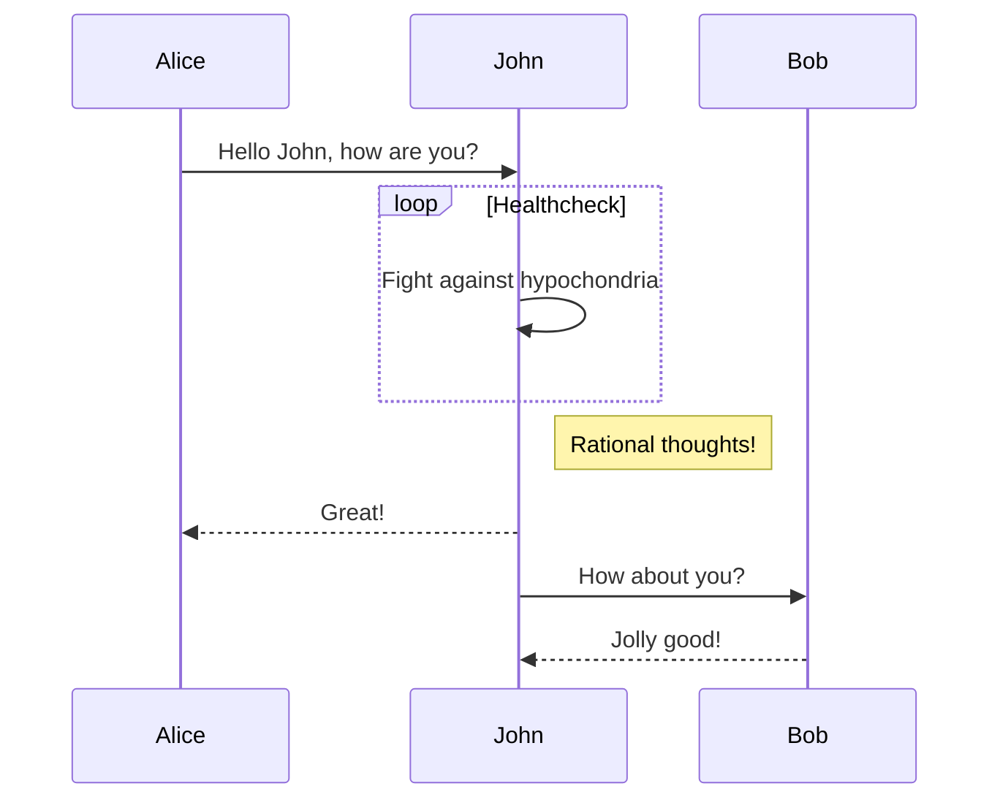

## 引言

最开始我是在[CSDN](https://blog.csdn.net/w_weilan)上写博客的。博客写了一年多，访问量勉强破万，感觉其中至少有三成是自己贡献的。而且 CSDN 上的广告是越来越多，网页编辑器也是越来越不好用。

十一月份，在青岛的 ICPC 区域赛失利之后，想要重新开始，和过去告别。也从此转移自己写博客的阵地。考虑过转投暂时还比较干净而且可以部分定义页面的[博客园](https://www.cnblogs.com/wu-kan/)，但是最终还是决定在[Github Pages](https://pages.github.com/)上搭建属于自己的博客。

然后，翻了一些网上的教程，用[Hexo](https://hexo.io/zh-cn/)框架和[NexT](https://github.com/theme-next/hexo-theme-next)主题搭了一个比较素雅的符合个人审美的博客。然而，Hexo 搭建的博客需要先在本地生成博客页面然后再上传到服务器上，每次发博客都需要在电脑重新生成页面并上传，感觉没有那么方便。在不同电脑上想要发博客更是十分困难，感觉如果胡乱操作后本地部署的文件发生了一定的错乱，恢复起来会十分麻烦。

后来发现，Github Pages 原生支持[Jekyll](https://www.jekyll.com.cn/)，因此如果只需要推送文章可以直接在 github 的仓库里做。于是决定在期末考试后用 Jekyll 重新搭建个人博客。原来的博客不再维护。

## 构思

目前博客的 demo 如下：


想搭建一个足够干净、页面几乎不要有多余元素的博客，同时博客的功能还要足够丰富，满足我以下的需求：

- [x] 用 Markdown 写博客
- [x] 支持 Latex 公式
- [x] 支持 mermaid 等插件
- [x] 个性化 Live2D
- [x] 分享一些我在其他网站的个人账号
- [x] 移动端适配
- [x] 足够快的加载速度
- [x] 访问量统计，评论互动
- [ ] ……（需求是会逐渐增长的，参见[关于](https://wu-kan.cn/about/)）

其中，Live2D 是我某次访问别人的博客初次见到的，感觉非常吸引人。最终的目标是去掉网页上所有多余的元素，只剩下博文和 Live2D 看板娘，看板娘本身还可以作为博客访问的导航，感觉会十分有新意。

## 搭建过程（不定期更新）

我目前读的专业是计科超算方向，所以软件工程专业相关方面的基础几乎为 0😌，大部分的内容都是参考网上教程慢慢摸索的，假如对某些过程有意见和建议欢迎向我提出！

### 开发环境

这个学期选了一门 Linux 相关的公选课，感觉还不错，因此直接把开发环境是搭建在 Windows Subsystem for Linux（简称 WSL）上了，Windows 下也可以直接访问其中的环境，详见[这篇博客](https://wu-kan.cn/_posts/2018-12-14-Windows-Subsystem-for-Linux/)。

```bash
sudo apt install jekyll
```

Jekyll 是基于 Ruby 和 Node.js 环境的，很多依赖的包也会同时安装进来。现在，找在目录下打开终端，运行如下代码，加入新建了一个名为`blog`的文件夹，则说明安装成功了。

```bash
jekyll new blog
```

### 结构解析

观察刚刚生成的博客目录，有如下的结构：

```bash
├──_config.yml
├── _drafts
|   ├── begin-with-the-crazy-ideas.textile
|   └── on-simplicity-in-technology.markdown
├── _includes
|   ├── footer.html
|   └── header.html
├── _layouts
|   ├── default.html
|   └── post.html
├── _posts
|   ├── 2007-10-29-why-every-programmer-should-play-nethack.textile
|   └── 2009-04-26-barcamp-boston-4-roundup.textile
├── _site
├── .jekyll-metadata
└── index.html
```

它的结构还算是比较简单清晰，详细功能如下表。

| 文件/目录                                          | 描述                                                                                                                                                                                                                                                   |
| -------------------------------------------------- | ------------------------------------------------------------------------------------------------------------------------------------------------------------------------------------------------------------------------------------------------------ |
| \_config.yml                                       | 保存配置数据。很多配置选项都可以直接在命令行中进行设置，但是如果把那些配置写在这儿，就不用非要去记住那些命令了。                                                                                                                                       |
| \_drafts                                           | drafts（草稿）是未发布的文章。这些文件的格式中都没有 title.MARKUP 数据。学习如何使用草稿。                                                                                                                                                             |
| \_includes                                         | 可以加载这些包含部分到的布局或者文章中以方便重用。                                                                                                                                                                                                     |
| \_layouts                                          | layouts（布局）是包裹在文章外部的模板。布局可以在 YAML 头信息中根据不同文章进行选择                                                                                                                                                                    |
| \_posts                                            | 这里放的就是的文章了。文件格式很重要，必须要符合:YEAR-MONTH-DAY-title.MARKUP。 永久链接 可以在文章中自己定制，但是数据和标记语言都是根据文件名来确定的。                                                                                               |
| \_data                                             | 格式化好的网站数据应放在这里。jekyll 的引擎会自动加载在该目录下所有的 yaml 文件（后缀是 .yml, .yaml, .json 或者 .csv ）。这些文件可以经由 ｀ site.data ｀ 访问。如果有一个 members.yml 文件在该目录下，就可以通过 site.data.members 获取该文件的内容。 |
| \_site                                             | 一旦 Jekyll 完成转换，就会将生成的页面放在这里（默认）。最好将这个目录放进 .gitignore 文件中。                                                                                                                                                         |
| .jekyll-metadata                                   | 该文件帮助 Jekyll 跟踪哪些文件从上次建立站点开始到现在没有被修改，哪些文件需要在下一次站点建立时重新生成。该文件不会被包含在生成的站点中。将它加入到 .gitignore 文件可能是一个好注意。                                                                 |
| index.html and other HTML, Markdown, Textile files | 如果这些文件中包含 YAML 头信息 部分，Jekyll 就会自动将它们进行转换。当然，其他的如 .html, .markdown, .md, 或者 .textile 等在的站点根目录下或者不是以上提到的目录中的文件也会被转换。                                                                   |
| Other Files/Folders                                | 其他一些未被提及的目录和文件如 css 还有 images 文件夹， favicon.ico 等文件都将被完全拷贝到生成的 site 中。                                                                                                                                             |

### 选取模板

和丰富精美的 Hexo 比起来，好的 Jekyll 模板真的是太少了…经过漫长时间的挑选，最终选择在[lanyon](https://github.com/poole/lanyon)主题的基础上修改啦。

这里选我自己的博客为模板，也可以在 GitHub 上慢慢翻一些别人的博客或模板。

```bash
git clone https://github.com/wu-kan/wu-kan.github.io YourBlog
```

### 发送到 Github 托管

把本地文件修改后，上传到博客仓库的`master`或者`gh-pages`分支即可。

### 定制

我把博客实现的的插件基本上都封装起来了，可以直接在浏览器按 F12 查看我是怎么引入的。

#### 加入 Live2D 看板娘

参考了：

- [网页添加 Live2D 看板娘](https://www.fghrsh.net/post/123.html)。
- [在网页中添加 Live2D 看板娘](https://zhangshuqiao.org/2018-07/%E5%9C%A8%E7%BD%91%E9%A1%B5%E4%B8%AD%E6%B7%BB%E5%8A%A0Live2D%E7%9C%8B%E6%9D%BF%E5%A8%98)

由于 live2d 的协议是 GPL，这里我不把它的源码拷贝到自己的博客项目了，直接用链接引入。在 html 的任意位置插入下述语句：

```html
<script
  src="//cdn.jsdelivr.net/gh/stevenjoezhang/live2d-widget/autoload.min.js"
  defer="defer"
></script>
```

或者是在我博客的`_config.yml`的`script`配置下，加入如下内容（引入插件的方式比较无脑，就是把`yaml`格式换成对应的 html 标签）：

```yaml
script:
  - var:
      - key: src
        value: //cdn.jsdelivr.net/gh/stevenjoezhang/live2d-widget/autoload.min.js # live2d
      - key: defer # 需要在页面加载之后执行
        value: defer
```

#### $\KaTeX$

参考：

- [使用 KaTeX 代替 MathJax 渲染公式](https://www.jianshu.com/p/f2b28954d902)。
- [Auto-render Extension · Katex](https://katex.org/docs/autorender.html)

在 html 任意位置插入如下代码：

```html
<link rel="stylesheet" href="//cdn.jsdelivr.net/npm/katex/dist/katex.min.css" />
<script
  src="//cdn.jsdelivr.net/npm/katex/dist/katex.min.js"
  defer="defer"
></script>
<script
  src="//cdn.jsdelivr.net/npm/katex/dist/contrib/auto-render.min.js"
  defer="defer"
  onload='renderMathInElement(document.body, { delimiters: [{ left: "$", right: "$", display: false }] })'
></script>
```

或是在我的`_config.yml`中的`head`和`script`配置下插入如下内容：

```yaml
head:
  - tag: link
    var:
      - key: rel
        value: stylesheet
      - key: href
        value: //cdn.jsdelivr.net/npm/katex/dist/katex.min.css
script:
  - var:
      - key: src
        value: //cdn.jsdelivr.net/npm/katex/dist/katex.min.js # katex
      - key: defer # 需要在页面加载之后执行
        value: defer
  - var:
      - key: src
        value: //cdn.jsdelivr.net/npm/katex/dist/contrib/auto-render.min.js # katex自动渲染插件
      - key: defer # 需要在页面加载之后执行
        value: defer
      - key: onload # onload参数见https://katex.org/docs/autorender.html
        value: 'renderMathInElement(document.body, { delimiters: [{ left: "$", right: "$", display: false }] })'
```

后面只给出`_config.yml`中的写法了，html 标签可以自行推出。这里的 onload 属性实际上就是内嵌了一段 js 脚本。不过这样仅能显示`$ E=mc^2 $`这样的行间公式，行内公式是没有办法显示的（[issue](https://github.com/wu-kan/wu-kan.github.io/issues/1)）。

```tex
$$
E=mc^2
$$
```

一种方法是引入 mathjax 进行渲染，但是这样做就失去了用 katex 的初心了。后来我发现 katex 有对应的插件可以解决这一问题。补充如下配置项：

```yaml
kramdown:
  math_engine: mathjax # github上katex设置无效，只好设置为mathjax
script:
  - var:
      - key: src
        value: //cdn.jsdelivr.net/npm/katex/dist/contrib/mathtex-script-type.min.js # 行间公式渲染
      - key: defer # 需要在页面加载之后执行
        value: defer
  #    - var: # mathjax，出现katex失效可以用来代替
  #        - key: defer
  #          value: defer
  #        - key: src
  #          value: //cdn.mathjax.org/mathjax/latest/MathJax.js?config=TeX-AMS-MML_HTMLorMML
```

效果如下。

$$
E=mc^2
$$

可以在[这个页面](https://katex.org/docs/libs.html)查看一些别的插件，比如化学方程式的插件等等，都是可以引入的。

#### mermaid 流程图

````markdown

````

效果如下。


需要插入如下内容（这里为了偷懒引入了 jQuery）：

```yaml
head:
  - tag: link
    var:
      - key: rel
        value: stylesheet
      - key: href
        value: //cdn.jsdelivr.net/npm/mermaid/dist/mermaid.min.css
script: # 需要在正文后调用的脚本
  - var:
      - key: src
        value: //cdn.jsdelivr.net/npm/jquery/dist/jquery.min.js # jQuery
      - key: defer
        value: defer
  - var:
      - key: src
        value: //cdn.jsdelivr.net/npm/mermaid/dist/mermaid.min.js
      - key: defer
        value: defer
      - key: onload
        value: '$(".language-mermaid").removeClass("language-mermaid").addClass("mermaid");mermaid.init();'
```

#### prism 代码高亮

默认的代码高亮器`rouge`渲染出来的效果一般，同时代码行号效果非常差。这里使用了 prismjs 来进行代码渲染。它的好处是模块化程度非常高，且支持自定义插件。

这里我引入了三个插件（代码行号、动态代码高亮、工具栏，且自己写了一个选中全部代码的按钮）作为例子，也可以像我一样自己定制。

注意 prism 和 mermaid 共存的时候要先加载 mermaid 在加载 prism。

```yaml
head:
  - tag: link
    var:
      - key: rel
        value: stylesheet
      - key: href
        value: //cdn.jsdelivr.net/npm/prismjs/themes/prism-coy.min.css # //在https://github.com/PrismJS/prism/tree/master/themes 内查看可用主题，或者也可以搜一些第三方主题，比如https://github.com/PrismJS/prism-themes
script:
  - var:
      - key: src
        value: //cdn.jsdelivr.net/npm/prismjs/components/prism-core.min.js
      - key: defer
        value: defer
  - var:
      - key: src
        value: //cdn.jsdelivr.net/npm/prismjs/plugins/line-numbers/prism-line-numbers.min.js
      - key: defer
        value: defer
      - key: onload
        value: '$("pre").addClass("line-numbers")'
  - var:
      - key: src
        value: //cdn.jsdelivr.net/npm/prismjs/plugins/autoloader/prism-autoloader.min.js # prism自动加载语法插件，可在https://github.com/PrismJS/prism/tree/master/components 查看支持的语言
      - key: defer
        value: defer
      - key: onload # onload参数见https://katex.org/docs/autorender.html
        value: 'Prism.plugins.autoloader.languages_path = "//cdn.jsdelivr.net/npm/prismjs/components/"'
  - var:
      - key: src
        value: //cdn.jsdelivr.net/npm/prismjs/plugins/toolbar/prism-toolbar.min.js # prism工具栏插件
      - key: defer
        value: defer
      - key: onload # 创建一个选中代码的按钮
        value: |
          Prism.plugins.toolbar.registerButton("select-code", function (env) {
            var button = document.createElement("button");
            button.innerHTML = "select this " + env.language;
            button.addEventListener("click", function () {
              if (document.body.createTextRange) {
                var range = document.body.createTextRange();
                range.moveToElementText(env.element);
                range.select();
              } else if (window.getSelection) {
                var selection = window.getSelection();
                var range = document.createRange();
                range.selectNodeContents(env.element);
                selection.removeAllRanges();
                selection.addRange(range);
              }
            });
            return button;
          })
```

#### valine 评论

配置详见[官方手册](https://valine.js.org/)，说得很清楚了。引入这个插件后，会在 html 页面中寻找`.v`的页面元素。其中 appId 和 appKey 都要自己去申请，我的 leanCloud 开了白名单，直接使用我的是不能用的。

```yaml
script:
  - var:
      - key: src
        value: //cdn.jsdelivr.net/npm/valine # valine
      - key: defer # 在页面加载之后执行
        value: defer
      - key: onload
        value: | # 配置项的介绍见https://valine.js.org/configuration.html
          new Valine({
            "el": ".v",
            "appId": "9hABRddSuEkTgqLrt1VSK5B1-gzGzoHsz",
            "appKey": "NJ7RwmgrxsF7KDzlqU7YewlL",
            "notify": "true",
            "verify": "true",
            "avatar": "identicon",
            "placeholder": "在这里评论吧！",
            "visitor": true,
            "highlight": true,
            "avatarForce": false,
            "recordIP": true
          })
```

## 下一步计划

详细的开发计划及建站内容详见[博客详情页](https://wu-kan.cn/about)。

从[这个页面](https://magical-girl.site/)得到的灵感，目标是博客上除了文章和作为导航的 Live2D 之外不出现其他的模块，尽量的干净、快速。

## 参考资料

大部分的参考链接已在原文给出，同时搭建本博客的过程中还参考了以下内容，感谢作者们：

- [Jekyll + Github Pages 博客搭建入门](https://www.jianshu.com/p/9f198d5779e6)
- [Jekyll 博客 Next 主题超深度配置](https://blog.csdn.net/ds19991999/article/details/81516568)
- [【应用软件】Jekyll 配置](https://www.jianshu.com/p/bb184f61c9ae)
