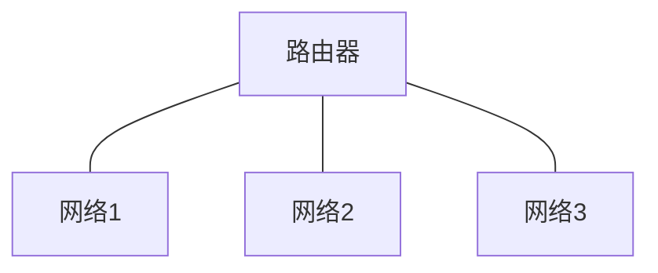

---
categories:
  - 计算机网络
  - 笔记
---
# 什么是计算机网络？
> 计算机网络(computer network)是自主计算机的互连集合。（ANDREW S. TANENBAUM）

> 计算机网络是利用通信设备和线路将地理位置不同的、功 能独立的**多个计算机系统*****连接***起来，以功能完善的网络软件实现网络的硬件、软件及资源共享和信息传递的系统。 简单来说就是连接两台或多台计算机进行通信的系统。（维基百科）

## 直接连接的网络
点到点网络 (point-to-point network)
- 单向（simplex）：通信线路上的数据按单一方向传送
- 半双工（half duplex）：一段时间内只有一边向另一边传送，如对讲机
- 全双工（full duplex）：接收数据的同时也能传送数据，如电话

多路访问网络 (multiple access network)
- 单播（unicast）：每个时刻一个站点发送一个站点接收的通信方式
- 多播（multicast）：一对多的通信方式
- 广播（broadcast）：一对所有的通信方式

点到点网络：

多路访问网络：

四个，ABE共享链路为一个直连网，BC点到点连接为一个直连网，CDF共享链路为一个，FG点到点连接为一个，共四个直连网。
## 间接连接的网络
- 中间节点、路由器(router)
- 包(packet)
- 存储转发(store-and-forward)
- 路由选择(routing)
- 路由(route)
- 目的地(destination),下一跳(next hop)
- 路由表(routing table)

## 网络互连
用路由器(或网关)连接起来构成的网络称为互连网络(internetwork 或internet)。因特网 (Internet) 是一种互连网络。

- 系统域网(System Area Network, SAN)
- 局域网(Local Area Network, LAN)：一般限定在较小的区域内（小于10km的范围），通常采用有线的方法连接起来。实验室一般采用局域网的连网方式。
- 城域网(Metropolitan Area Network, MAN)：规模局限在一座城市的范围内。
- 广域网(Wide Area Network, WAN)：网络跨越国界、洲界，甚至遍及全球范围。因特网属于广域网WAN。

- 个人区域网（PAN）：一般指家庭一台或多台电脑所使用的网络。
- 无线局域网（WLAN）：是指通过无线设备建立的，给支持无线通信的设备使用的，比如无线网卡，或手机上的WIFI。

# 什么是因特网？
ISP ( Internet Service Provider)，即因特网服务提供商。顶层ISP也称为主干网。第2层ISP是更小的ISP(常常是区域ISP)，是顶层ISP的客户，可 以连到顶层ISP或其它第2层ISP。终端系统可以通过第2层ISP或本地ISP网络(接入网络)连 入互联网。
- 终端系统(end system)：主机
  - 运行网络应用程序 (例如，浏览器)
- 通信链路(communication link)
  - 光纤, 铜线, 无线电, 卫星
  - 传输速率=带宽
- 路由器(router)

- network core -- 主干网
- access network -- 接入网
- network edge -- 网络边界(主机及网络程序)

# 网络提供的服务
数据链路层一般都提供3种基本服务，即无确认的无连接服务、有确认的无连接服务、有确认的面向连接的服务。
- 无确认的无连接服务 无确认的无连接服务是源机器向目的机器发送独立的帧，而目的机器对收到的帧不作确认。如果由于线路上的噪声而造成帧丢失，数据链路层不作努力去恢复它，恢复工作留给上层去完成。这类服务适用于误码率很低的情况，也适用于像语音之类的实时传输，实时传输情况下有时数据延误比数据损坏影响更严重。大多数局域网在数据链路层都使用无确认的无连接服务。
- 有确认的无连接服务 这种服务仍然不建立连接，但是所发送的每一帧都进行单独确认。以这种方式，发送方就会知道帧是否正确地到达。如果在某个确定的时间间隔内，帧没有到达，就必须重新发此帧。
- 有确认的面向连接的服务 采用这种服务，源机器和目的机器在传递任何数据之前，先建立一条连接。在这条连接上所发送的每一帧都被编上号，数据链路层保证所发送的每一帧都确实已收到。而且，它保证每帧只收到一次，所有的帧都是按正确顺序收到的。面向连接的服务为网络进程间提供了可靠地传送比特流的服务。

可靠的服务包括：
- 文件传输
- 浏览网页
- 电子邮件
- 电子商务

不可靠的服务包括：
- 视频直播
- IP电话
- 网络会议

面向连接的服务，无连接的服务

有确认的服务，无确认的服务
在有确认的服务中，作为对请求原语的反应，接收方要发出一个明确的响应原语。

数据报服务：无连接无确认

请求响应和消息流服务

下面的电信模式分别使用的服务类型：

普通邮件：无连接无确认的服务（尽力服务）
电话：面向连接的服务
快件：无连接有确认的服务
# 因特网体系结构
- 应用层：提供对某些专门应用的支持，如文件服务（ftp），邮件（smtp），网页（http）
- 传输层：进程之间的数据传送（端到端，end-to-end），如TCP,UDP
- 网络层：路由选择，实现到互连网中的数据传送（主机到主机,host-to-host），如IP，routing protocols
- 数据链路层：在物理网络中传送包（跳到跳，hop-to-hop节点到节点node-to-node），ppp，Ethernet
- 物理层：线上的比特（传送原始比特流）

- 每一层都可以有多个协议，每个协议都可以使用下层提供的服务并为上层提供服务。
- 同一个互连网络中要求网络层协议相同而链路层协议可以不同
- 应用层对应消息message
- 传输层对应数据段segment
- 网络层对应数据报datagram
- 链路层对应帧frame然后将source封装起来，从一个主机经过网络层从高到低发送出去，到达另外一个主机，由低到高到达应用层。

# ISO/OSI参考模型
一般网络体系结构（OSI参考模型）将网络协议分为七层；TCP/IP体系结构将网络协议分为五层。因特网没有这两层，如果需要，可以在应用程序中实现。
- 表示层(presentation): 提供数据转换服务, 例如，加密解密，压缩解压缩，数据 格式变换
- 会话层(session): 简化会话实现机制，例如，数据流的检查点设置和回滚以及多 数据流同步。

## 网络性能分析：延迟和丢包

当一个包到达时如果有空闲缓存则排队等待转发，产生延迟(delay)。如果没有空闲缓存，则丢弃该包，造成丢失 (loss)
## 包交换（packet-switching）中的延迟：
节点延迟：d(nodal) = d(proc) + d(queue) + d(trans) + d(prop)
1. 处理延迟（processing）
  - 检查比特错
  - 确定输出链路
2. 排队延迟（queueing）
  - 在输出链路队列等待发送
  - 依赖于路由器的拥塞程度
3. 传输延迟（transmission delay）
  - 包长（bits）/链路带宽（bps），也称为发送延迟
4. 传播延迟（propagation delay）
  - 物理链路长度/信号传播速度（~2*10^8m/sec)

## 带宽和吞吐量：
- 带宽（bandwidth）：一条链路可达到的**最大**数据传送速率（bits per second,bps)
- 吞吐量（throughput)：发送者和接收者之间的数据传送速率（bps）
  - 瞬时吞吐量：某个时刻的数据速率
  - 平均吞吐量：在某个较长时期的数据速率

注：一条链路的带宽(bandwidth)一定大于等于其吞吐量(throughput)
### 例题
>  一条点到点链路长200公里，传播速度为2×10^8米/秒。如果发送一个100字节的包， 以多少带宽(bps)它的传播延迟(propagation delay)会等于其传输延迟(transmit delay)?（只 写最后结果，单位为Kbps）

8 * 100 / X（bps） = 200*1000/（2×10^8）= 1 / 1000
X = 800000bps = 800Kbps

> 一条点到点链路长200公里，传播速度为2×10^8米/秒，带宽为100Mbps。发送一个 20000比特的包通过该链路需要多长时间(ms)? 考虑从第一位发送到收到最后一位的时间。

200000/200000000+20000/100000000=1ms+0.2ms = 1.2ms

> 如果一个长度为3000字节的文件用一个数据包从源主机通过一段链路传给了一个交换 机（采用store-and-forward方式),然后再通过第二段链路到达目的主机。如果在包交换 机的延迟为2ms, 两条链路上的传播延迟都是2×10^8米/秒,带宽都是1Mbps, 长度都是 6,000公里。问这个文件在这两台主机之间的总延迟是多少？

在源主机发出和交换机发出之后，均包括传输延迟和传播延迟，所以需要*2，结果为110ms。

（存储转发方式：收到整个包再发送）
> 假定12个包同时到达包交换机的输出接口，此时并没有任何包在此输出接口处发送或 排队。如果每个数据包的长度都是300字节，该接口的带宽为1Mbps。这些数据包的平 均排队延迟是多少?

每个包的发送时间为300bytes/1Mbps，即2.4ms。

第一个排队时间为0，第二个包的排队时间为1*2.4ms，...，第12包的排 队时间为11*2.4ms。

因此，平均排队时间为：    (0+……+11)*2.4/12 =66*2.4ms/12=13.2ms
