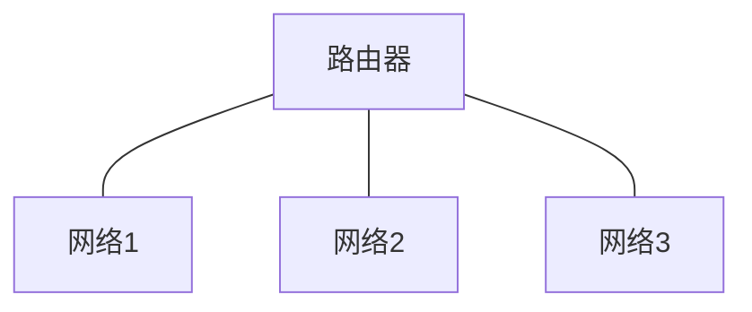

# 什么是计算机网络？
> 计算机网络(computer network)是自主计算机的互连集合。（ANDREW S. TANENBAUM）

> 计算机网络是利用通信设备和线路将地理位置不同的、功 能独立的**多个计算机系统*****连接***起来，以功能完善的网络软件实现网络的硬件、软件及资源共享和信息传递的系统。 简单来说就是连接两台或多台计算机进行通信的系统。（维基百科）

## 直接连接的网络
```mermaid
graph LR
A--链路（link），专用介质（dedicated medium）---B,节点(node)或主机(host)
```
点到点网络 (point-to-point network)
- 单向(simplex)
- 半双工(half duplex)
- 全双工(full duplex)

```mermaid
graph LR
共享介质(shared medium), 广播, 碰撞(collision)

```
多路访问网络 (multiple access network)
- 单播(unicast)
- 多播(multicast)
- 广播(broadcast)

## 间接连接的网络
- 中间节点、路由器(router)
- 包(packet)
- 存储转发(store-and-forward)
- 路由选择(routing)
- 路由(route)
- 目的地(destination),下一跳(next hop)
- 路由表(routing table)

## 网络互连
用路由器(或网关)连接起来构成的网络称为互连网络(internetwork 或internet)。因特网 (Internet) 是一种互连网络。

- 系统域网(System Area Network, SAN)
- 局域网(Local Area Network, LAN)
- 城域网(Metropolitan Area Network, MAN)
- 广域网(Wide Area Network, WAN)

# 什么是因特网？
ISP ( Internet Service Provider) -- 因特网服务提供商
- 终端系统(end system)：主机
  - 运行网络应用程序 (例如，浏览器)
- 通信链路(communication link)
  - 光纤, 铜线, 无线电, 卫星
  - 传输速率=带宽
- 路由器(router)

# 因特网体系结构
# 开放系统互连参考模型
# 网络性能分析
