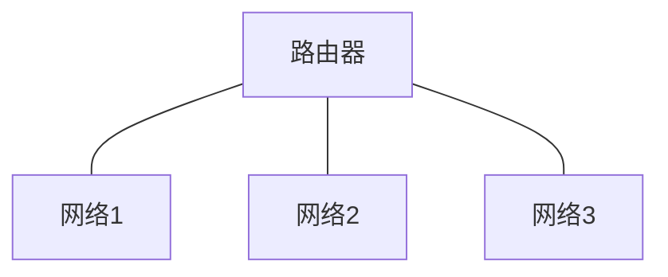

# 什么是计算机网络？
> 计算机网络(computer network)是自主计算机的互连集合。（ANDREW S. TANENBAUM）

> 计算机网络是利用通信设备和线路将地理位置不同的、功 能独立的**多个计算机系统*****连接***起来，以功能完善的网络软件实现网络的硬件、软件及资源共享和信息传递的系统。 简单来说就是连接两台或多台计算机进行通信的系统。（维基百科）

## 直接连接的网络
```mermaid
graph LR
A--链路（link），专用介质（dedicated medium）---B,节点(node)或主机(host)
```
点到点网络 (point-to-point network)
- 单向(simplex)
- 半双工(half duplex)
- 全双工(full duplex)

```mermaid
graph LR
共享介质(shared medium), 广播, 碰撞(collision)

```
多路访问网络 (multiple access network)
- 单播(unicast)
- 多播(multicast)
- 广播(broadcast)

## 间接连接的网络
- 中间节点、路由器(router)
- 包(packet)
- 存储转发(store-and-forward)
- 路由选择(routing)
- 路由(route)
- 目的地(destination),下一跳(next hop)
- 路由表(routing table)

## 网络互连
用路由器(或网关)连接起来构成的网络称为互连网络(internetwork 或internet)。因特网 (Internet) 是一种互连网络。

- 系统域网(System Area Network, SAN)
- 局域网(Local Area Network, LAN)
- 城域网(Metropolitan Area Network, MAN)
- 广域网(Wide Area Network, WAN)

局域网（LAN）：一般限定在较小的区域内（小于10km的范围），通常采用有线的方法连接起来。
城域网（MAN）：规模局限在一座城市的范围内。
广域网（WAN）：网络跨越国界、洲界，甚至遍及全球范围。
个人区域网（PAN）：一般指家庭一台或多台电脑所使用的网络
无线局域网（WLAN）：是指通过无线设备建立的，给支持无线通信的设备使用的，比如无线网卡，或手机上的WIFI。
# 什么是因特网？
ISP ( Internet Service Provider) -- 因特网服务提供商
- 终端系统(end system)：主机
  - 运行网络应用程序 (例如，浏览器)
- 通信链路(communication link)
  - 光纤, 铜线, 无线电, 卫星
  - 传输速率=带宽
- 路由器(router)

# 因特网体系结构
## 网络提供的服务
数据链路层一般都提供3种基本服务，即无确认的无连接服务、有确认的无连接服务、有确认 的面向连接的服务。

（1）无确认的无连接服务 无确认的无连接服务是源机器向目的机器发送独立的帧，而目的机器对收到的帧不作确认。
如果由于线路上的噪声而造成帧丢失，数据链路层不作努力去恢复它，恢复工作留给上层去完成。
这类服务适用于误码率很低的情况，也适用于像语音之类的实时传输，实时传输情况下有时数据延误比数据损坏影响更严重。
大多数局域网在数据链路层都使用无确认的无连接服务。

（2）有确认的无连接服务 这种服务仍然不建立连接，但是所发送的每一帧都进行单独确认。
以这种方式，发送方就会知道帧是否正确地到达。如果在某个确定的时间间隔内，帧没有到达，就必须重新发此帧。

（3）有确认的面向连接的服务 采用这种服务，源机器和目的机器在传递任何数据之前，先建立一条连接。
在这条连接上所发送的每一帧都被编上号，数据链路层保证所发送的每一帧都确实已收到。
而且，它保证每帧只收到一次，所有的帧都是按正确顺序收到的。面向连接的服务为网络进程间提供了可靠地传送比特流的服务。
# 开放系统互连参考模型
# 网络性能分析
