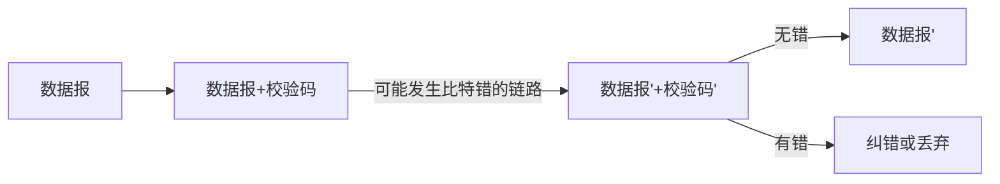

---
categories:
  - 计算机网络
  - 笔记
---
# 概述
数据链路层负责把数据包从一个节点通过链路（直连网络或物理网络）传给相邻的另一个节点。

网络层必须依靠链路层的服务。在每个节点，网络层将数据报下传给链路层，链路层沿着路径将数据报传递给下一个节点，在下一个节点链路层将数据报上传给网络层。

链路层主要在网络接口卡(network interface card,NIC)及其驱动程序上实现。路由器是在接口模块上实现。

- 主机和路由器是节点(nodes)
- 连接相邻节点的通道是链路(links)
  - 有线链路(wired links)
  - 无线链路(wireless links)
  - 局域网(LANs)
- 第2层的数据包(packet)是帧(frame)

## 功能
- 形成帧 (framing)：能够区分不同数据包
- 差错检测(error detect)：比特错，纠错；需要校验码，查看比特错，多用循环冗余码(CRC)[ 在数据报上加上校验码，经过链路传输后如果经校验数据有错则进行纠错或者直接丢弃 ]。
- 差错控制(error control)：处理丢包、重复、错序等情况。流控制(flow control)
- 介质访问控制(medium access control): 处理多路访问和碰撞(collision)的情况

# 差错检测

## 奇偶校验
分为奇校验（bits共有奇数个1）；偶校验（bits共有偶数个1）.通过对行和列加同一种校验来检测传输后的数据的变化。

如果一组给定数据位中1的个数是奇数，那么偶校验位就置为1，从而使得1的个数是偶数。如果给定一组数据位中1的个数是偶数，那么奇校验位就置为1，使得总的1的个数是奇数。


此处为奇校验，因为1的个数为9个，加上一个0使之继续为奇数。

二维的奇偶校验码（偶校验）如下，横竖1的个数均为奇数的那一位为出错位。其中，最下方和最右方为添加的校验位。


以下为收到的带有二维奇偶校验码(偶校验)的数据，则row 4 col 2出错了
```
10001
11000
11110
01110
10001
```

二维奇偶校验码可以检出所有的两位错误。如果这两位错在同一行，则会有两列发现错误，如果不在同一行，则会有两行发现错误。二维奇偶校验码不能纠正两位错误。 任何一行两位出错，都只能发现哪两列有错，但是不能确定它们在哪一行。
## 检验和(Checksum)
校验和(checksum)：将数据报的内容按字相加得到一个字大小的校验和。


上面的数据通过按字相加得到了校验和，注意如果相加时有进位，则忽略进位并且在0号位加1.所有字相加完成后取反码，得到了校验和。

数据 + 校验和 = 每个bit都为1
由于需要使用加法器实现算法，校验和一般不用于数据链路层，而是用于更高层，例如 ，IP层和传输层。
## 循环冗余校验码(Cyclic Redundancy Check, CRC)
在数据后面加上校验码，采用的是模2除法，可理解为异或操作。需要先确定除数，又称为Generator。

链路层常用CRC检验，因为容易用硬件实现且检错率高。
CRC的位数比Generator的位数少1，在计算时需要先将被除数补CRC的位数个0.

如果传输过程中没有出现比特错，接 收方用相同的除数去除数据加CRC校 验码，余数应该为0。
(Cyclic Redundancy Check, CRC)

采用模2除法：做减法时没有借位，类似于按位异或。

链路层常用CRC检验，因为容易用硬件实现，速度快，检错率很高。

CRC-CCITT(x16+x12+x5+1)的错误检测能力：可以检出所 有随机奇数位错误和双位错，可以检出所有长度小于等 于16位的突发错；对于长度等于17位的突发错误，检错 率为99.9969%；长度大于等于18位的突发错误，检错率 为99.9985%。

如果传输过程中没有出现比特错，接收方用相同的除数去除数据加CRC校验码，余数应该为0.

例子：

数据为：101110000，除数为：1001,求校验码。

解：每一步计算为按位异或：
<div class="table-box"><table width="200" border="1" cellspacing="1" cellpadding="1"><tbody><tr><td>1</td><td>0</td><td>1</td><td>1</td><td>1</td><td>0</td><td>0</td><td>0</td><td>0</td></tr><tr><td>1</td><td>0</td><td>0</td><td>1</td><td>&nbsp;</td><td>&nbsp;</td><td>&nbsp;</td><td>&nbsp;</td><td>&nbsp;</td></tr><tr><td>&nbsp;</td><td>&nbsp;</td><td>1</td><td>0</td><td>1</td><td>0</td><td>&nbsp;</td><td>&nbsp;</td><td>&nbsp;</td></tr><tr><td>&nbsp;</td><td>&nbsp;</td><td>1</td><td>0</td><td>0</td><td>1</td><td>&nbsp;</td><td>&nbsp;</td><td>&nbsp;</td></tr><tr><td>&nbsp;</td><td>&nbsp;</td><td>&nbsp;</td><td>&nbsp;</td><td>1</td><td>1</td><td>0</td><td>0</td><td>&nbsp;</td></tr><tr><td>&nbsp;</td><td>&nbsp;</td><td>&nbsp;</td><td>&nbsp;</td><td>1</td><td>0</td><td>0</td><td>1</td><td>&nbsp;</td></tr><tr><td>&nbsp;</td><td>&nbsp;</td><td>&nbsp;</td><td>&nbsp;</td><td>&nbsp;</td><td>1</td><td>0</td><td>1</td><td>0</td></tr><tr><td>&nbsp;</td><td>&nbsp;</td><td>&nbsp;</td><td>&nbsp;</td><td>&nbsp;</td><td>1</td><td>0</td><td>0</td><td>1</td></tr><tr><td>&nbsp;</td><td>&nbsp;</td><td>&nbsp;</td><td>&nbsp;</td><td>&nbsp;</td><td>&nbsp;</td><td>&nbsp;</td><td><span style="color:#ff0000;">1</td><td><span style="color:#ff0000;">1</td></tr><tr><td>&nbsp;</td><td>&nbsp;</td><td>&nbsp;</td><td>&nbsp;</td><td>&nbsp;</td><td>&nbsp;</td><td>&nbsp;</td><td>&nbsp;</td><td>&nbsp;</td></tr></tbody></table></div>

解得校验码为011，将数据加上11为101110011，除上1001，余数为0.

注：链路层常用CRC检验，因为容易用硬件实现，速度快，检错率很高。
# 可靠数据传输
自动重发请求（automatic repeat request，ARQ），每发送一帧都启动一个超时定时器，哪个帧超时将重传该帧并重启其定时器。

确认帧（acknowledgement frame）：接收方发给发送方用来表示已经收到数据帧的一个控制帧。

- 如果不纠错，出现比特错的帧将被丢弃，即出现丢包错误（loss）。
- **自动重发请求**(Automatic Repeat request, **ARQ**),每发送一帧都启动一个超时定时器，哪个帧超时将重传该帧，并重启定时器。
- 确认帧是接收方发给发送方用来表示已经收到数据帧的一个控制帧。
- **停等协议**和**滑动窗口协议**都是**自动重发请求协议**。


## 例题
> 如果选择性重传协议不采用NAK，设计一种可行方法完成只重传丢失帧的任务。

对一个帧收到了3个重复的确认帧之后重传该帧

> 为什么ARQ协议的超时时间不应设置得太长？

如果ARQ设置过大将会使发送方经过较长时间的等待才能发现帧丢失，通过超时重传来纠正这些错误需要太长的时间，降低了连接数据传输的吞吐量；但也不能设置的太短，导致接收方会误认为大量帧丢失而导致大量不必要的重传。

## 停等协议（stop-and-wait)
只有收到前一个数据帧的确认才可以发送下一个数据帧。


停等协议正常情况下是不需要序号的，但是为了避免出错，至少需要两个序号。出错的情况有三种：
1. 数据帧丢失
2. 确认帧丢失
3. 确认帧在超时时间之后返回。

如果没有序号，若确认帧丢失或延时，则超时重发机制会使接收方接收到两个同样的数据帧，导致重复数据帧出现。若接收方收到序号相同的数据帧，就表明出现了重复帧。这时接收方应当丢弃这个重复帧，同时向发送方发送一个确认帧。 因为接收方这时已经知道发送方没有收到上一次发送的确认帧。如果数据帧丢失，则接收方将重新接收到的应该接受的序号的帧接收。对于停等协议，由于每发送一个数据帧就停止等待，所以说用序号轮流使用0和1就足够了。
## 滑动窗口协议（sliding window)
提高滑动窗口协议的效率
1. 选择性确认：接收方把已收到的帧的序号告诉发送方
2. 捎带确认：通信双方以全双工方式工作，接收方在发数据给对方时顺便发送确认号
3. 延迟确认：接收方收到一帧后并不立即发送确认帧，而是等待一段时间再发送

可以连续发送多个帧，个数由发送窗口来控制。
发送窗口（sending window）是个连续发送数据帧的可用序号范围，主要用于流控制。
发送窗口大小（sending window size, SWS）也是发送缓冲区的大小。（最多可以同时由多个数据帧未发送）
确认帧用于接收方通知发送方其发送的序号的数据帧以及更早发送的数据帧已经全部收到并已交给上层协议。

不需要等待前面发送的帧的确认回来，就可以连续发送多个帧，其个数由发送窗口来控制。


发送窗口：是个序号范围，表示可以连续发送多少**未确认**的数据帧，主要用于流控制。

发送窗口大小(Sending Window Size,SWS)：表示发送窗口的大小，也是发送缓冲区的大小。

**确认帧**(Acknowledgement Frame)：表示**这一帧（确认号为ACK）及之前的数据帧**全部收到并已交给上层协议。


问题：滑动窗口协议的确认帧的确认号表示什么含义，它这样表示的好处是什么？

答：表示该帧以及之前的帧均已被接收方收到。通过延迟确认，可以少发送确认帧。如果前面的确认帧丢失，后面到达的确认帧也可以对前面帧的确认，提高了可靠性。

## 回退N协议（go back N)
如果传送序号1-4的数据帧，其中1、2和4传输成功而3丢失，则4传输成功后接收方会仍然返回ACK=2，这就说明了3出问题了。而且会从3开始重传3以及其之后已经传送过的数据帧，所以会有重复传送


### 例题
> 如果使用回退N滑动窗口协议，发送窗口大小为4，可以循环使用的序号为0~7，RTT大于4帧的发送时间。如果发送方发送了从序号3开始的10个数据帧，除了第2帧（序号为4）和第5帧（序号为7）丢失，包含重传帧在内的其它帧均正确到达接收方，问接收方依次收到这些帧（含重传帧）的序号（序号之间用一个空格隔开）

接收方依次接受到的帧序号为：3 5 6 4 5 6 7 0 1 2 3 4

因为发送窗口大小为4，当发送了3456之后，收到了3的ACK，然后发送7等待4的ACK返回，在这个过程中接收方收到56，但是没有收到4的ACK，所以回退到发送4和567，一共发送了10个帧，在7之后还发送了01234，所以接收方收到序列为35645701234.
## 选择性重传(Selective Repeat)
否定性确认帧NAK：用于表示这一帧之前的数据帧全部收到并已交给上层协议，要求发送方重传这一帧。每个帧只发送一次NAK。
接收窗口：用于确定应该保存哪些帧，用序号范围表示。如当前接收窗口为[3,4,5,6]，则接收方仅会接收3,4,5,6号数据帧并保存，其他序号的数据帧不会被接收。
接收窗口大小RWS：也就是数据缓冲区的大小
这种情况下最后的ACK携带的序号是6.
与回退N协议相比，没有重复传送已被接收的数据。

**否定性确认帧**（Negative Acknowledgement,NAK）:用于表示**这一帧之前的数据帧**全部收到并已交给上层协议，要求发送方重传这一帧。每个帧只发送一次NAK。


接收窗口：用于确定应该保存哪些帧，用序号范围表示。

接收窗口大小（Receiving Window Size,RWS）:表示接收窗口的大小，也是接收缓冲区的大小。


### 例题
> 选择性重传协议的RWS大于SWS是否有意义？

没意义。错序到达的帧加上期待接收的帧最多SWS个。发送方发送的未确认的帧最多只有SWS个，接收方只需要缓存这些帧，故RWS没有必要大于SWS。
> 选择性重传协议需要的最少序号个数与SWS和RWS有什么关系？

序号个数>=SWS+RWS。如果接收方收到新的SWS帧，发回的确认全部丢失，在这种情况下，重发时要求这些帧的序号不落在当前接收窗口的序号范围内，序号少了就会出现重复错误。
> 选择性重传协议可能会收到落在接收窗口之外的数据帧。这句话是否正确？

正确。因确认帧丢失而重传的帧都会落在接收窗口之外。
> 回退N协议可能会收到落在发送窗口之外的确认帧。这句话是否正确？

正确。如果因确认帧迟到而出现超时重传，就可能收到一个帧的两个确认帧。第二个确认帧就会落在发送窗口之外。
> 选择性重传协议丢失了NAK并非致命错误。这句话是否正确？

正确，因为还有超时重传机制确保可靠性。多个帧丢失后的一种NAK发送机制：发送NAK时启动一个超时定时器，在其到 期之前不会再发送NAK，而是发送ACK。
> 如果上题（回退N滑动窗口协议中的例题）改为选择性重传，并且接收窗口大小等于发送窗口大小，并且只有第2帧丢失，问接收方依次收到这些帧（含重传帧）的序号（序号之间用一个空格隔开）

解析：序列为：3 5 6 7 4 0 1 2 3 4
发送3456之后，收到3的ACK，继续发送7，但是此时没有收到4的ACK，重发4，在4收到之前收到567，所以序列为3567401234.
## PPP协议
- PPP协议（Point-to-Point Protocol)：是点到点网络的数据链路层协议
- 根据HDLC(high-level data link control)协议进行设计的
- 主要用于串行电缆、电话线等各种串行链路。
- 为各种网络层协议提供服务
- PPP协议可以提供连接认证、传输加密和压缩功能。
- PPP协议用IPCP协议获取IP地址。
- PPP协议使用LCP协议确定是否需要身份认证和确定链路层的参数。
- PPP协议的多链路捆绑技术可以通过将通信两端之间的多条通信链路捆绑成一条虚拟的链路而达到扩充链路可用带宽的目的。
-	PPP数据帧采用了HDLC的广播地址(0xFF)和无编号帧(0x03，作为控制字节)，且采用字节填充法(byte-stuffing)将信息字段出现的标志字节(0x7E)用0x7D-5E替换，0x7D用0x7D-5D替换。可以省略地址和控制字节。
-	PPP协议可以进行TCP压缩和数据压缩
-	PPP协议没有纠错功能，也没有流控制和确保有序的功能
