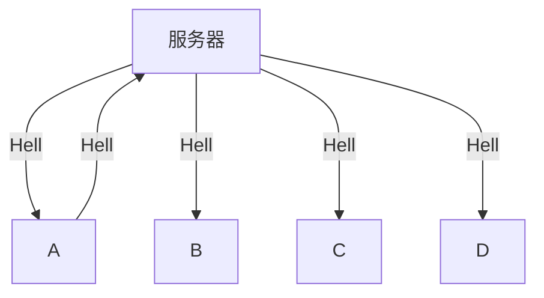

## 实验题目

Chat 实验

## 实验目的

掌握套节字的多线程编程方法。

## 实验介绍

利用客户/服务器(Client/Sever 或 CS)模式实现一个多人聊天(群聊)程序。其功能是每个客户发送给服务器的消息都会传送给所有的客户端。



## 参考资料

- https://docs.microsoft.com/en-us/windows/desktop/WinSock/getting-started-with-winsock （套接字）
- https://www.cnblogs.com/hgwang/p/6074038.html （套接字）
- https://www.jb51.net/article/37410.htm （字符串）
- https://docs.microsoft.com/en-us/cpp/c-runtime-library/stream-i-o?view=vs-2017 （字符串）
- https://docs.microsoft.com/en-us/cpp/c-runtime-library/reference/crt-alphabetical-function-reference?view=vs-2017#s （字符串）
- http://www.runoob.com/cprogramming/ （字符串）
- 例程“\_beginthreadex” （创建线程）
- 例程“TCPServer 和 TCPClient” （传送服务器时间）
- 课件“套接字并发编程.PDF”
- Chat 实验的课件

## 实验环境

- Windows + VS 2012
  - 对于 VS2015 和 VS2017 默认使用安全周期检查，如果不关闭 VS 的安全周期检查，很多字符串函数都不能用。
- Linux + gcc

这里我使用的环境是 Windows 10 + VSCode + gcc version 8.1.0 (x86_64-posix-sjlj-rev0, Built by MinGW-W64 project)

## 实验内容

先阅读课件“套接字并发编程.PDF”。重点是读懂课件中“chat 并发编程(服务器)”和“chat 并发编程(客户端)”的流程图。 然后，完成下面步骤（截屏要同时显示服务器和至少两个客户端）：

1. 编写多人聊天程序，要求客户端和服务器都采用多线程方式进行编程。每个客户端都采用 TCP 协议连接服务器并保持连接。服务器同时与所有客户端建立和保持连接。每个客户端输入的消息都会通过服务器转发给所有客户。
2. 服务器程序转发某个客户端发来的消息时都在消息前面加上该客户端的 IP 地址和端口号以及服务器的当前时间。要求服务器程序把转发的 消息也显示出来。
3. 新客户刚连接时服务器端把“enter”消息（包含客户端 IP 地址和端口号）发送给所有客户端。
4. 客户端输入 exit 时退出客户端程序（正常退出），或者客户端直接关闭窗口退出（异常退出），服务器都会把该客户 leave 的消息广播给所有客户。

客户端程序：

```c
#include <stdio.h>
#include <string.h>
#include <process.h>
#include <winsock2.h>
#define BUFLEN 2000
#define WSVERS MAKEWORD(2, 0)
#pragma comment(lib, "ws2_32.lib")
int finish = 0;
unsigned __stdcall recvMessage(SOCKET *p)
{
	for (char buf[BUFLEN];;)
	{
		int cc = recv(*p, buf, BUFLEN, 0); // BUFLEN为缓冲区buf的长度，返回值：接收的字符数(>0)、对方已关闭(=0) 或连接出错(<0)
		if (finish)
			return 0;
		if (cc > 0)
		{
			buf[cc] = '\0';	//  ensure null-termination
			printf("%s", buf); // 显示所接收的字符串
		}
		else if (cc == SOCKET_ERROR)
			printf("Recv Error:\n%d\n", GetLastError());
		else if (cc == 0)
			printf("Recv connect closed.\n");
	}
}
int main()
{
	char buf[BUFLEN];
	WSADATA wsadata;
	WSAStartup(WSVERS, &wsadata);
	struct sockaddr_in sin; // an Internet endpoint address
	memset(&sin, 0, sizeof(sin));
	sin.sin_family = AF_INET; // 因特网地址簇
	printf("Input the IP address:\n");
	gets(buf);
	sin.sin_addr.s_addr = inet_addr(buf); // 服务器IP地址(32位)
	printf("Input the IP port:\n");
	gets(buf);
	sin.sin_port = htons(atoi(buf));						 // 服务器端口号(16位)
	SOCKET sock = socket(PF_INET, SOCK_STREAM, IPPROTO_TCP); // socket descriptor
	int ret = connect(sock, &sin, sizeof(sin));				 // 连接到服务器.无错时，返回0；否则，返回SOCKET_ERROR ，可以调用函数WSAGetLastError取得错误代码
	HANDLE h = _beginthreadex(NULL, 0, &recvMessage, &sock, 0, NULL);
	for (;;)
	{
		gets(buf);
		if (!strcmp(buf, "exit"))
			break;
		int cc = send(sock, buf, strlen(buf), 0); //把缓冲区buf的数据发送出去，len为要发送的字节数，返回值：(>0) 实际发送的字节数(≤len), (=0) 对方正常关闭，（=SOCKET_ERROR) 出错，用函数WSAGetLastError取错误码。
		if (cc == SOCKET_ERROR)
			printf("Send Error:\n%d\n", GetLastError());
		else if (cc == 0)
			printf("Send connect closed.\n");
	}
	finish = 1;
	CloseHandle(h);
	closesocket(sock); // 关闭套接字
	WSACleanup();	  //  卸载winsock library
	system("pause");
}
```

服务器端程序：

```c
#include <stdio.h>
#include <time.h>
#include <process.h>
#include <winsock2.h>
#define BUFLEN 2000
#define WSVERS MAKEWORD(2, 0)
#pragma comment(lib, "ws2_32.lib") //使用winsock 2.2 library
SOCKET ssock[BUFLEN];			   //master & *p sockets
struct sockaddr_in ssin[BUFLEN];
int sbadd[BUFLEN], ssock_size = 0;
unsigned __stdcall server(int *p)
{
	for (char msg[BUFLEN] = "Enter!", pts[BUFLEN];;)
	{
		time_t now = time(NULL);
		sprintf(pts,
				"ip: %d.%d.%d.%d port: %u\n"
				"time: %s"
				"message: %s\n"
				"\n>>",
				ssin[*p].sin_addr.S_un.S_un_b.s_b1,
				ssin[*p].sin_addr.S_un.S_un_b.s_b2,
				ssin[*p].sin_addr.S_un.S_un_b.s_b3,
				ssin[*p].sin_addr.S_un.S_un_b.s_b4,
				ssin[*p].sin_port,
				ctime(&now),
				msg);
		printf(pts);
		for (int i = 0; i < ssock_size; ++i)
			send(ssock[i], pts, strlen(pts), 0);
		if (!strcmp(msg, "Leave!"))
			return closesocket(ssock[*p]), 0; //关闭连接套接字
		int cc = recv(ssock[*p], msg, BUFLEN, 0);
		if (cc > 0)
			msg[cc] = 0;
		else
			sprintf(msg, "Leave!");
	}
}
int main()
{
	WSADATA wsadata;
	WSAStartup(WSVERS, &wsadata);							  //加载winsock library，WSVERS为请求版本，wsadata返回系统实际支持的最高版本
	struct sockaddr_in msin;								  //an Internet endpoint addresss
	memset(&msin, 0, sizeof(msin));							  //从&sin开始的长度为sizeof(sin)的内存清0 , sin为一个地址结构
	msin.sin_family = AF_INET;								  //因特网地址簇(INET-Internet)
	msin.sin_addr.s_addr = INADDR_ANY;						  //监听所有(接口的)IP地址(32位)，0.0.0.0
	msin.sin_port = htons(atoi("50500"));					  //监听的端口号(16位) 。atoi--把ascii转化为int，htons—主机序到网络序
	SOCKET msock = socket(PF_INET, SOCK_STREAM, IPPROTO_TCP); //创建套接字。参数：因特网协议簇(family)，字节流，TCP协议号。 返回：要监听套接字的描述符或INVALID_SOCKET
	bind(msock, (struct sockaddr *)&msin, sizeof(msin));	  //通过msin把要监听的IP地址和端口号绑定到套接字上
	listen(msock, 5);										  //建立长度为5的连接请求队列，并开始监听是否有连接请求到来，来了则放入队列
	printf("Server Start to listen.\n");
	while (!_kbhit()) //检测是否有按键 (什么时候执行？)
	{
		int alen = sizeof(struct sockaddr);												//from-address length
		ssock[ssock_size] = accept(msock, (struct sockaddr *)&ssin[ssock_size], &alen); //accept：如果有新的连接请求，返回连接套接字，否则，被阻塞，ssin包含客户端IP地址和端口号
		sbadd[ssock_size] = ssock_size;
		_beginthreadex(NULL, 0, &server, &sbadd[ssock_size++], 0, NULL);
	}
	closesocket(msock);
	WSACleanup();
	system("pause");
}
```

运行效果如下：


测试一下客户端是否能够连上老师在校园网搭的服务器（172.18.187.9:50500）：
运行截屏（客户端）：


和同学互测一下看看，作为服务器运行截屏：

作为客户端运行截屏：


## 实验体会

1. 在服务端的程序中，一开始传新连接的下标的指针到子线程的时候直接传了一个局部变量过去，结果在新开的线程里就会出错；原因是局部变量已经被析构。随后使用一个全局数组作为过渡。为什么是数组？因为假设只用一个变量进行过渡的话，在有多人同时连接，新开多个线程时可能该变量的变化早于新开线程的参数传递。
2. 在和同学测试时没有关掉本机防火墙，导致接收不到同学发来的消息。
3. 客户端输入 exit 下线时，如果不接受的线程不同时关闭的话会不断报错。于是额外用一个全局变量`finish`来中转，子线程在`finish`值变化的时候不再接受消息。
