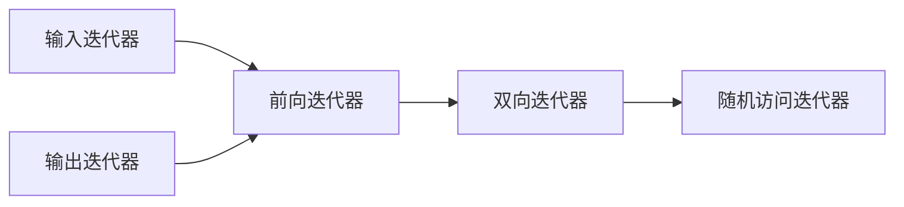

> 参考了[C++中文手册\具名要求](https://zh.cppreference.com/w/cpp/named_req)，感谢社区内的志愿者。

STL 的全称是 Standard Template Library，即标准模板库。STL 是 C++标准程序库的核心，深刻影响了标准程序库的整体结构，STL 内的所有组件都由模板（template）构成，旨在为问题提供最通用的容器和解决算法。

## 算法

大部分算法都定义在算法库`algorithm`中，另外还在`<numberic>`中定义了一些数值泛型算法。标准库中提供了上百种算法，然而，死记硬背是不需要的，算法库有一致的结构。除了少数特例之外，标准库都对一个迭代器范围内的元素进行操作，我们将这个元素范围称为“输入范围”。接受输入范围的元素大部分都是用左闭合区间来表示这个范围，还有少部分是子串区间。

### 迭代器

STL 中大量使用迭代器（iterator）这一通用概念在一些数据结构内访问数据，下面先进行简要介绍。

#### 表示一个元素序列的几种方法

例如，有如下十个数线性排列，下标地址从`0`开始：

```
40,41,42,43,44,45,46,47,48,49
```

##### 全闭合区间

数学上的表示是$[left,right]$或$[first,last]$，用这个序列第一个和最后一个元素的地址表示一个区间内的所有元素，则$[2,9]$表示了序列

```
42,43,44,45,46,47,48,49
```

在全闭合区间中，$first>last$时表示一个空区间。

##### 左闭合区间

数学上的表示是$[begin,end)$，用这个序列第一个和最后一个元素**后一个**的地址来表示一个区间内的左右元素，相当于全闭合区间里的$[begin,end-1]$。`end`可以指向一个不存在元素的地址，例如$[2,10)$同样表示了上面这个序列。

在左闭合区间中，$begin=end$时表示一个空区间。

##### 子串区间

数学上的表示是$[position,position+length)$，表示了从给定元素开始的若干元素。例如，$[2,2+8)$同样表示了上面这个序列。

C 标准库的很多函数都是使用这一方法表示一个区间，例如`qsort`、`memset`等。

在子串区间中，$length=0$表示一个空区间。

#### 左闭合区间表示的优势

##### 访问方便，且对迭代器的要求较低

```cpp
for (it=begin; it!=end; ++it) {} // 使用左闭合区间
for (it=left; it<=right; ++it) {} // 使用全闭合区间
for (int i=0; i!=length; ++i) {} // 使用子串区间
```

在遍历一个元素序列时，三种表示法通常像上面这样遍历。这时，全闭合区间使用了`<=`运算，要求高于`!=`（通常，一个元素可以比较大小时一定可以判断相等与否；但反之不然）；子串区间需要额外维护一个计数器，对于很多不能按下标访问的数据结构来说显得不够方便。

##### 查找方便

查找 target，返回的位置==end，说明在范围内没有找到 target。

##### 便于二分

当需要取中间元素的时候，`mid=begin+end/2`的定位问题。如果区间元素的个数是奇数个，那么 mid 永远是指向中间的元素；如果区间元素是偶数个，那么 mid 永远指向后半段区间的首元素。这样做在二分查找等一些算法的实现上特别有优势。

mid 的规范写法是`mid=begin+(end-begin)/2`。

##### 快速统计区间内元素

$end-begin=length$。推论是，如果$begin==end$那么表示的是一个空区间。

#### 五类迭代器

> 在 C++17 中，定义了第 6 类迭代器：相接迭代器（contiguous iterator），其所指向的逻辑相邻元素也在内存中物理上相邻。
> 指向数组元素的指针满足相接迭代器的所有要求，但容器`deque`不满足。

> 在 C++20 中，定义了第 7 类迭代器：常表达式迭代器（constexpr iterator）是能在常量表达式求值中使用的迭代器。

> C++20 引入基于概念的新迭代器系统，它异于 C++17 及之前的迭代器。虽然基础分配法保持类似，但单独的迭代器类别的要求有些区别。

在 C++中，一图解释五类迭代器之间的继承关系：



##### 输入迭代器（input iterator）

只读，不写；单遍扫描，只能递增。

输入迭代器只支持顺序访问，通常用于读取序列中的元素。对于一个输入迭代器`it`，`*it++`保证是有效的，但递增它可能导致所有其他指向流的迭代器失效。其结果就是，不保证其状态可以保存下来并用来访问元素。因此，输入迭代器只能用于单遍扫描的算法。支持如下操作：

- 相等（`==`）、不等（`!=`）比较。
- 用于推进迭代器的前置和后置递增（`++`）。
- 解引用（`*`），只能出现在赋值运算的右侧；箭头运算符（`->`），`it->member`等价于`(*it).member`。

算法`find`要求输入迭代器；而类型`istream_iterator`是一种输入迭代器。

##### 输出迭代器（output iterator）

只写，不读；单遍扫描，只能递增。可以看作输入迭代器功能上的补集。

只能向解引用的输出迭代器赋值一次，类似输入迭代器，输出迭代器也只能用于单遍扫描的算法，通常用作算法的目标位置。支持如下操作：

- 用于推进迭代器的前置和后置递增（`++`）。
- 解引用（`*`），只能出现在赋值运算的左侧。

算法`fill`要求输出迭代器；而类型`ostream_iterator`是一种输出迭代器。

##### 前向迭代器（forward iterator）

可读写；多遍扫描，只能递增。

可以读写元素，只能在序列中沿着一个方向移动，支持所有输入迭代器和输出迭代器的操作，而且可以多次读写同一个元素。因此，可以保存前向迭代器的状态，使用前向迭代器的算法可以进行多遍扫描。

算法`replace`要求前向迭代器；容器`forward_list`上的迭代器是前向迭代器。

##### 双向迭代器（bidrectional iterator）

可读写；多遍扫描，能递增递减。

可正向/反向读写序列中的元素。除支持所有前向迭代器的操作之外，双向迭代器还支持前置和后置递减（`--`）。

算法`reverse`要求双向迭代器；除了`forward_list`之外，其他标准库容器上的迭代器都是双向迭代器。

##### 随机访问迭代器（random-access iterator）

可读写；多遍扫描，支持全部迭代器运算。

提供在常数时间内访问序列中任意元素的能力，除支持双向迭代器的所有操作外，还支持：

- 用于比较两个迭代器的相对位置（`>`、`<`、`>=`、`<=`）。
- 迭代器和一个整数值的加减运算（`+`、`+=`、`-`、`-=`），计算结果迭代器在序列中前进或后退给定整数后的迭代器。
- 迭代器之间的减法（`-`），得到两个迭代器之间的距离。
- 下标运算符（`[]`），`it[n]`与`*(it+n)`等价。

算法`sort`要求随机访问迭代器；容器`vector`上的迭代器和用于访问内置数组的指针是随机访问迭代器。

### [算法概览](https://zh.cppreference.com/w/cpp/algorithm)

### 定制算法

> c++11 中引入了 lamda 表达式，可以简化谓词的实现。

#### [谓词](https://zh.cppreference.com/w/cpp/named_req/Predicate)

有单参数，且不修改它，返回值可转换为 bool 的函数对象。

#### [二元谓词](https://zh.cppreference.com/w/cpp/named_req/BinaryPredicate)

有双参数，且不修改它，返回值可转换为 bool 的函数对象。

##### [比较](https://zh.cppreference.com/w/cpp/named_req/Compare)

建立顺序关系的二元谓词 (BinaryPredicate) 。应用到满足比较 (Compare) 类型对象的函数调用运算的返回值，在按语境转换成 bool 时，若此类型所引入的严格弱序关系中调用的第一参数先出现于第二参数，则生成 true ，否则生成 false 。

## [容器](https://zh.cppreference.com/w/cpp/named_req/Container)

容器（Container）是用于存储其他对象，并管理**其所容纳的对象所用的内存**的对象。随着 STL 标准的不断发展，标准库内集成了越来越多的容器，这里举一些常用的容器作为例子。

### 前置知识

#### [pair](https://zh.cppreference.com/w/cpp/utility/pair)

pair 用于快速将两个元素“打包”，包含在任意一个标准库里。pair 支持赋值操作和基于字典序的比较操作。

### 顺序容器

这里以[`vector`](https://zh.cppreference.com/w/cpp/container/vector)、[`deque`](https://zh.cppreference.com/w/cpp/container/deque)、[`list`](https://zh.cppreference.com/w/cpp/container/list)作为入门，其余在新的 C++标准中实现的容器可以自行学习。

#### 通用操作

这里举一些常用的函数

##### 构造函数

设模板名为`C`。

```cpp
C
	c1(b, e),		   //用左闭合区间[b,e)区间内的元素构造容器，要求输入迭代器
	c2(n, cv),		   //c2是一个有n个元素的容器，每个元素的类型都是cv，这里cv可省略（代表使用默认初始化）
	c3(c1),			   //拷贝构造函数
	c{cv1, cv2, cv3};  //花括号构造，用左边这个集合去构造容器，C++11开始支持
```

##### 访问元素

```cpp
c.front(); //c的首元素
c.back();  //c的尾元素
c[pos];    //c的第pos个元素，list不支持
```

上面三个的函数均不进行合法检查，因此要注意是否有越界情况。

##### 迭代器

```cpp
c.begin();//返回首迭代器，重载了常量迭代器的版本
c.end();//返回尾后迭代器，重载了常量迭代器的版本
c.rbegin();//反向迭代器
c.rend();//反向迭代器
```

反向迭代器将在“再探迭代器”部分详细解释。

```cpp
sort(c.begin(), c.end(), greater<T>()); //将C内元素从大到小排序
sort(c.rbegin(), c.rend()); //和上面等价
```

##### 大小及修改大小的操作

```cpp
c.size(); //c的大小
c.empty(); //c是否为空，等价于c.size()==0
c.assign(args...); //重新调用构造函数。在这里args等价于构造函数的参数，并且参数不可省略
c.resize(n, cv); //将容器大小调整为n，删去多余的，如果容器大小小于n会用cv去填（可省，等价于默认初始化）
c.clear(); // 清空
c.insert(args...); //插入元素，时间复杂度根据容器结构有不同
c.erase(args...); //删除元素，时间复杂度根据容器结构有不同
```

#### 个人经验：如何选择合适的容器

1. 不知道用什么的时候，选用`vector`。
2. 如果你的程序需要频繁地在头部和尾部插入/删除元素，选用`deque`。
3. 如果你的程序需要频繁地在容器的任意位置插入删除元素，但不需要随机访问元素，选用`list`。
4. 如果你的程序既需要随机访问，又需要在中间插入，则应该取决于两种操作的数量和相对性能选择容器，或者考虑向下面这样在不同的阶段拷贝到不同的容器中。换言之，标准库为容器提供了相同的接口，我们可以方便的测试不同容器的实际表现以决定改选用哪一个。
5. 如果你需要对一个链表排序，不应直接使用算法库中的`sort`。这是因为标准库内置的`sort`需要随机访问迭代器，而`list`提供的迭代器是双向迭代器。`list`自带了一个基于冒泡排序实现的排序算法，但是时间性能上最优秀的做法是：将其拷贝到一个`vector`中排序再拷贝回来。
6. 警惕[`vector<bool>`](https://zh.cppreference.com/w/cpp/container/vector_bool)，标准库对其进行了负优化，相当于一个动态的`bitset`。使用`vector<int>`代替之。

### 关联容器

关联容器实现能快速查找（ $O(\log n)$ 复杂度）的数据结构。

| 容器名   | 特性                                 |
| -------- | ------------------------------------ |
| set      | 唯一键的集合，按照键排序             |
| map      | 键值对的集合，按照键排序，键是唯一的 |
| multiset | 键的集合，按照键排序                 |
| multimap | 键值对的集合，按照键排序             |

> C++11 中引入的无序关联容器是关联容器的时间优化版本，通过哈希桶取代平衡树实现，可以自行拓展学习（在上面模板名前加`unordered_`前缀）。

#### 元素访问

`operator[]`，仅`map`和`unordered_map`支持。

#### 迭代器

```cpp
s.begin();//返回首迭代器，重载了常量迭代器的版本
s.end();//返回尾后迭代器，重载了常量迭代器的版本
s.rbegin();//反向迭代器
s.rend();//反向迭代器
```

关联容器的迭代器遍历是从小到大（无序容器中是随机的），复杂度是$O(\log n)$级别的，其中$n$为容器大小。

#### 查找操作

```cpp
s.count(val); //返回集合中等于val元素的数量
s.find(val); //返回指定位置的迭代器
s.lower_bound(val); //返回指向首个不小于给定键的元素的迭代器
s.upper_bound(val); //返回指向首个大于给定键的元素的迭代器
```

#### 大小及修改大小的操作

```cpp
s.size(); //c的大小
s.empty(); //c是否为空，等价于c.size()==0
s.assign(args...); //重新调用构造函数。在这里args等价于构造函数的参数，并且参数不可省略
s.clear(); // 清空
s.insert(args...); //插入元素，时间复杂度根据容器结构有不同
s.erase(args...); //删除元素，时间复杂度根据容器结构有不同
```

### 适配器

| 模板名         | 功能                                | 模板类型 |
| -------------- | ----------------------------------- | -------- |
| stack          | 堆栈适配器（LIFO）                  | 类模板   |
| queue          | 改写容器来提供队列（FIFO 数据结构） | 类模板   |
| priority_queue | 改写容器来提供优先级队列            | 类模板   |

基于几种容器的封装。

#### `priority_queue`

详细提一下`priority_queue`：基于堆实现的优先队列，性能比使用 set 要优秀。但是要注意，和一般思维不同，`priority_queue`中先取出的是最大的元素。

```
priority_queue<T> q1; //使用vector作为容器，小于运算符作为比较
priority_queue<T,Container> q2; //使用Container作为容器，小于运算符作为比较
priority_queue<T,Container,Compare> q3; //使用Container作为容器，Compare作为比较
q.top(); //q中优先级最大的元素
q.pop(); //删去q中最大的元素，容器空时未定义
q.push(val); //把val加入队列
```

### [再探迭代器](https://zh.cppreference.com/w/cpp/iterator)

#### [反向迭代器](https://zh.cppreference.com/w/cpp/iterator/reverse_iterator)

#### 插入迭代器

| 模板名                  | 功能                                                    | 模板类型 |
| ----------------------- | ------------------------------------------------------- | -------- |
| `back_insert_iterator`  | 用于在容器尾部插入的迭代器适配器                        | 类模板   |
| `back_inserter`         | 创建拥有从参数推出的类型的`std::back_insert_iterator`   | 函数模板 |
| `front_insert_iterator` | 用于在容器头部插入的迭代器适配器                        | 类模板)  |
| `front_inserter`        | 创建拥有从参数推出的类型的 `std::front_insert_iterator` | 函数模板 |
| `insert_iterator`       | 用于插入容器的迭代器适配器                              | 类模板   |
| `inserter`              | 创建拥有从参数推出的类型的 `std::insert_iterator`       | 函数模板 |

#### 流迭代器

| 模板名                | 功能                                     | 模板类型 |
| --------------------- | ---------------------------------------- | -------- |
| `istream_iterator`    | 从`std::basic_istream`读取的输入迭代器   | 类模板   |
| `ostream_iterator`    | 写入`std::basic_ostream`的输出迭代器     | 类模板   |
| `istreambuf_iterator` | 从`std::basic_streambuf`读取的输入迭代器 | 类模板   |
| `ostreambuf_iterator` | 写入`std::basic_streambuf`的输出迭代器   | 类模板   |
