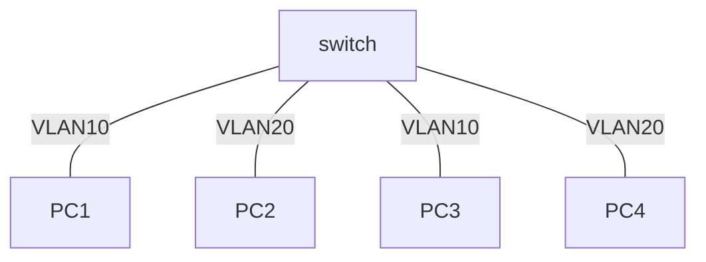
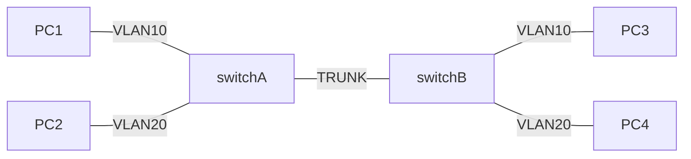

## 实验题目
VLAN实验
## 实验目的
掌握VLAN配置方法
## 实验说明
截屏只是记录一下实验结果，应尽量缩小，可以大致看清楚就可以了。注意实验开始前重启交换机：`#reload`
## 预备知识
- 两台交换机之间采用干道(trunk)端口连接，干道端口属于所有VLAN。非干道端口为普通VLAN接口(主机端口)，默认为VLAN 1。
- 进入干道的帧需要封装VLAN ID，使得接收方可以知道该帧来自哪个VLAN。从干道收到的没有封装VLAN ID的帧属于Native VLAN，默认为VLAN 1。

## 配置举例
- 启动VLAN 10`(config)#vlan 10`
- 把接口f0/5配置为VLAN 10接口`(config)#interface f0/5``(config-if)#switchport access vlan 10`
- 把接口f0/24配置为干道接口`(config)#interface f0/24``(config-if)#switchport mode trunk`
- 显示VLAN（不显示trunk接口）`#show vlan`
- 一般来说，取消某个配置在原来的语句前加上no和空格，但是不能取消`switchport mode trunk`而是先用`(config-if)#switchport mode access`重新设置为主机端口。
- 交换机不一定有f0/5等接口, 用`#show interface`查看一下接口名

## 实验任务
发送：用anysend发帧，选择实验网网卡（接口），修改MAC DA或MAC SA，然后发送（可以设置周期发送）。

接收：用WireShark接收帧，选择实验网网卡，选择ARP协议，设置filter:eth.src==0001.0EC3.0F0E(改为源主机地址)
复杂filter:eth.src==0001.0EC3.0F0E or eth.dst==0002.DEF5.2D13
### 用命令`ipconfig /all`查出实验网网卡的MAC地址:

|网卡|MAC地址|
|-|-|
|PC1|00-88-99-00-07-61|
|PC2|00-88-99-00-13-53|
|PC3|44-33-4C-0E-AD-C0|
|PC4|00-99-99-00-13-74|

### 按下图配置VLAN

#### PC1 分别向PC2、PC3和PC4发帧
##### 哪些主机可以收到？
PC3
##### 收到该帧的主机截屏WireShark：

#### PC2 发送广播帧
##### 哪些主机可以收到？
PC2 PC4
##### 收到该帧的主机截屏WireShark

#### Switch`#show vlan`并截屏

#### 分析实验结果
PC1、PC3属于同一个广播域，PC2、PC4属于同一个广播域，不同广播域之间发送的帧是收不到的。
### 按下图进行配置:

#### PC1 分别向PC2、PC3和PC4发帧
##### 哪些主机可以收到？
我们在这个实验里为PC1、PC2配置了VLAN10，为PC3、PC4配置了VLAN20，因此PC2收到（即和上图有区别）
##### 收到该帧的主机截屏WireShark

#### PC2 发广播帧
##### 哪些主机可以收到？
我们在这个实验里为PC1、PC2配置了VLAN10，为PC3、PC4配置了VLAN20，使用PC3发的广播帧，因此PC3和PC4收到
##### 收到该帧的主机截屏WireShark

#### SwitchA`#show vlan`并截屏

#### SwitchB`#show vlan`并截屏

#### 分析实验结果
我们在这个实验里为PC1、PC2配置了VLAN10，为PC3、PC4配置了VLAN20，因此PC1、PC2属于同一个广播域，PC3、PC4属于同一个广播域，不同广播域之间发送的帧是收不到的。
### 接上一步骤，将SwitchA和SwitchB的接口F0/24分别改为VLAN 10和VLAN 20：
#### PC1 分别向PC2、PC3和PC4发帧
##### 哪些主机可以收到？
PC4
##### 收到该帧的主机截屏WireShark：

#### PC2 发广播帧
##### 哪些主机可以收到？
由于我们的接线略有区别，我们是使用PC3发送的广播帧，没有主机收到
##### 收到该帧的主机截屏WireShark
不存在的
#### SwitchA`#show vlan`并截屏

#### SwitchB`#show vlan`并截屏

#### 分析实验结果
PC1发送的帧先被转发到同一交换机上同为VLAN10的接口，于是帧到达另外一个交换机；另外一个交换机是从配置为VLAN20的端口收到的帧，因此转发给这个交换机上另一个配置为VLAN20的端口的PC4

PC3发送的帧会被转发给同一交换机上同为VLAN20的接口或者干道，然而改变配置后均不存在，因此其发送的帧没有人可以收到。
## 实验体会
相对于上次实验，这次实验显得相对轻松，只用了一堂实验课而没有在课下继续来到实验室。整个实验过程中也没有特别多的问题，遇到的各种情况基本上都是符合心理预期的。通过这次实验，我对VLAN协议是怎样划分广播域以及多个交换机之间是怎样进行VLAN协议的有了更深的理解和体会。
