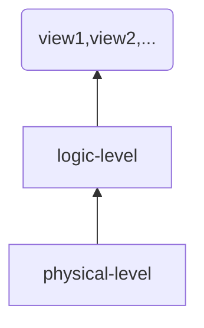

## 基本概念

### 数据库(database)

数据的集合

### 数据库管理系统(database-management system, DBMS)

由数据库, 和访问数据库的程序组成.

### 为什么需要数据库

操作系统已经有文件系统, 但基于文件系统管理数据有一些弊端:

## 使用文件处理系统作为数据库的几个问题

### 数据的冗余和不一致(data redundancy and inconsistency)

基于文件系统的存储可能由于程序设计过程中的疏漏, 使硬盘上同一份信息存有多份, 这带来了冗余和一致性的问题.

### 数据访问困难

- 数据管理接口不一致 :: 如果不统一管理数据的接口, 会增加程序员的沟通成本和开发成本.
- 数据存储格式不一致 :: 增加了程序开发的难度.

### 数据孤立性

### 完整性问题

数据的值必需满足特定的一致性约束(consistency constraint).

### 并发访问异常

对数据库的操作不保证原子性.

### 安全性问题

文件系统难以控制访问权限.

## 数据库的三个抽象层次

我们需要数据库管理系统为用户提供抽象. 数据库管理系统应该隐藏数据存储和维护的某些细节. 数据库管理系统有以下三个层次的抽象:

### 物理层(physical level)

描述数据是怎么存储的

### 逻辑层

描述数据的数据结构，以及数据间的关系

### 视图层（View Level）

只描述数据库的一部分, 因为用户常常只关系部分数据. 数据库管理系统可以提供多个视图.

应用隐藏数据类型的细节。视图也会根据安全方面的需求隐藏一些信息。

## 实例和模式

- 子模式 :: TODO
- 物理独立性 :: 应用程序不依赖物理模式

### 实例（Instance）

特定时刻储存在数据库中信息的集合.

### Schema（模式）

database的逻辑结构，数据库的总体设计.

#### PhysicalSchema

描述数据库的物理层设计

物理层描述数据库的模式

每个条目存储在的位置，以及便于检索的一些索引、与其他条目的关系。

#### LogicalSchema

逻辑层描述数据库的模式

## 数据模式

数据模型(data model)是描述数据库系统设计的概念工具的集合.

数据模型可划分为四类:

### 关系模型(relational model)

用表的集合表示数据间的联系. 每个表有多个列, 每个列的列名唯一.

### 实体-联系模型

用具有属性的实体及其之间的联系来描述数据.

#### 实体(entity)

某一类实体由属性名和实体名描述.

#### 属性(attribute)

用于刻画实体的特性.

#### 联系(relationship)

实体间的关联, 可以是一对一, 一对多, 多对多.

### 基于对象数据模型

### 半结构化数据模型

允许相同类型的数据项含有不同的属性集的数据说明. XML 可以用于表示半结构化数据.

## 数据库语言

### 数据操纵语言(DML)

帮助用户访问或操纵数据. 访问类型有增删查改.类型有:

### 过程化 DML

要求用户指定如何操纵数据.

### 声明化 DML

只要求用户指定需要操纵的数据.

### 数据定义语言(DDL)

定义数据库模式. 如果说 DML 操纵的是数据, 那么 DDL 操纵的是数据库的元数据(metadata), 元数据放置于数据字典.

#### 一致性约束

数据值必须满足某些一致性约束. 比如账户余额不能低于 100 美元.  数据库系统专注于可以最小代价测试的完整性约束.

##### 域约束

每个属性的所有可能的取值构成的一个域(整数, 字符, 日期等)

##### 参照完整性

TODO

##### 断言

域约束和参照完整性是特殊的断言. 但不足以描述所有断言需求, 比如, 账户的余额不小于 1000 美元.

##### 授权

不同用户在数据库中不同数据值上允许的访问类型不同.

## 关系数据库

关系数据库基于关系模型, 使用一系列表(元数据)来表达数据以及这些数据之间的联系.下面介绍 SQL 语言.

### 表

每个表有多个列, 每个列的名字唯一.

### 数据操纵语言

声明化

## 数据库系统模块

数据库系统的程序部分可以分为存储管理器和查询管理器.

### 存储管理器

负责数据库中数据的存储, 检索和更新.

- 权限及完整性管理器
- 事物管理器
- 文件管理器
- 缓冲区管理器

### 查询处理器

为用户提供操纵接口, 查询处理器会操纵存储管理器.

- 数据文件
- 数据字典
- 索引
