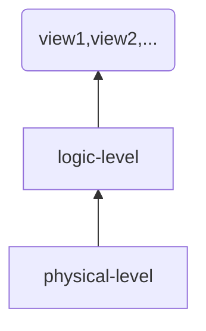

## 使用文件处理系统作为数据库的几个问题

### 数据的冗余和不一致

### 数据访问困难

### 数据孤立性

### 完整性问题

### 并发访问异常

### 安全性问题

## 数据库的三个抽象层次

### 物理层

描述数据是怎么存储的

### 逻辑层

描述数据的数据结构，以及数据间的关系

### 视图层（View Level）

应用隐藏数据类型的细节。视图也会根据安全方面的需求隐藏一些信息。

## 实例和模式

### Schema（模式）

database的逻辑结构

#### PhysicalSchema

物理层描述数据库的模式

每个条目存储在的位置，以及便于检索的一些索引、与其他条目的关系。

#### LogicalSchema

逻辑层描述数据库的模式

### Instance

#### 关系模型

#### 实体关系模型

#### 基于对象的数据模型

#### 半结构化数据模型

#### 网状数据模型

#### 层次数据模型

## 数据库语言

### 数据操纵语言（Data-Manipulation Language，DML）

### 数据定义语言（Data-Definition Language，DDL）

## 关系数据库

### 表

### 数据操纵语言

## 数据存储和查询

### 存储管理器

- 权限及完整性管理器
- 事物管理器
- 文件管理器
- 缓冲区管理器

- 数据文件
- 数据字典
- 索引
