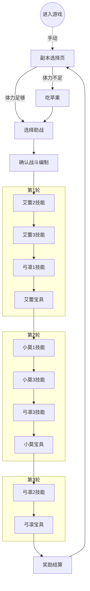

> 此为网易游戏在中山大学计算机科学与技术专业 2019~2020 学年第一学期开设的选修课程《移动互联网编程实践》作业。

课程报告地址：<https://wu-kan.github.io/posts/%E9%92%88%E5%AF%B9FGO%E7%9A%84%E8%87%AA%E5%8A%A8%E5%8C%96%E6%B5%8B%E8%AF%95%E5%AE%9E%E8%B7%B5>

Airtest 脚本开源地址：<https://github.com/wu-kan/FGO-AirTester.air>

Airtest 运行报告地址：<https://wu-kan.github.io/FGO-AirTester.air/log.html>

PerfDog 性能数据地址：<https://perfdog.qq.com/case_detail/336356>，Password: KBKmyX

完整测试视频地址：<https://www.bilibili.com/video/av80128598/>

## 作业主题

游戏的性能测试

## 作业内容

选择一款你喜欢的游戏，设计一段性能测试用例并执行测试，给出分析报告。

## 作业要求

- 测试用例：用思维导图描述测试方案
- 性能指标：列举指标及其具体含义
- 工具：若使用现有工具，介绍其使用方法
- 开发：根据需要可以适当开发，描述开发目的、思路及效果
- 结果分析：描述发现的性能问题（如果有）并分析原因，或者解释测试中的现象
- 平台：不限（安卓，IOS，Windows 等）
- 展示：挑选优秀作业展示
- 诚信：独立完成

## 实验环境

### 测试游戏

[Fate Grand Order](https://game.bilibili.com/fgo/)，国服版本号为 v1.55.244193。下述介绍截取自游戏官网。

> Fate 系列首款正版手游，100 万字剧情描绘史上最大圣杯战争！《FGO》剧情原案由 Fate 之父奈须蘑菇亲自执笔，长达 100 万字的小说级故事线将为您揭露多重背景设定！
>
> 史上最多英灵集结，跨越时代的终极召唤！在《FGO》中可召唤的从者包含了《Fate/Zero》、《Fate/stay night》等多部知名 Fate 作品中的经典角色，以及多位《FGO》首创英灵与您展开命运的羁绊，更有全新职阶首次于 Fate 系列中登场！
>
> 指令卡式战斗，原汁原味的日式 RPG！在《FGO》中，战斗通过对从者下达的命令用指令卡来表现，通过回合制的形式展开指令战斗。战斗分为战术阶段与指令阶段，根据您的选择，从者会分别发动攻击。己方攻击后，转为敌方行动。敌方行动后一回合结束。
>
> 50 多位知名画师参与英灵绘制，40 位以上声优倾情献声！《FGO》力邀武内崇在内的 50 余位知名画师组成超豪华美术团队，更特邀 Fate 系列原班声优参与配音！

### 测试工具

#### 自动化工具

[Airtest Windows(64bit) v1.2.2](http://airtest.netease.com/index.html)

Airtest 是由网易开源的一款基于 OpenCV 的跨平台的 UI 自动化框架，适用于游戏和 App。下述介绍来自于[其 GitHub 上的开源仓库](https://github.com/AirtestProject/Airtest/blob/master/README_zh.md)。

> - 各种运行：Airtest 提供了跨平台的 API，包括安装应用、模拟输入、断言等。 基于图像识别技术定位 UI 元素，你无需嵌入任何代码即可进行自动化。
> - 扩展性：Airtest 提供了命令行和 python 接口，可以很容易地在大规模设备集群上运行。自动生成的 HTML 报告，包含详细步骤和录屏，让你迅速定位失败点。
> - AirtestIDE： 是一个强大的 GUI 工具，可以帮助你录制和调试自动化脚本。 AirtestIDE 支持了完整的自动化流程：录制脚本->真机回放->生成报告。
> - Poco: Poco 框架可以直接访问 UI 控件，支持主流平台和游戏引擎。通过 Python API 操作 UI 控件，可以实现更强大的自动化控制。

这里是[官方教程](https://airtest.doc.io.netease.com/tutorial/0_automated_testing/)。

#### 性能测试工具

[PerfDog v3.2.191204](https://perfdog.qq.com/)

腾讯 WeTest 明星工具 PerfDog 在 2019 年 11 月正式对外发布（非常新的工具喔）。PerfDog 作为一款性能测试和分析工具，支持全平台的应用形态测试，包括 Android、iOS、小游戏、小程序、H5 等。且 Android 设备无需 ROOT，iOS 设备也无需越狱，能非常高效地解决两大系统测试分析的难题，提高测试工作的效率。

这里是[官方教程](https://perfdog.qq.com/support)。

### 开发环境

[VAIO Z Flip](https://us.vaio.com/products/vaio-z-flip)

- Intel(R) Core(TM) i7-6567U CPU @3.30GHZ 3.31GHz
- 8.00GB RAM
- Windows 10, 64-bit (Build 17763) 10.0.17763

### 测试环境

[Sony Xperia 10](https://www.sonymobile.com/hk/products/phones/xperia-10/)

- Qualcomm(R) Snapdragon(TM) 630
- 4.00GB RAM, 64.00GB ROM
- Android 9.0 (Pie)
- 1080 x 2520 pixels, 21:9 ratio, 6.0 inches, IPS LCD capacitive touchscreen
- 2870 mAh Battery

虽然是今年春季发布的新机器，但是配置非常之低，索尼大法诚不坑我…不过，卡牌类游戏对设备要求低，玩家 Android 多低端设备多样性带来设备适配问题，因此使用这台手机（~~就~~不仅是因为穷）所得到的测试结果也十分有参考意义。

## 测试用例

我针对 FGO 的 QP（打开宝物库之门）副本设计了一个自动化脚本。详细的脚本内容和完整测试视频已经放在开头的链接里，可自行查看。

下图是我使用的队伍编制。由于自动化测试过程中我希望尽量避免考虑额外的情况，因此没有使用热门的双 CBA+狂兰/伯爵的配置（依赖好友助战）。这个配置的方便之处在于，三轮战斗都只要靠丢技能和宝具就可以过关，不依赖于指令卡、助战和 Master 技能。

下面是一个完整的测试的流程图，这样安排技能和宝具的顺序可以最大化输出。

## 性能指标

使用的 PerfDog 工具在 Android 平台下，支持对以下数据的收集：

- ScreenShot(只支持 USB 模式)
- FPS(1 秒内游戏画面或者应用界面真实平均刷新次数，俗称帧率/FPS)
  1. Avg(FPS):平均帧率(一段时间内平均 FPS)
  2. Var(FPS):帧率方差(一段时间内 FPS 方差)
  3. Drop(FPS):降帧次数(平均每小时相邻两个 FPS 点下降大于 8 帧的次数)
- Jank(1s 内卡顿次数。iOS9.1 以下系统暂时不支持。类似 Android 的 Jank 卡顿和 iOS 的 FramePacing 平滑度统计原理。帧率 FPS 高并不能反映流畅或不卡顿。比如：FPS 为 50 帧，前 200ms 渲染一帧，后 800ms 渲染 49 帧，虽然帧率 50，但依然觉得非常卡顿。同时帧率 FPS 低，并不代表卡顿，比如无卡顿时均匀 FPS 为 15 帧。所以平均帧率 FPS 与卡顿无任何直接关系)
  1. BigJank:1s 内严重卡顿次数
  2. ank(/10 分钟):平均每 10 分钟卡顿次数。
  3. BigJank(/10 分钟):平均每 10 分钟严重卡顿次数
- FTime(上下帧画面显示时间间隔，即认为帧耗时)
  1. Avg(FTime):平均帧耗时
  2. Delta(FTime):增量耗时(平均每小时两帧之间时间差>100ms 的次数)
- CPU Usage(Total 整机/App 目标进程，统计结果和 Android Studio Profiler 一致)
- CPU Clock(各个 CPU 核心的频率和使用率)
- Memory (PSS Memory，统计结果和 Android Java API 标准结果一致，与 Meminfo 也一致。注：部分三星机器系统修改了 Meminfo 底层统计方式，导致 Meminfo 与 Java AP 统计结果不一致，新出三星机器已修复)
- Swap Memory (Swap Memory，部分设备支持 Swap 功能，在启用 Swap 功能后，系统会对 PSS 内存进行压缩，Swap 增加，PSS 会相应减少，由于压缩会占用 CPU 资源，同时相应会导致 FPS 降低)
- Virtual Memory(VSS)
- Memory Detail(NativePSS、GFX、GL、Unknown)
- GPU Usage(目前仅支持部分高通芯片手机)
- GPU Frequency(目前仅支持部分高通芯片手机)
- Network(Recv/Send)
- CTemp(CPU 温度)
- Battery Power(Current 电流、Voltage 电压、Power 功耗)（注：与仪器测试误差<3%左右）
- Log 日志采集(WIFI 模式下，不支持 Log 收集)

## 结果分析

由于（2019-12-21 晚上八点半左右）打开游戏的时候游戏有一个更新，因此采集到的数据前 5 分钟是没有在运行自动化测试的，实际上自动化测试运行了大约二十分钟。

此处为游戏的帧率数据，可以看到帧率在 11~30 之间抖动。由于帧率的数据比较密集，我们结合下面 CPU 的数据进行分析。

可以发现在游戏运行的过程中 CPU 占用大致在 50%左右，但是偶尔会有几处占用会飙升。我们结合之前帧率的数据，进行分析。

选择一个比较有代表性的时间点。在 13:10，即自动化测试开始运行到第 8 分钟的时候，CPU 占用有一个高峰点，对应时刻的帧率下降、抖动的也比较厉害。让我们打开自动化脚本的运行日志，检查一下。

和预期的一致，此处在运行的是艾蕾的宝具动画。由于 FGO 虽然是一款 2D 卡牌游戏，但是他的宝具动画实际上是使用 3D 渲染的（真·纸片人），因此在运行宝具动画的瞬间对计算性能的压力是比其他状态下要高的。

此处为游戏的内存占用数据。可以看到，游戏在主界面的内存占用大概在 600M 上下，进入副本后的占用会升到 700M。

由于使用的工具不支持对我的手机的 GPU 运行数据的收集，这里没有 GPU 的数据。

此处为游戏运行时候的网络占用情况。可以看到，除了刚开始打开游戏时候的一波更新占用了一些流量外，卡牌类游戏在运行的时候其实是不怎么吃流量的，游戏大部分的工作都是在本地客户端渲染完成。

由于手机是通过 USB 调试连接到我的笔记本上的，因此实际上是一直在充电的，电量消耗情况没有参考意义。不过，就事论事，PerfDog 这个工具本身是支持 wifi 下远程数据收集的，只是 Airtest 工具限制了我需要用 USB 连上笔记本。

## 遇到问题以及解决方法

### 同时开两个测试工具抢占 ADB 导致其中一个连接失败

被这个问题卡住了很久，后来发现网易的 Airtest 支持调整 ADB 连接模式，我调整成“Use javacap”之后就没问题了。

### 自动化测试的时候界面元素加载时间不确定

一开始我的解决方法是`sleep()`足够长的一段时间。~~（好蠢）~~

后来看了官方的文档，使用了`touch(wait(v,timeout))`的方法，这样就可以等待界面元素出现之后点击了。

### 艾蕾 2 技能和小莫 1 技能图标一样

我是使用 OpenCV 的图像匹配来定位界面元素位置的。然而，艾蕾和小莫的 2 个技能图标是完全一样的，因此对于她们的技能我需要手动定位到准确的坐标值上。

### 人物长得太像导致 OpenCV 匹配指令卡错误

众所周知，~~枪凛~~艾蕾和弓凛是两个角色，但是她们长得非常像~~doushiwolaopo~~。在最开始的几次测试中，我遇到了 OpenCV 将她们的宝具卡和指令卡认错，导致自动化测试进入死循环的情况。比如在下面这个场景中，~~由于发牌员的恩赐~~同时有六张长得非常相似的指令卡出现，很容易导致匹配错误。

我的解决方法是：选择界面中识别性较高的部分进行图像匹配。比如这里我是选择了宝具文字部分。

### 运行测试一段时间之后游戏体力不足

根据体力是否足够，增加了一个是否吃苹果（体力恢复道具）的预判。

### 改进方向

由于时间所限，我只实现了最基本的自动化测试脚本。事实上，只要时间允许，增加一些代码，我还想实现以下功能：

- 选择有满破蒙娜丽莎礼装的充能技能满级 CBA 好友助战（收益最大化）
- 增加一些别的副本支持
- 优化脚本（当前脚本运行一轮大概要五分钟，比自己手刷三四分钟的平均时间是要慢的）
- 增加自动化的程度，比如从打开游戏开始（要判断是否有更新、登陆界面、游戏公告、签到礼包等等…）
- 增加容错脚本，比如如果突然收到短信点错了…

一开始我想做的改进方向只有一两条，但是真的写下来却发现越写越多…写到最后我是不是真的可以百分之百的让机器替我玩游戏了呢！~~laopohaishizijide~~

## 实验感想

通过本次作业，我得以以一个游戏测试人员的角度重新看自己玩的游戏。一直以来，FGO 的界面卡顿就饱为玩家们所诟病，这一次的测试算是~~实锤~~验证了这一点。我觉得，这门课上学到的东西应用在自己的实践中的这段过程是非常有趣的，也确实让人学到了很多。

~~一个额外的收获是我以后刷 QP 岂不是都可以【手动狗头】…~~

总的来说，由于是自己正在玩的游戏，本次作业让我写的格外有动力！感谢这门课程给我的这次机会，也感谢网易和腾讯开发的非常好用的工具~
