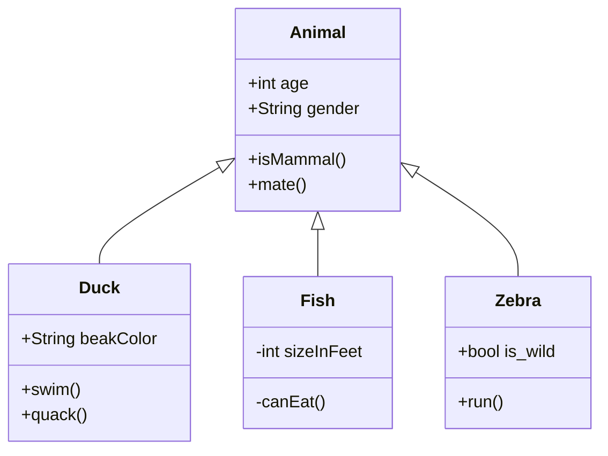

## 类图有几个图形符号？画出一个任意场景的类图，并简单解释

类图基本符号可拆分为虚线，箭头，实线，空心右三角，实心右三角，空心菱形和实心菱形。如下是一组动物类型的类图，由这些基本的图形进行组合构成了类图的基本符号。

解释：Animal 类描述了一些动物的固定属性和一些操作；Duck、Fish、Zebra三个类继承了前者，并有自己的属性和操作。

## UML 中的包是什么样子的，其作用是什么？UML 中有 package diagram 吗

包是基于模型元素的含义或作用将模型元素分组的一种机制，通过分组，可提高模型的维持性。

包图并非正式的 UML 图，包是 UML 的一种结构。

## 简述软件工程的 6 个最佳实践

1. 迭代的开发软件
2. 需求管理
3. 使用基于构件的体系结构
4. 可视化软件建模
5. 验证软件质量
6. 控制软件变更

## 解释对象、类、继承、聚合、多态、封装

- 类：类是对一组有着相同属性、操作、关系和语义的对象的描述；类是一种抽象，强调相关的特征、抑制其它的特征
- 对象：对象是有明确定义的边界和封装了状态和行为的实体；状态由属性和关系表示，行为由操作、方法和状态机表示
- 继承：使用已存在的定义做为基础建立新定义的技术。
- 聚合：在一个新的对象里面使用一些已有的对象，使之成为新对象的一部分：新的对象通过向这些对象的委派达到复用已有功能的目的。
- 多态：对于相同的消息，让各个对象产生不同的行为；允许将父对象设置成为一个或更多的他的子对象相等的技术。
- 封装：将类的某些信息隐藏在类内部，不允许外部程序直接访问，而是通过该类提供的方法来实现对隐藏信息的操作和访问。
