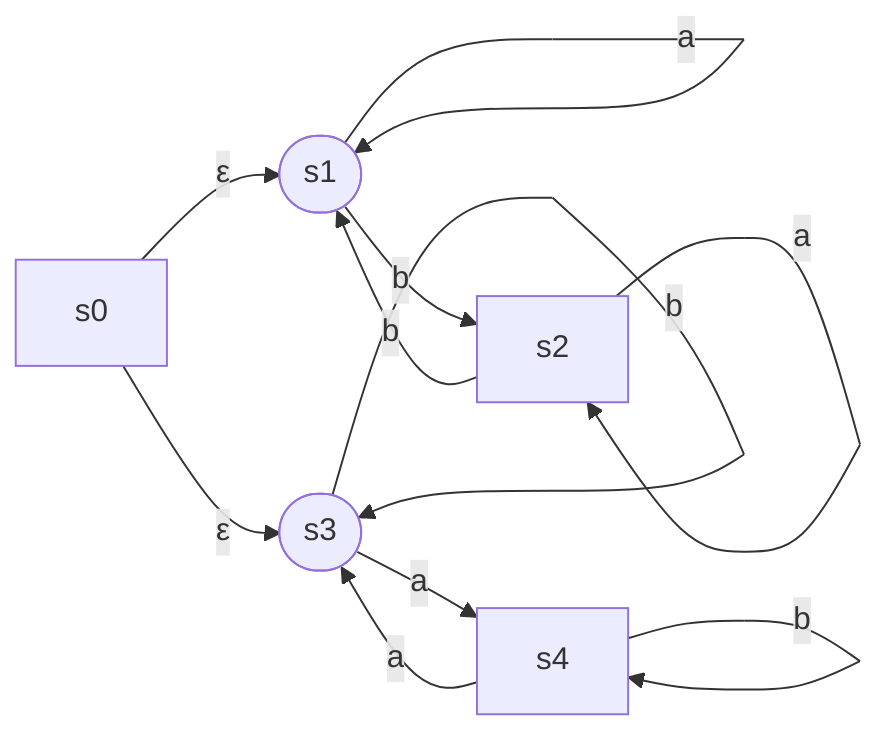
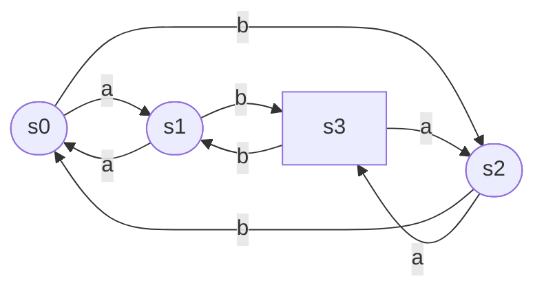
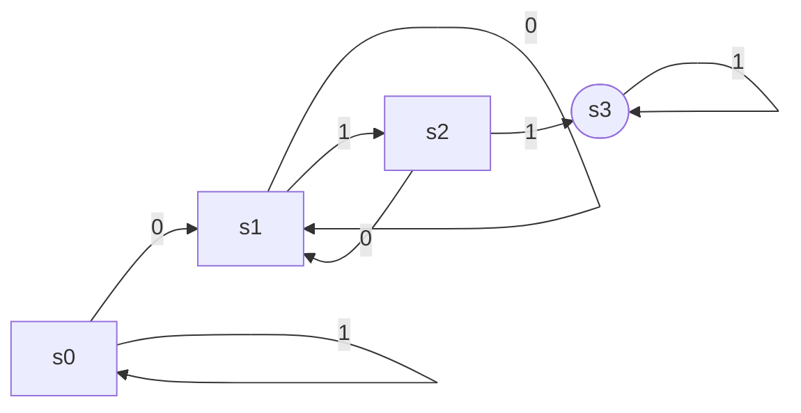
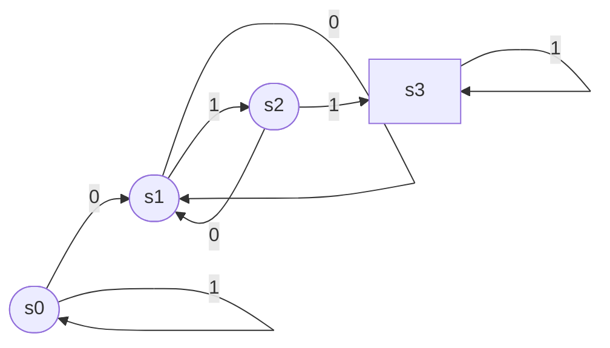
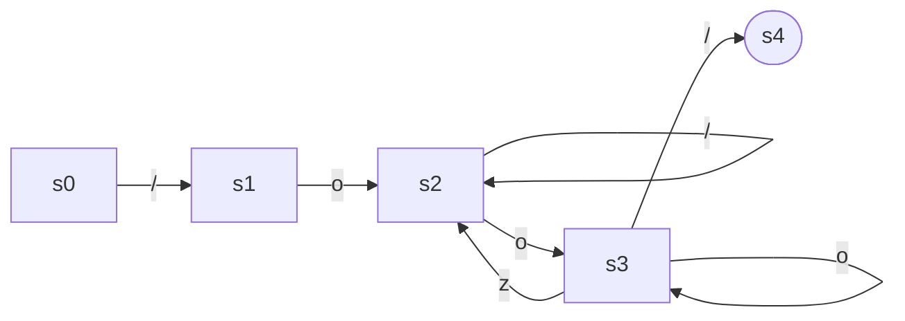

由画图工具所限，以下均以 s0 作为起始状态，椭圆形作为接收状态。

## 考虑以下 NFA

### 这一 NFA 接受什么语言（用自然语言描述）

由 a 和 b 构成的字符串，a 或 b 出现了偶数次。

### 构造接受同一语言的 DFA

## 正则语言补运算

### 画出一个 DFA，该 DFA 恰好识别所有含有 011 子串的二进制串

### 画出一个 DFA，该 DFA 恰好识别所有不含 011 子串的二进制串

### 再证明：对任一正则表达式 $R$，一定存在另一正则表达式 $R'$，使得 $L(R')$ 是 $L(R)$ 的补集

因为正则表达式和 DFA 是等价的，不妨设识别 $L(R)$ 的 DFA 为 $M$。由前两问容易发现，将 $M$ 中所有接收状态与非接收状态反转可得到 $M'$，它将识别 $L(R)$ 的补集 $L(R')$。再次利用正则表达式与 DFA 的等价性可以证明并求得 $R'$。

## 设有一门小小语言仅含 `z`、`o`、`/`（斜杠）3 个符号，该语言中的一个注释以一个`/o` 为开始标记，以此后出现的第一个 `o/`为结束标记

### 请给出单个正则表达式，它仅与一个完整的注释匹配，除此之外不匹配任何其他串。书写正则表达式时，要求仅使用最基本的正则表达式算子（$\varepsilon$，$\vert$，\*，+，？）

`/o((o*z)|/)*o+/`

## 给出识别上述正则表达式所定义语言的确定有限自动机（DFA）. 你可根据问题直接构造 DFA，不必运用机械的算法从上一小题的正则表达式转换得到 DFA

