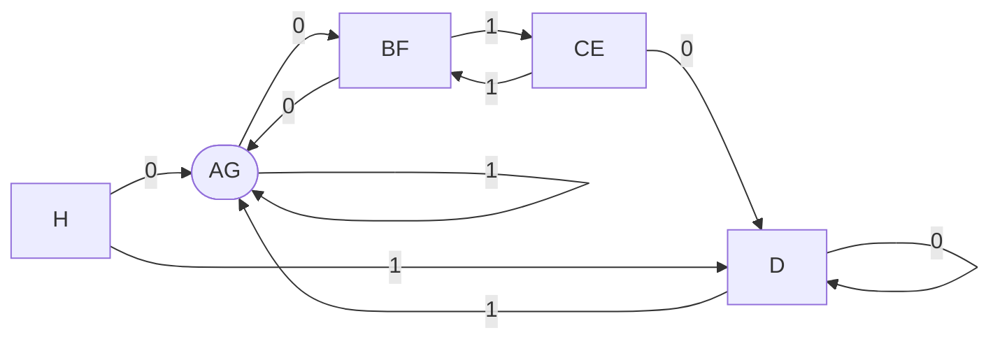

## 考虑以下 DFA 的状态迁移表，其中 0，1 为输入符号，A~H 代表状态，其中 A 为初始状态，D 为接受状态，请画出与此 DFA 等价的最小 DFA，并在新的 DFA 状态中标明它对应的原 DFA 状态的子集

|     | 0   | 1   |
| --- | --- | --- |
| A   | B   | A   |
| B   | A   | C   |
| C   | D   | B   |
| D   | D   | A   |
| E   | D   | F   |
| F   | G   | E   |
| G   | F   | G   |
| H   | G   | D   |

| 步骤 | $F$     | $S-F$                           |
| ---- | ------- | ------------------------------- |
| 1    | $\lbrace D\rbrace $ | $\lbrace A,B,C,E,F,G,H\rbrace $             |
| 2    | $\lbrace D\rbrace $ | $\lbrace C,E\rbrace ,\lbrace A,B,F,G,H\rbrace $         |
| 3   | $\lbrace D\rbrace $ | $\lbrace C,E\rbrace ,\lbrace A,G\rbrace ,\lbrace B,F\rbrace ,\lbrace H\rbrace $ |

由画图工具所限，以下均以椭圆形表示 Start 节点。

备注：按照教材 DFA 的算法，「死状态」H 会保留下来，但是从实用性的角度 H 去掉也无妨.

## 考虑所有含有 3 个状态（设为 p，q，r）的 DFA. 设只有 r 是接受状态. 至于哪一个状态是初始状态与本问题无关. 输入符号只有 0 和 1. 这样的 DFA 总共有 729 种不同的状态迁移函数，因为对于每一状态和每一输入符号，可能迁移到 3 个状态中的一个，所以总共有 3^6=729 种可能. 在这 729 个 DFA 中，有多少个 p 和 q 是不可区分的（indistinguishable）？解释你的答案

当 p 和 q 不可区分的时候，r 的迁移实际上与问题无关，因此 r 对输入 0 或者输入 1 各有三种可能的迁移，总共 $3\times 3=9$ 种可能，均符合题意。

下面考虑 p 和 q 的迁移，不妨考虑输入为 0 的情况：

1. 若 p 迁移到 r，则 q 也要迁移到 r，只有一种情况符合。
2. 若 p 迁移到 p，则 q 迁移到 p、q 都是符合的。
3. 若 p 迁移到 q，则 q 迁移到 p、q 都是符合的。

综上，当输入为 0 时 p、q 的迁移有五种情况符合。同理当输入为 1 的时候 p、q 的情况也有五种符合，因此 p、q 的迁移表有 $5\times 5=25$ 种情况符合，因此总共有 $9\times 25=225$ 个 DFA 符合题意。
