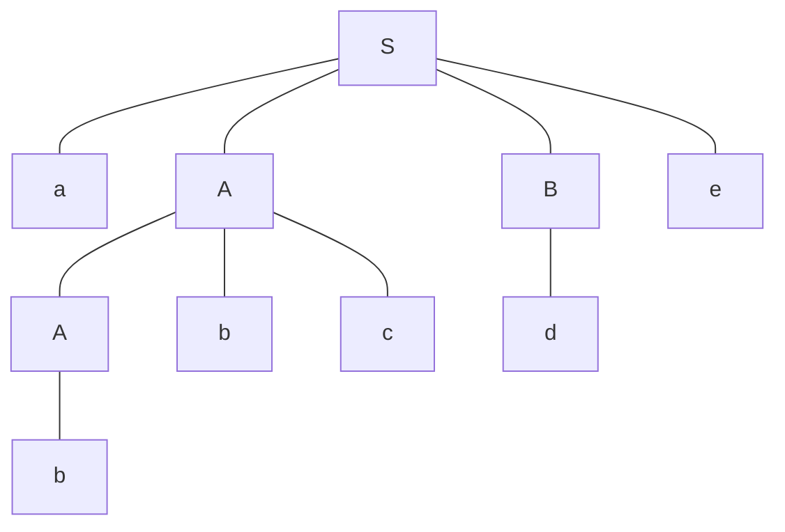
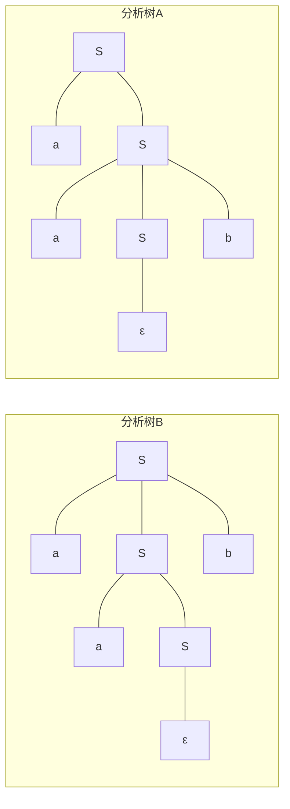

## 用上下文无关文法描述下列语言

### 定义在字母表 $\sum=\lbrace a, b\rbrace $ 上，所有首字符和尾字符相同的非空字符串

$$
S\to aRa\vert bRb\vert a\vert b \\
R\to Ra\vert Rb\vert \varepsilon
$$

1. $R$ 表示字典表是 $\sum$ 上的所有字符串
2. $S$ 在 $R$ 的基础上定义题目要求的串，注意到单个 $a$ 和 $b$ 也是符合要求的。

### $L=\lbrace 0^i1^j\vert 0\le i\le j \le 2i\rbrace $

$$
S\to 0S1\vert 0S11\vert\varepsilon
$$

1. 若 $S$ 符合要求，则 $0S1$ 符合要求，可得 $S\to 0S1$
2. 若 $S$ 符合要求，则 $0S11$ 符合要求，可得 $S\to 0S11$
3. 空串符合要求，可得 $S\to\varepsilon$

### 定义在字母表 $\sum =\lbrace 0, 1\rbrace $上，所有含有相同个数的 0 和 1 的字符串（包括空串）

$$
S\to SS\vert 0S1\vert 1S0 \vert\varepsilon
$$

1. 若首尾字母相同，那么原字符串一定能划分成两个符合要求的子串，于是得到 $S\to SS$
2. 若首尾字母不同，则去掉首尾字母仍然符合要求，于是得到 $S\to 0S1\vert 1S0$
3. 空串符合要求，得到 $S\to\varepsilon$

## 考虑以下文法

$$
S\to aABe \\
A\to Abc\vert b \\
B\to b
$$

### 用最左推导（leftmost derivation）推导出句子 abbcde

$$
S\Rightarrow aABe\Rightarrow aAbcBe \Rightarrow abbcBe \Rightarrow abbcde
$$

### 用最右推导（rightmost derivation）推导出句子 abbcde

$$
S\Rightarrow aABe \Rightarrow aAde \Rightarrow aAbcde \Rightarrow abbcde
$$

### 画出句子 abbcde 对应的分析树（parse tree）

## 考虑下述文法

$$
S \to aSb\\
S \to aS\\
S \to \varepsilon
$$

## 这一文法产生什么语言（用自然语言描述）

若干个 $a$ 紧接若干个 $b$ 的字符串，且 $a$ 的数量不少于 $b$ 。

## 证明这一文法是二义的

例如，对于串 $aab$ 可以产生下述两种分析树:

## 写出一个新的文法，要求新文法无二义且和上述文法产生相同的语言

$$
S\to aSb\vert R\\
R\to aR\vert \varepsilon
$$

由前一问可以知道，产生二义性的原因是，对于某些位置的 $a$ ，既可以从第一条规则得到，也可以由第二条规则得到。因此考虑定义一个新的只含有字母 $a$ 的串 $R$，这样就可以规定每一个 $a$ 是由哪一条规则得到的（不妨设串中有 $\alpha$ 个 $a$，$\beta$ 个 $b$ ，则由第一问有 $\alpha \ge \beta$）：

1. 如果对于特定位置的 $a$，它到最近的 $b$ 的距离小于等于 $\beta$，则它是由第一条规则得到的。
2. 如果对于特定位置的 $a$，它到最近的 $b$ 的距离大于 $\beta$，则它是由第二条规则得到的。
3. 对于所有的 $b$，它一定是由第一条规则得到的。

由此可以证明文法无二义，同时证明过程也推导了任意一个前述文法相同语言的过程，于是这个新的文法是符合要求的。
