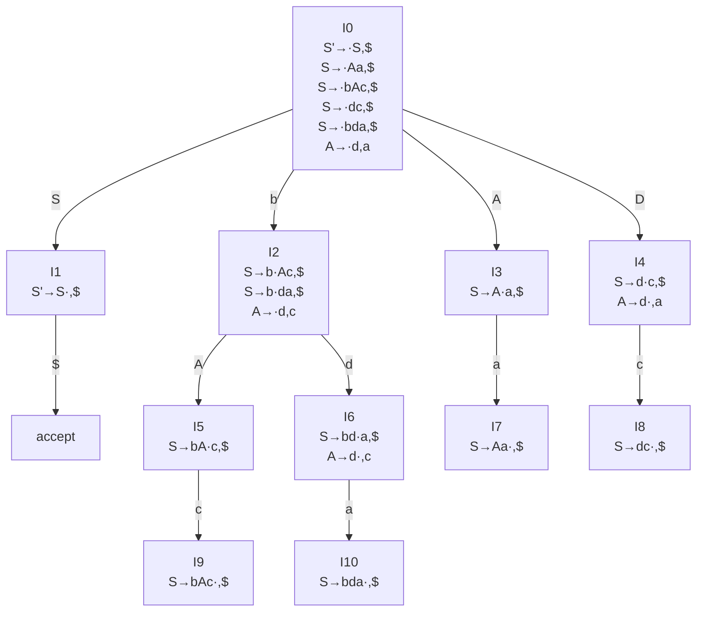
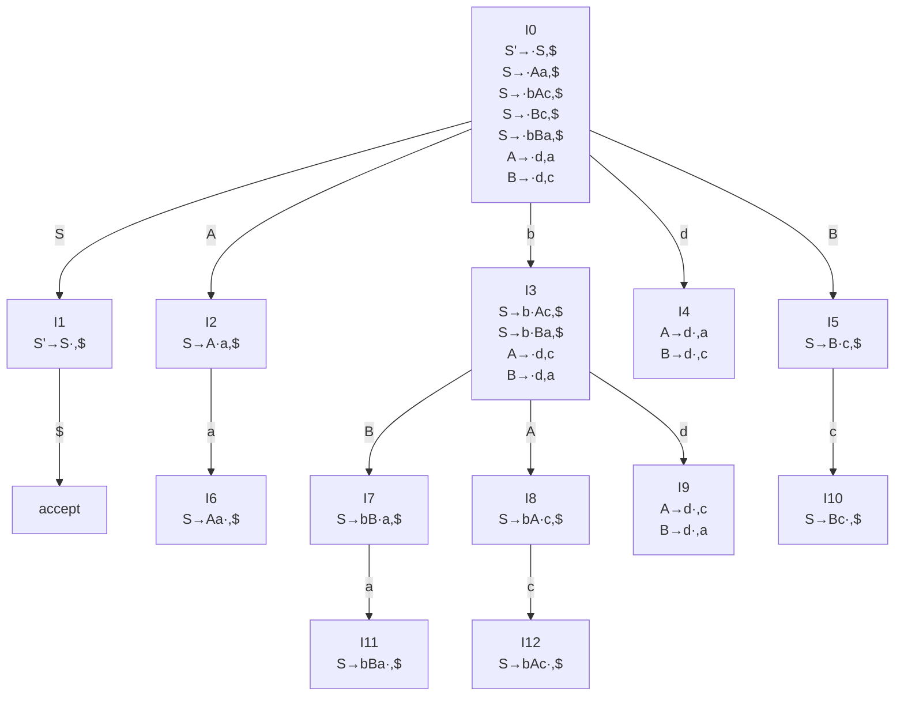

只需画出相应的自动机，并指出冲突的状态即可，不需要构造完整的分析表.

## 证明下列文法是 LALR(1) 文法但不是 SLR(1) 文法

$$
S\to Aa\vert bAc\vert dc\vert bda\\
A\to d
$$

以下是构造的 LR(1) 自动机，没有同核心的状态，不需要合并， LALR 分析表不冲突，因此是 LALR(1) 文法。

然而对于图中状态 I4 ，当输入符号为 $c$ 时，有 $c\in\lbrace a,c\rbrace =\text{FOLLOW}(A)$，同时有移进 $S\to d\cdot c$ 和规约 $S\to d\cdot$，因此不是 SLR(1) 文法。

## 证明下列文法是 LR(1) 文法但不是 LALR(1) 文法

$$
S\to Aa\vert bAc\vert dc\vert bBa\\
A\to d\\
B\to d
$$

使用增广文法增加新的开始符号 $S'$ 和产生式 $S'\to S$。以下是构造的自动机，显然 LR 分析表不冲突，因此是 LR(1) 文法。

将图中具有相同核心的 I4 和 I9 合并，会出现 $A\to d\cdot,a$ 和 $A\to d\cdot,c$ 的规约-规约冲突，因此不是 LALR(1) 文法。
