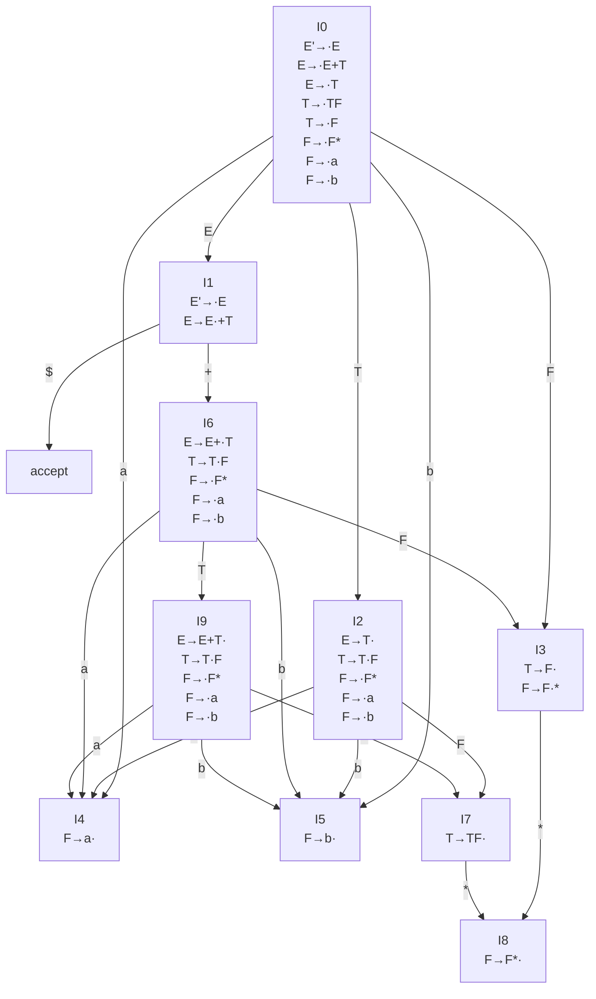

考虑以下文法

$$
E\to E+T\\
E\to T\\
T\to TF\\
T\to F\\
F\to F\mathop{\star}\\
F\to a\\
F\to b\\
$$

## 写出每个非终端符号的 FIRST 集和 FOLLOW 集

|     | FIRST | FOLLOW                                    |
| --- | ----- | ----------------------------------------- |
| $E$ | $a,b$ | $\text{\textdollar},+$                    |
| $T$ | $a,b$ | $\text{\textdollar},+,a,b$                |
| $F$ | $a,b$ | $\text{\textdollar},+,a,b,\mathop{\star}$ |

## 构造识别这一文法所有活前缀（viable prefixes）的 LR(0) 自动机（参照课本 4.6.2 节图 4.31）

使用增广文法增加新的开始符号 $E'$ 和产生式 $E'\to E$。

## 构造这一文法的 SLR 分析表（参照课本 4.6.3 节图 4.37）

| STATE | ACTION$a$ | ACTION$b$ | ACTION$+$ | ACTION$\mathop{\star}$ | ACTION$\text{\textdollar}$ | GOTO E | GOTO T | GOTO F |
| :---: | :-------: | :-------: | :-------: | :--------------------: | :------------------------: | :----: | :----: | :----: |
|   0   |    s4     |    s5     |           |                        |                            |   1    |   2    |   3    |
|   1   |           |           |    s6     |                        |           accept           |        |        |        |
|   2   |    s4     |    s5     |    r2     |                        |             r2             |        |        |   7    |
|   3   |    r4     |    r4     |    r4     |           s8           |             r4             |        |        |
|   4   |    r6     |    r6     |    r6     |           r6           |             r6             |        |        |        |
|   5   |    r7     |    r7     |    r7     |           r7           |             r7             |        |        |        |
|   6   |    s4     |    s5     |           |                        |                            |   9    |   3    |
|   7   |    r3     |    r3     |    r3     |           s8           |             r3             |        |        |        |
|   8   |    r5     |    r5     |    r5     |           r5           |             r5             |        |        |        |
|   9   |    s4     |    s5     |    r1     |                        |             r1             |        |        |   7    |

## 给出 SLR 分析器识别输入串 $a+ab\mathop{\star}$ 的过程（参照课本 4.6.4 节图 4.38）

| STACK  | SYMBOLS              |                                  INPUT | ACTION |
| :----- | :------------------- | -------------------------------------: | :----: |
| 0      |                      | $a+ab\mathop{\star}\text{\textdollar}$ | shift  |
| 04     | $a$                  |  $+ab\mathop{\star}\text{\textdollar}$ | reduce |
| 03     | $F$                  |  $+ab\mathop{\star}\text{\textdollar}$ | reduce |
| 02     | $T$                  |  $+ab\mathop{\star}\text{\textdollar}$ | reduce |
| 01     | $E$                  |  $+ab\mathop{\star}\text{\textdollar}$ | shift  |
| 016    | $E+$                 |   $ab\mathop{\star}\text{\textdollar}$ | shift  |
| 0164   | $E+a$                |    $b\mathop{\star}\text{\textdollar}$ | reduce |
| 0163   | $E+F$                |    $b\mathop{\star}\text{\textdollar}$ | reduce |
| 0169   | $E+T$                |    $b\mathop{\star}\text{\textdollar}$ | shift  |
| 01695  | $E+Tb$               |     $\mathop{\star}\text{\textdollar}$ | reduce |
| 01697  | $E+TF$               |     $\mathop{\star}\text{\textdollar}$ | shift  |
| 016978 | $E+TF\mathop{\star}$ |                   $\text{\textdollar}$ | reduce |
| 01697  | $E+TF$               |                   $\text{\textdollar}$ | reduce |
| 0169   | $E+T$                |                   $\text{\textdollar}$ | reduce |
| 01     | $E$                  |                   $\text{\textdollar}$ | accept |
