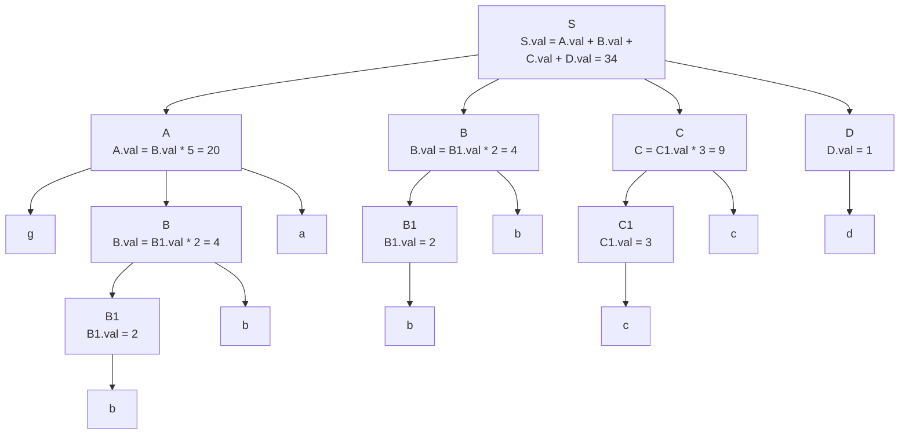

## 考虑以下语法制导定义（Syntax Directed Definition），对于输入串 gbbabbccd 构造带注释的分析树（annotated parse tree）

| 语法规则    | 语义规则                                |
| ----------- | --------------------------------------- |
| $S\to ABCD$ | `S.val = A.val + B.val + C.val + D.val` |
| $A\to gBa$  | `A.val = B.val * 5`                     |
| $B\to B1b$  | `B.val = B1.val * 2`                    |
| $B\to b$    | `B.val = 2`                             |
| $C\to C1c$  | `C.val = C1.val * 3`                    |
| $C\to c$    | `C.val = 3`                             |
| $D\to d$    | `D.val = 1`                             |

## 以下文法定义了二进制浮点数常量的语法规则。试给出一个 S 属性的语法制导定义，其作用是求出该二进制浮点数的十进制值，并存放在开始符号 S 相关联的一个综合属性 value 中。例如，对于输入串 101.101，S 的 value 属性值结果应该是 5.625。要求在编写语法制导定义时，不得改写文法

$$
S\to L.L\vert L\\
L\to LB\vert B\\
B\to 0\vert 1
$$

| 语法规则       | 语义规则                                        |
| -------------- | ----------------------------------------------- |
| $S\to L$       | `S.val = L.val`                                 |
| $S\to L_1.L_2$ | `S.val = L1.val + L2.val * pow(0.5, L2.len)`    |
| $L\to L_1B$    | `L.val = L1.val *2 + B.val, L.len = L1.len + 1` |
| $L\to B$       | `L.val = B.val, L.len = 1`                      |
| $B\to 0$       | `B.val = 0`                                     |
| $B\to 1$       | `B.val = 1`                                     |
