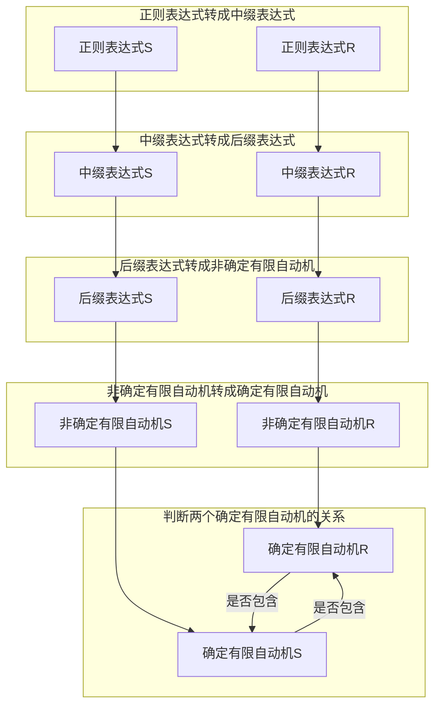
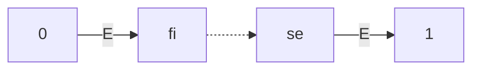
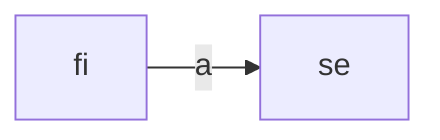
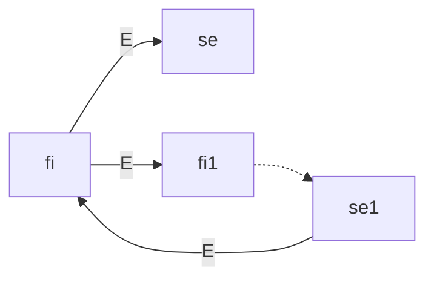
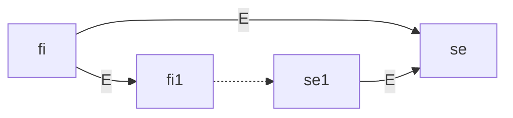
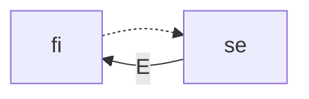
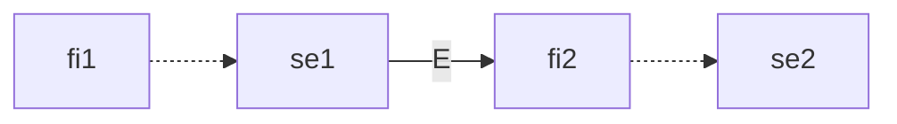
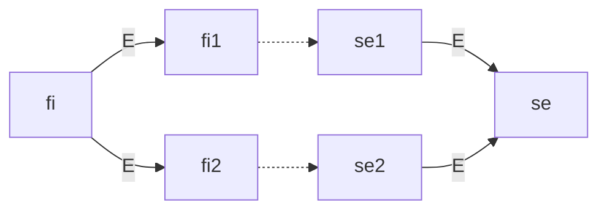

![成绩]

## Description

对于两个正则表达式 r 和 s，判断这两个正则表达式的关系。正则表达式的关系有 4 种：

1. r 和 s 等价，即 r 描述的语言和 s 描述的语言相等；
2. r 描述的语言是 s 描述的语言的真子集；
3. s 描述的语言是 r 描述的语言的真子集；
4. 非上述情况。

输入的正则表达式只包含小写字母`a`-`z`, `|`, `*`, `?`, `+`, `E`, `(`, `)`。其中，`a`-`z`是所描述语言字符集中的字符，`E` 表示 epsilon（空串），其它符号含义和教材相同。

请编写一个 C++ 程序实现上述功能。

## Input

第一行是测试数组的组数 T。

接下来的 T 行，每行是两个正则表达式 r 和 s，每个正则表达式只包含 `a`-`z`, `|`, `\*`, `?`, `+`, `E`, `(`, `)`。两个正则表达式之间用一个空格隔开。

## Output

输出有 T 行。对于每组数据，如果 r 和 s 等价，输出 `=`；如果 r 是 s 的真子集，输出 `<`；如果 s 是 r 的真子集，输出 `>`；非上述情况，输出 `!`。

## 实验原理

要判断两个正则表达式的关系，我有如下的思路：

1. 正则表达式转成中缀表达式
2. 中缀表达式转成后缀表达式
3. 后缀表达式转成非确定有限自动机
4. 非确定有限自动机转成确定有限自动机
5. 判断两个确定有限自动机的关系



算法的大致流程如上图，接下来我详细介绍每一部分的算法。

### 正则表达式转成中缀表达式

这一步主要将正则表达式中省略的连接运算符（`&`，即 cat）加上，方便计算机运算。需要添加 `&` 的有六种情况：

1. 两个字符相连，如 `aa`
2. 字符和左括号相连，如 `a(`
3. 单目运算符和字符相连，如 `*a`
4. 单目运算符和左括号相连，如 `*(`
5. 右括号和字符相连，如`)a`
6. 右左括号相连，如 `)(`

总结起来就是：当第一位是字符、单目运算符或右括号，且第二位为字符或左括号时，需要在他们中间加一个连接运算符。于是很容易得到下面的代码。

```cpp
string regex_to_infix(string s)
{
	for (int i = 0; i + 1 < s.size(); ++i)
		if (isalpha(s[i]) || s[i] == '?' || s[i] == '+' || s[i] == '*' || s[i] == ')')
			if (isalpha(s[i + 1]) || s[i + 1] == '(')
				s.insert(i + 1, "&");
	return s;
}
```

以表达式`(a|b)*abb`为例，预处理后的表达式为：`(a|b)*&a&b&b`。要注意，此处运算符的优先级别从高到低依次为：

1. 单目运算符 `?`、`+`、`*`
2. 连接运算符 `&`
3. 或运算符 `|`

### 中缀表达式转成后缀表达式

[之前的实验](https://wu-kan.cn/_posts/2020-05-26-%E8%AF%AD%E6%B3%95%E5%88%86%E6%9E%90/#%E4%B8%AD%E7%BC%80%E8%BD%AC%E5%90%8E%E7%BC%80) 里已经做过中缀转后缀的程序了，稍作修改就可以用在本程序中。转换过程中用到一个运算符栈，具体过程如下:

1. 如果遇到字符，直接将其输出。
2. 如果遇到运算符：
   - 遇到左括号 `(` 直接压入栈中；
   - 遇到右括号 `)` 重复将栈里的运算符弹出直到遇到 `(`，将 `(` 弹栈但不输出；
   - 遇到其他运算符：
     - 如果栈为空，直接将运算符压入栈中；
     - 如果栈不为空，弹出栈中优先级大于等于当前运算符的运算符并输出，再将当前运算符入栈。

当输入串读取完之后，如果栈不为空，则将栈中元素依次出栈并输出。

```cpp
string infix_to_suffix(const string &s)
{
	string str, stak;
	static const unordered_map<char, int> priority{
		{'?', 3},
		{'+', 3},
		{'*', 3},
		{'&', 2},
		{'|', 1},
		{'(', 0}};
	for (int i = 0; i < s.size(); ++i)
	{
		if (isalpha(s[i]))
			str.push_back(s[i]);
		else if (s[i] == ')')
		{
			while (stak.back() != '(')
			{
				str.push_back(stak.back());
				stak.pop_back();
			}
			stak.pop_back();
		}
		else if (s[i] == '(')
			stak.push_back(s[i]);
		else
		{
			while (!stak.empty() && priority.at(stak.back()) >= priority.at(s[i]))
			{
				str.push_back(stak.back());
				stak.pop_back();
			}
			stak.push_back(s[i]);
		}
	}
	str.insert(str.end(), stak.rbegin(), stak.rend());
	return str;
}
```

### 后缀表达式转成非确定有限自动机

我认为这一步是本次实验的核心。我设计了一个图结构于存储非确定有限自动机，其包含下述内容：

1. 边集 `e`，其中每条**有向**边包含
   - 起点 `first`
   - 终点 `second`
   - 迁移字符 `ch`
2. 点集 `v`，其中每个顶点包含
   - 出边表 `o`，保存每条以当前顶点为起点的边的序号
   - 是否为接收状态 `isAccepted`
3. 增加一条边 `void add(const Edge &ed);`
   - 当加入边的顶点大小超过当前点集大小的时候会自动扩张
4. 计算一个图上顶点集合的闭包 `vector<int> closure(vector<int> se) const;`
   - 后续 NFA 转 DFA 时会用到
5. 计算一个集合的 a_move `vector<int> a_move(const vector<int> &se, char a) const;`
   - 后续 NFA 转 DFA 时会用到

```cpp
struct Graph
{
	struct Vertex
	{
		vector<int> o;
		int isAccepted;
		Vertex() : isAccepted(0), o(0) {}
	};
	struct Edge
	{
		int first, second;
		char ch;
	};
	vector<Vertex> v;
	vector<Edge> e;
	Graph(int n = 0) : v(n) {}
	void add(const Edge &ed);
	vector<int> closure(vector<int> se) const;
	vector<int> a_move(const vector<int> &se, char a) const;
};
```

转换过程中要用到一个保存**顶点对**的栈。按顺序读取后缀表达式，每次读取一个字符，然后根据读取的不同字符，按照不同策略更新当前的图，详见下文。最后栈顶的顶点对 `{fi, se}` 就是所得 NFA 的初始状态和唯一接受状态；为方便起见，我又按照如下方式连边：



这样所得到的 NFA 一定是以状态 0 作为初始状态，状态 1 作为唯一接收状态。

#### 遇到字符

如果遇到字符（此处用`a`代替），则在图上新建两个顶点 `fi`、`se`，在他们之间连一条迁移字符为 `a` 的边，如下图所示。



然后将顶点对 `{fi, se}` 压栈。

```cpp
int fi = nfa.v.size(),
	se = nfa.v.size() + 1;
nfa.add({fi, se, s[i]});
stak.push_back({fi, se});
```

#### 遇到 `*`

如果遇到闭包运算符 `*`，则在图上新建两个顶点 `fi`、`se`，从栈中弹出一个顶点对 `{fi1, se1}`，按照如下方式连边（其中`fi1`到`se1`的边已经在之前连过了，无需重连）：



然后将顶点对 `{fi, se}` 压栈。

```cpp
int fi = nfa.v.size(),
	se = nfa.v.size() + 1,
	fi1 = stak.back().first,
	se1 = stak.back().second;
stak.back() = {fi, se};
nfa.add({fi, se, 'E'});
nfa.add({fi, fi1, 'E'});
nfa.add({se1, fi, 'E'});
```

#### 遇到 `?`

虽然可以直接把正则表达式中 `a?` 转换成 `E|a`，但是在前缀表达式转中缀表达式过程中做转换有些复杂，因此这一步放在创建自动机的过程中。

在图上新建两个顶点 `fi`、`se`，从栈中弹出一个顶点对 `{fi1, se1}`，按照如下方式连边（其中`fi1`到`se1`的边已经在之前连过了，无需重连）：



然后将顶点对 `{fi, se}` 压栈。

```cpp
int fi = nfa.v.size(),
	se = nfa.v.size() + 1,
	fi1 = stak.back().first,
	se1 = stak.back().second;
stak.back() = {fi, se};
nfa.add({fi, se, 'E'});
nfa.add({fi, fi1, 'E'});
nfa.add({se1, se, 'E'});
```

#### 遇到 `+`

虽然可以直接把正则表达式中 `a+` 转换成 `aa*`，但是在前缀表达式转中缀表达式过程中做转换有些复杂，因此这一步放在创建自动机的过程中。

不需要创建新节点，直接从栈中弹出一个顶点对 `{fi, se}`，按照如下方式连边（其中一条边已经在之前连过了，无需重连）：



然后将顶点对 `{fi, se}` 重新压栈。

```cpp
int fi1 = stak.back().first,
	se1 = stak.back().second;
nfa.add({se1, fi1, 'E'});
```

#### 遇到 `&`

不需要创建新节点，直接从栈中弹出两个顶点对 `{fi1, se1}`、`{fi2, se2}`，按照如下方式连边（其中两条边已经在之前连过了，无需重连）：



然后将顶点对 `{fi1, se2}` 重新压栈。

```cpp
int fi2 = stak.back().first,
	se2 = stak.back().second;
stak.pop_back();
int fi1 = stak.back().first,
	se1 = stak.back().second;
stak.back().second = se2;
nfa.add({se1, fi2, 'E'});
```

#### 遇到 `|`

在图上新建两个顶点 `fi`、`se`，从栈中弹出两个顶点对 `{fi1, se1}`、`{fi2, se2}`，按照如下方式连边（其中两条边已经在之前连过了，无需重连）：



然后将顶点对 `{fi, se}` 重新压栈。

```cpp
int fi2 = stak.back().first,
	se2 = stak.back().second;
stak.pop_back();
int fi = nfa.v.size(),
	se = nfa.v.size() + 1,
	fi1 = stak.back().first,
se1 = stak.back().second;
stak.back() = {fi, se};
nfa.add({fi, fi1, 'E'});
nfa.add({fi, fi2, 'E'});
nfa.add({se1, se, 'E'});
nfa.add({se2, se, 'E'});
```

### 非确定有限自动机转成确定有限自动机

此处使用了课本上的算法，其算法如下：

1. 一开始 `d_state` 中只有一个状态 `nfa.closure({0})`，且无标记
2. 选择 `d_state` 中一个无标记的状态 `T`
3. 给 `T` 打标记
4. 对于每个输入字符 `a`
   1. 计算 `U = nfa.closure(nfa.a_move(se, a))`
   2. 如果 `U` 不在 `d_state` 中，将 `U` 加入 `d_state` 且不打标记
   3. 建立转移状态 `{T, U, a}`
5. 如果 `d_state` 中存在一个无标记的状态返回第二步，否则算法结束

其中，计算闭包和 a_move 均只要在图上遍历一下即可，此处不再详述。

```cpp
Graph nfa_to_dfa(const Graph &nfa)
{
	struct ID : map<vector<int>, int>
	{
		int ask(const vector<int> &v)
		{
			if (count(v))
				return at(v);
			int s = size();
			return insert({v, s}), s;
		}
	} d_state;
	Graph dfa;
	for (vector<vector<int>> stak(1, nfa.closure({0})); !stak.empty();)
	{
		vector<int> se = stak.back();
		stak.pop_back();
		int id = d_state.ask(se);
		for (char a = 'a'; a <= 'z'; ++a)
		{
			vector<int> se2 = nfa.closure(nfa.a_move(se, a));
			if (!d_state.count(se2))
				stak.push_back(se2);
			dfa.add({id, d_state.ask(se2), a});
		}
	}
	for (ID::iterator it = d_state.begin(); it != d_state.end(); ++it)
		if (find(it->first.begin(), it->first.end(), 1) != it->first.end())
			dfa.v[it->second].isAccepted = 1;
	return dfa;
}
```

### 判断两个确定有限自动机的关系

这一步才是主要实现实验要求的部分，实际上这里只要实现一个检查“包含”关系的函数即可，然后按照

1. 如果 r 包含 s 且 s 包含 r，则 r 和 s 等价
2. 如果 r 不包含 s 且 s 包含 r，则 r 描述的语言是 s 描述的语言的真子集
3. 如果 r 包含 s 且 s 不包含 r，则 s 描述的语言是 r 描述的语言的真子集
4. 非上述情况

得到答案。而要判断有限自动机的包含关系，可以通过一次搜索遍历完成。

```cpp
int contain(const Graph &lhs, const Graph &rhs)
{
	vector<vector<int>> vis(lhs.v.size(), vector<int>(rhs.v.size(), 0));
	for (vector<pair<int, int>> q(vis[0][0] = 1, {0, 0}); !q.empty();)
	{
		int xl = q.back().first,
			xr = q.back().second;
		q.pop_back();
		if (lhs.v[xl].isAccepted < rhs.v[xr].isAccepted)
			return 0;
		for (int i = 0; i < lhs.v[xl].o.size(); ++i)
		{
			int yl = lhs.e[lhs.v[xl].o[i]].second,
				yr = rhs.e[rhs.v[xr].o[i]].second;
			if (!vis[yl][yr])
				vis[yl][yr] = 1, q.push_back({yl, yr});
		}
	}
	return 1;
}
```

这段代码同时经过了 [History of Languages](https://vjudge.net/solution/26302640) 这道题目的测试，可以验证它的正确性！

## 实验过程

我的实验环境是：

- Intel(R) Core(TM) i7-6567U CPU @3.30GHZ 3.31GHz
- 8.00GB RAM
- Windows 10 2004 19041.264, 64-bit
  - Visual Studio Code 1.47.0
    - Remote - WSL 0.44.4：配合 WSL，在 Windows 上获得 Linux 接近原生环境的体验。
  - Windows Subsystem for Linux [Ubuntu 20.04 LTS]：WSL 是以软件的形式运行在 Windows 下的 Linux 子系统，是近些年微软推出来的新工具，可以在 Windows 系统上原生运行 Linux。
    - gcc version 9.3.0 (Ubuntu 9.3.0-10ubuntu2)

在 Linux 终端依次执行下述指令可以将我的代码 `regex_cmp.cpp` 编译成可执行文件 `regex_cmp`。然后运行这个程序并计时，将输入重定向到 `input.txt`，将输出重定向到 `output.txt`。

```bash
$ g++ -std=c++11 -O3 -o regex_cmp regex_cmp.cpp
$ time ./regex_cmp < input.txt > output.txt

real    0m0.010s
user    0m0.000s
sys     0m0.000s
```

可以看到，在我的机器上，十组测试数据只花费了十毫秒左右的时间就全部计算完毕，运行效率还是非常高的。

### 样例输入 `input.txt`

这里我构造了十组测试数据。前六组测试数据分别用于检验我的程序能不能够正确处理 `?`、`+`、`*`、`&`（正则表达式中省略了连接运算符）、`|`、`E`（空集）；第七到第十组数据是我构造的复杂一点的例子，其中第十组数据识别的语言也是之前作业写过的“[小小语言](https://wu-kan.cn/_posts/2020-04-28-%E7%BC%96%E8%AF%91%E5%8E%9F%E7%90%86-%E4%BA%8C/#%E8%AE%BE%E6%9C%89%E4%B8%80%E9%97%A8%E5%B0%8F%E5%B0%8F%E8%AF%AD%E8%A8%80%E4%BB%85%E5%90%AB-zo%E6%96%9C%E6%9D%A03-%E4%B8%AA%E7%AC%A6%E5%8F%B7%E8%AF%A5%E8%AF%AD%E8%A8%80%E4%B8%AD%E7%9A%84%E4%B8%80%E4%B8%AA%E6%B3%A8%E9%87%8A%E4%BB%A5%E4%B8%80%E4%B8%AAo-%E4%B8%BA%E5%BC%80%E5%A7%8B%E6%A0%87%E8%AE%B0%E4%BB%A5%E6%AD%A4%E5%90%8E%E5%87%BA%E7%8E%B0%E7%9A%84%E7%AC%AC%E4%B8%80%E4%B8%AA-o%E4%B8%BA%E7%BB%93%E6%9D%9F%E6%A0%87%E8%AE%B0)”（将原字符集中的 `/` 换成 `a`）。

```bash
10
a a?
a a+
a a*
a ab
a a|b
a* (a|E)*
a(a|b)* a(ab)?+b
a(a|b)* a(ab)*b
a(ab)*b a(a|b)*ab
ao(o*z|a)*o+a aoa*(za*|o)*oa
```

### 样例输出 `output.txt`

容易手动验证这里结果的正确性。

```bash
<
<
<
!
<
=
>
>
!
=
```

### 测试数据 `testdata.in`

这组数据是老师提供的，当然我的结果也是正确的。

```bash
5
((E|a)b*)* (a|b)*
b*a*b?a* b*a*ba*|b*a*
b*a*b?a* (b*|a*)(b|E)a*
(c|d)*c(c|d)(c|d) (c|d)*d(c|d)(c|d)
x+y+z+ x*y*z*
```

### 测试答案 `testdata.out`

```bash
=
=
>
!
<
```

### 源代码 `regex_cmp.cpp`

得益于（自认为）非常不错的数据封装，此处仅用了**不到 240 行**代码（且未压行）就实现了所有功能！（[网上一些实现](https://github.com/GgBondXiang/RexToMinDFA) 仅将正则表达式转成自动机就用了近一千行代码）

```cpp
#include <bits/stdc++.h>
using namespace std;
struct Graph
{
	struct Vertex
	{
		vector<int> o;
		int isAccepted;
		Vertex() : isAccepted(0), o(0) {}
	};
	struct Edge
	{
		int first, second;
		char ch;
	};
	vector<Vertex> v;
	vector<Edge> e;
	Graph(int n = 0) : v(n) {}
	void add(const Edge &ed)
	{
		if (v.size() < max(ed.first, ed.second) + 1)
			v.resize(max(ed.first, ed.second) + 1);
		v[ed.first].o.push_back(e.size());
		e.push_back(ed);
	}
	vector<int> closure(vector<int> se) const
	{
		vector<int> vis(v.size(), 0);
		while (!se.empty())
		{
			int u = se.back();
			se.pop_back();
			vis[u] = 1;
			for (int i = 0, k; i < v[u].o.size(); ++i)
				if (k = v[u].o[i], !vis[e[k].second] && e[k].ch == 'E')
				{
					vis[e[k].second] = 1;
					se.push_back(e[k].second);
				}
		}
		for (int i = 0; i < vis.size(); ++i)
			if (vis[i])
				se.push_back(i);
		return se;
	}
	vector<int> a_move(const vector<int> &se, char a) const
	{
		vector<int> vis(v.size(), 0), ans;
		for (int j = 0; j < se.size(); ++j)
			for (int u = se[j], i = 0, k; i < v[u].o.size(); ++i)
				if (k = v[u].o[i], e[k].ch == a && !vis[e[k].second])
					vis[e[k].second] = 1;
		for (int i = 0; i < vis.size(); ++i)
			if (vis[i])
				ans.push_back(i);
		return ans;
	}
};
string regex_to_infix(string s)
{
	for (int i = 0; i + 1 < s.size(); ++i)
		if (isalpha(s[i]) || s[i] == '?' || s[i] == '+' || s[i] == '*' || s[i] == ')')
			if (isalpha(s[i + 1]) || s[i + 1] == '(')
				s.insert(i + 1, "&");
	return s;
}
string infix_to_suffix(const string &s)
{
	string str, stak;
	static const unordered_map<char, int> priority{
		{'?', 3},
		{'+', 3},
		{'*', 3},
		{'&', 2},
		{'|', 1},
		{'(', 0}};
	for (int i = 0; i < s.size(); ++i)
	{
		if (isalpha(s[i]))
			str.push_back(s[i]);
		else if (s[i] == ')')
		{
			while (stak.back() != '(')
			{
				str.push_back(stak.back());
				stak.pop_back();
			}
			stak.pop_back();
		}
		else if (s[i] == '(')
			stak.push_back(s[i]);
		else
		{
			while (!stak.empty() && priority.at(stak.back()) >= priority.at(s[i]))
			{
				str.push_back(stak.back());
				stak.pop_back();
			}
			stak.push_back(s[i]);
		}
	}
	str.insert(str.end(), stak.rbegin(), stak.rend());
	return str;
}
Graph suffix_to_nfa(const string &s)
{
	vector<pair<int, int>> stak;
	Graph nfa(2);
	for (int i = 0; i < s.size(); ++i)
	{
		if (s[i] == '?')
		{
			int fi = nfa.v.size(),
				se = nfa.v.size() + 1,
				fi1 = stak.back().first,
				se1 = stak.back().second;
			stak.back() = {fi, se};
			nfa.add({fi, se, 'E'});
			nfa.add({fi, fi1, 'E'});
			nfa.add({se1, se, 'E'});
		}
		else if (s[i] == '+')
		{
			int fi1 = stak.back().first,
				se1 = stak.back().second;
			nfa.add({se1, fi1, 'E'});
		}
		else if (s[i] == '*')
		{
			int fi = nfa.v.size(),
				se = nfa.v.size() + 1,
				fi1 = stak.back().first,
				se1 = stak.back().second;
			stak.back() = {fi, se};
			nfa.add({fi, se, 'E'});
			nfa.add({fi, fi1, 'E'});
			nfa.add({se1, fi, 'E'});
		}
		else if (s[i] == '&')
		{
			int fi2 = stak.back().first,
				se2 = stak.back().second;
			stak.pop_back();
			int fi1 = stak.back().first,
				se1 = stak.back().second;
			stak.back().second = se2;
			nfa.add({se1, fi2, 'E'});
		}
		else if (s[i] == '|')
		{
			int fi2 = stak.back().first,
				se2 = stak.back().second;
			stak.pop_back();
			int fi = nfa.v.size(),
				se = nfa.v.size() + 1,
				fi1 = stak.back().first,
				se1 = stak.back().second;
			stak.back() = {fi, se};
			nfa.add({fi, fi1, 'E'});
			nfa.add({fi, fi2, 'E'});
			nfa.add({se1, se, 'E'});
			nfa.add({se2, se, 'E'});
		}
		else
		{
			int fi = nfa.v.size(), se = nfa.v.size() + 1;
			nfa.add({fi, se, s[i]});
			stak.push_back({fi, se});
		}
	}
	nfa.add({0, stak.back().first, 'E'});
	nfa.add({stak.back().second, 1, 'E'});
	nfa.v[1].isAccepted = 1;
	return nfa;
}
Graph nfa_to_dfa(const Graph &nfa)
{
	struct ID : map<vector<int>, int>
	{
		int ask(const vector<int> &v)
		{
			if (count(v))
				return at(v);
			int s = size();
			return insert({v, s}), s;
		}
	} d_state;
	Graph dfa;
	for (vector<vector<int>> stak(1, nfa.closure({0})); !stak.empty();)
	{
		vector<int> se = stak.back();
		stak.pop_back();
		int id = d_state.ask(se);
		for (char a = 'a'; a <= 'z'; ++a)
		{
			vector<int> se2 = nfa.closure(nfa.a_move(se, a));
			if (!d_state.count(se2))
				stak.push_back(se2);
			dfa.add({id, d_state.ask(se2), a});
		}
	}
	for (ID::iterator it = d_state.begin(); it != d_state.end(); ++it)
		if (find(it->first.begin(), it->first.end(), 1) != it->first.end())
			dfa.v[it->second].isAccepted = 1;
	return dfa;
}
int contain(const Graph &lhs, const Graph &rhs)
{
	vector<vector<int>> vis(lhs.v.size(), vector<int>(rhs.v.size(), 0));
	for (vector<pair<int, int>> q(vis[0][0] = 1, {0, 0}); !q.empty();)
	{
		int xl = q.back().first,
			xr = q.back().second;
		q.pop_back();
		if (lhs.v[xl].isAccepted < rhs.v[xr].isAccepted)
			return 0;
		for (int i = 0; i < lhs.v[xl].o.size(); ++i)
		{
			int yl = lhs.e[lhs.v[xl].o[i]].second,
				yr = rhs.e[rhs.v[xr].o[i]].second;
			if (!vis[yl][yr])
				vis[yl][yr] = 1, q.push_back({yl, yr});
		}
	}
	return 1;
}
int main()
{
	int t;
	for (cin >> t; t--;)
	{
		string a, b;
		cin >> a >> b;
		const Graph
			dfa = nfa_to_dfa(suffix_to_nfa(infix_to_suffix(regex_to_infix(a)))),
			dfb = nfa_to_dfa(suffix_to_nfa(infix_to_suffix(regex_to_infix(b))));
		cout << "!<>="[contain(dfa, dfb) << 1 | contain(dfb, dfa)] << "\n";
	}
}
```

[成绩]: data:image/webp;base64,UklGRvAKAABXRUJQVlA4IOQKAACwXQCdASp7CD8AP73a524+M7EqIpDJk8A3iWdu/C45q+stXcVX8pf67uE8Ba/A3N/Od+u6xvFQy+V4t5aeQhvMp398hPpLdmX2HdIvfJrLKqv7IPJKFS75w5FVX9kHklCpd84ciqr+yDyShUu+cORVV/ZB5JQqXfOHIqq/sg8koVLvnDkVVf2QeR9ykT9h7lVyMeLbhJUgirEuKFaDrBKaWOxhHk0+3STNyHLquDNya0JqL5jyVjoQeDB9V/6gawQUsWX6DUz9sZnTV0XouVdwO0D8uAYEqi4ELyP8RjeK35x2WVUtASZ2eBNB0ET1g/6mXjUOVNct/Pt5tlrn/Cn6FsN0MoiqqmB6+1cSkHDrjjKnssVn3dI68P4xoOajt3xk41+C2h//TTe+TWNm3/U2artWvJKFS75w5EplJa66X1GJnYKARu1kb9bujtbqKqnkkzoijO7IPHMmVS9ko+v7IOclzzVQaQvDjU4ciUyb2YdTaQbQdV03eTaAFfjd/42vzkWuJuqupAbEJn4uHYyMn7c2ojbx17ZARqf3BNuDyRv7sKJ7WsICkwxs8OZOxGLNLyAjSnakvOFLRNia9Wn6QKf6d2h5CQEo3DRJtiOXYC8ORVV+b6nePyVJTBxkNFQpL+J8KCyaqmdFiLsUZ3RXgpDzl3oSWeGSpALWzvAajw7rTThWiWZ9Oi2ChwIDqUIoUzO81CmMKaamssl2LZibUyUXsbywVM5HvJKE/QCVCVOmAHspML96hFVX9kHkkiLy7CD/t0CL2Cf73J/ZsBMKhSQj31wGRmxGwDMIiKzjSrSkDb5QOi7mTPEMnQsx+WcdFLP9sszSfBM9cJjxyKquUEUcGDjurRwBmRFfYNSKquVAm84Z6c/b8xQr6/XE6QAq+kJRei77EuB/G54CG8WHprScwxq98mss/o5dc75w5FVbd0EBv7IPKAHt3yayyrFPZB5JQqXfOHIqq/sg8koVL1h3sLvnDkVVf2QerPZB5JQqXrBUAAD9ROCdD2T18FFH2lrUas4XmWyYWK/W7Pg+AAAAA2j4V2FIVUqssQ6ZyrdMtC7RaUTbRCexI9FSeIMNrsysckAhhkgsRa++TvPzn6gtoF5Fk5gARFyKfzS25ZEmfO1ugpgbt9oDirYP6hc3IrUHRrOZl8c8BXr3SCXosP0fILaZrsh4Ous07a6siLszRtepUNM55UwX6YiFenOaw9Y37AAqzN18uFgJ3EyEmc9dvIS5swKldP+P4R2KL9oT7vcjlE4Ikj6tWCs+Lch6gUHJ5+DDRYLmv/M2Z2DFNZvHZW+QOCpsdeWEUu4sqQc9/WAK+81yQEIc4te6gf3JKdylbd6MHsomRNPGJSr547sfrRnV9PaVAxTeAa8TiGc9iXCxR5s0GmAzn9fyZOfM5G8OVFa5ORJmNyVCoUHqDyEhdXUSTFnKuqlFDsII+c+HPBkhPGfjiVIxfmcjHLGFGIHnSbv7mZwMk+0Ct10aq9t6G05IjSRHn3v9gwnN51lJ9UMPd6wHWjCJI42qbzJMkP2KhVtOMYxYZoc+fyWFKii+vjWfXCS7OcPZEh+BKSKO6Y441Afq2isJmcsjKqsPuESp6eNJeOVy2MW90aQWjkuOQ/GzLRN0S/BQy2soKLzUzSP+bTeH/qdRurKEKR8T3zNy6OGyTZw9jn4oh8+OSVqx+BKSKO6lWwIF78h9uB8lwW4YQe6uYb6/PmawV5/Iy/FHn4akoIQSlrfjWRYQou9ALfw9au8Sa3ddDSHQcnoN1Jy5nnXJYDiFbDvmYeXn8XbyBlRySm+IZ/wYwx8vaZcsu5n6RaUOJVku3BYzPty67k6dQD2pxYQowIYyWkhvyHVk3fzbCWL11ntdNw7mxlQpdt2iUDR2k1CD0zk313yQtOr2DAjxTlEhO2qB2xY71XmI/NlCVOKyZitDOjcYxmNz8NHe95QdRwcNXcDkspmRd1aUhTBipTqAdIOMXYdTW2Y916NEvXhtQcn6YrVgYb4kHwvkURuF1e4hc+AVsJxElM3nVEBxs/gL4wG2SaM8DqPznk65DdmSnrdS1KVS9GyqpCOChmrmfbAYkCe/YK1e9JVv3Q+RjINhBeXGtUpLPZp4ImijeXlA841o7fSLP1I3VIxFRS2ExihvbHYkN+AywEsFC+lQHqmgtEFXH6mhZHa3H5qqoQAhyaWZqIFqlru1lQOJSWi/BVhMN4ivwZhu2DW1u05DzFXFPsI+3RgBL9XB40jmHLK1UtE9GAB4iB6rbgb06grjZd0cxNRrumb4SidytCNErBusltFsEn5IAkzGmfvQhlVEcVO/vl+xvDO+oZgK1PHm0XUYig8WxIjqu1BYHUq0jRtuAKfV4EBA+Oz2jGUNftpVW6kFMZ4U+CDN9of0otW95B3d7A2W9ITDCbyHvc6jLeCtxXEIuZU2foFXNMlUK3kljY37Wr4bOk2ape/VUW2AAJY0I1VT2vXI7fKBjqmoY+bsgZ20LEKga/sCuFP4tPZpnf/IyxRBsKsuOaHLBVLyq0q45djEZZ7JYgRIYwfwviUEqKt6O1sOKjCLWDnWuwfk0DY2rX3rhzRgQ1QI3YTaYUxTgJCsRzWuZ/VPeiiqYX0g0BPI6kkYmDR+l/piCRA5qvskkQUm9cfWONldZDKPT2TYbJ6qGM764CeJ7diqr0nuoteNWI25JXWfT7yO+Vexqf6icdW7J0JIIxxZT7C9ltstmuB436wlG2rFc64YmWVW7QHuvGMsGwjeW8QWUL6i1Fw7qvjA5luUf0fA724y+teEOmbOjQNE+M01yZUHFVsLLgEvJQCVjNdBMffcTv0wrDl+R/9ocWtqlAMQPd+E+bhSL+XCgDSZpmwCBx6vv7WrtsjLLKQL8X4T/GAahcbind4Pv4sWFFswBXrwImYe/D54dUA5d6K6F6tKnpbgqQcgFCr3JYS0TSGj94wgxh4FgDCJEQ1nwQS0EKNsIc5pnNC1GwBcdcjG+aLe46ufCPjpC5Abmn3Kjf4HEEY3Csx+QAgezWq/uZKy2O0XvlgDwMptQXM4G1HvhZUT7X8mWULL4RRB7obU4oG6AGKTtxfd8tr/F++LhJ1gzAR+KfY0RvCfdYJPC3ia3tyvrISM0P69m5yM2f39VOw6G7r6brsViI7Xh0FKV6hL8tEWp/XDx3F+JJdWx5kBLlRiEREFGiVDyF7HpC0OTj4wDsur7uVFaTS/15Q+WTDnNVgX7pnithOmf5cmADn41w2WVUz059/4iSWaHVPjwjTLoqsiLZ0OslrGqxZw/7mmzELF8FBe9VMVPrp1xO5Z/BOb9INlkCMJkQepZvjwcrLsBVt3hD94VsyAeCwHVC5nPE2eiekCjLrVEU0bkwcYIP24ems8uSMEYC/KKX59zcDpRnMS9c2KkyjNtIOtmWbU5wOp80fwolN8OifHJu9Jrpokr/65ICXYmFnvBiWsCFwKsOSQ3FvPENdzzAnxUdWeXEOUb7slb7KkfUx98eR8+/WoEbdIsm3kDHJM0uNyuSov77GRg9hSlGax/VzlaPEKPQhkGn01vVuU4/pIMyQFU3sB7gAgEn324Ki0rj7dGYD/kkmRsasU06LaQhwj+50et6sxlBOg2hwT41tI4qJaKA6EOmYvrAgVkJ5MZYl+qK7Zhwu5JRJx252amfjmCWyMtjpWpp3KhJ16cjRDWgkZbiJPhlKv7VPrmYUAAAAAAAAA
