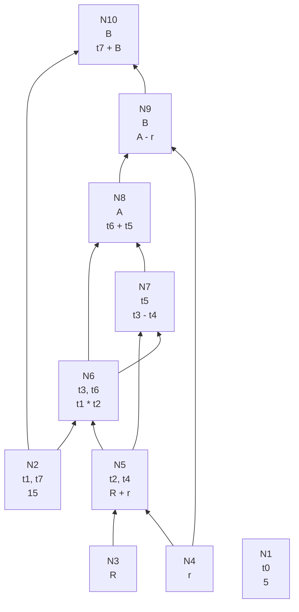
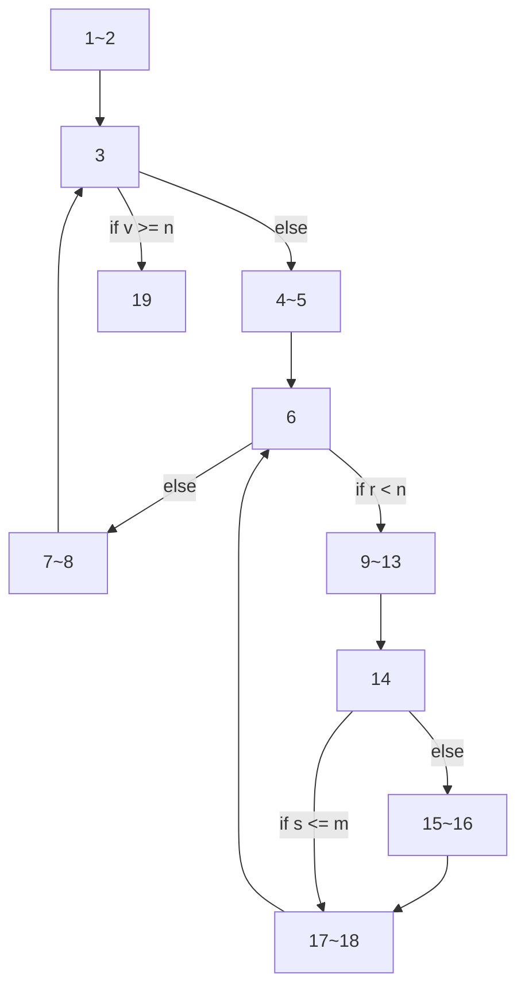

## 考虑以下基本块

```c
t0 = 5;
t1 = 3 * t0;
t2 = R + r;
t3 = t1 * t2;
t4 = t2;
t5 = t3 - t4;
t6 = t1 * t2;
A = t6 + t5;
B = A – r;
t7 = t1;
B = t7 + B;
```

### 构造这一基本块的 DAG



### 假设只有 A 和 B 在基本块后面还要被引用, 产生优化后的三地址代码

```bash
t2 = R + r;
t3 = 15 * t2;
t5 = t3 - t2;
A = t3 + t5;
B = A - r;
B = B + 15;
```

## 考虑下列代码片段, 为这段代码划分基本块（Basic Block），并画出控制流图（Control Flow Graph）. 在答案中你可以直接画出控制流图，但对图中的每个结点，请用 m~n 表示相应的基本块由第 m 至第 n 条语句组成

```python
m = 0               // 1
v = 0               // 2
if v >= n goto (19) // 3
r = v               // 4
s = 0               // 5
if r < n goto (9)   // 6
v = v + 1           // 7
goto (3)            // 8
s = v + r           // 9
y = 0 * x           // 10
z = v - y           // 11
x = z + r           // 12
r = m - x           // 13
if s <= m goto (17) // 14
m = s               // 15
s = s + r           // 16
r = r+1             // 17
goto (6)            // 18
return m            // 19
```

在下面的控制流图中，每个节点代表一个划分的基本块。


