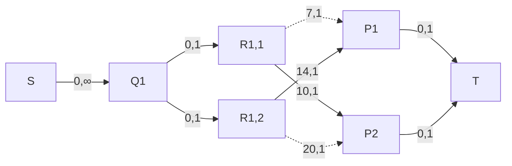

预计难度：CF Div2-

[题目数据&现场榜单](https://github.com/wu-kan/SYSU-Collegiate-Programming-Contest-2020--Online)

## Welcome to SYSU

Sun Yat-sen University, originally known as National Guangdong University, was founded in 1924 by Dr. Sun Yat-sen (also called Sun Zhongshan), a great democratic revolutionary leader of the 20th century. The University is located in Guangdong Province, an area neighboring Hong Kong and Macao, which is at the forefront of China's reform and opening up.


Being one of the leading universities in the People's Republic of China, Sun Yat-sen University is a comprehensive multi-disciplinary university, including the humanities, social sciences, natural sciences, technical sciences, medical sciences, pharmacology, and management science. At present, Sun Yat-sen University covers a total area of 6.17 square kilometers and has 4 campuses: Guangzhou South Campus, Guangzhou North Campus, Guangzhou East Campus, and Zhuhai Campus.

### Input

The input contains a positive integers n.

$1\le n\le 12$

### output

You should output the lexicographically N-th string with the same letters(2\*`S`+1\*`Y`+1\*`U`) as `SYSU`.

### Sample Input 1

```bash
1
```

### Sample Output 1

```bash
SSUY
```

### Sample Input 2

```bash
5
```

### Sample Output 2

```bash
SYSU
```

### Source

吴坎

### Solution

题目大意：输出与 `SYSU` 字母相同的字典序第 $n$ 小的串。

熟悉 STL 的同学可以直接使用 `next_permutation` 解决.

```cpp
#include <bits/stdc++.h>
using namespace std;
int main()
{
	string s("SYSU");
	sort(s.begin(), s.end());
	int n;
	for (scanf("%d", &n); --n;)
		next_permutation(s.begin(), s.end());
	printf("%s", s.c_str());
}
```

不熟的同学直接手算然后打表也是可以的啦~


~~欢迎报考中山大学！~~

## Formula

This formula is written as an equation about the length of edges A, B and C, which is usually called Pythagorean law.

$A^2 + B^2 = C^2$

Where $C$ is the length of the slanted side and $A$ and $B$ are the lengths of the other two sides.

Given $n$, you need to compute right triangles with side lengths $A$, $B$ and $C$ satisfying inequality $1 \le A \le B \le C \le n$.

### Input

The first line of input contains an integer $n~(1\leq n\leq 10000)$.

### Output

The first line of input contains an integer donating the answer.

### Sample Input

```bash
5
```

### Sample Output

```bash
1
```

### Note

3, 4, 5

### Source

范俭豪

### Solution

暴力枚举 a，b 即可。

```cpp
#include <bits/stdc++.h>
using namespace std;
int main()
{
	int n, ans = 0;
	scanf("%d", &n);
	for (int a = 1; a <= n; ++a)
		for (int b = a; b <= n; ++b)
		{
			double cc = sqrt(a * a + b * b);
			int c = cc;
			if (b <= c && c <= n && c == cc)
				++ans;
		}
	printf("%d", ans);
}
```

~~如果担心时间被卡的话打表也是毫无问题的。~~

## Island

A tour group is trapped on an island. The island can be regarded as a matrix of equal side length.

Each grid is either an obstacle (character `#`), a tourist (character `O`), or an open space (character `.`), visitors can walk up, down, left, right(to neighboring grid), but can't walk over obstacles.

Ask how many tourists can never get out of the island.

### Input

First line of the input is an integer $T$($1\le T \le 10$) indicating the number of test cases.

For each case, the first line contains an integer $n$ ($1\le n \le 50$) indicating the side length of island, each of the following $n$ lines contains a string with exact n charactors(obstacle `#`, tourist `O` or space `.`).

### Output

For each case output one integer per line, the number of tourist(s) cannot get out of the island.

### Sample Input

```bash
1
4
O.##
.#O#
#O.#
.###
```

### Sample Output

```bash
2
```

### Source

梁赛波

### Solution

题目大意：给定一个 $n\times n$ 矩阵，每个点要么是游客，要么是空地，要么是障碍物，每个人每次可以朝上下左右任一方向走一格，问有多少人最终可以走出矩阵。

暴力的做法是，每个游客分别以他初始位置为起点，搜索（BFS/DFS）出到达矩阵之外的路径，时间复杂度 $O(Tn^4)$

可以发现如果某个格子可以最终走出矩阵，那么所有路过该格子的人都可以最终走出矩阵。

上述搜索过程一旦走到**最终可以逃出**的格子，就可以立即返回。每个格子只会被遍历一次，时间复杂度 $O(Tn^2)$。

同样的时间复杂度，也可以从矩阵的非障碍边界开始向内搜索，能到达的游客格子肯定可以沿着相反的路逃出去。



```cpp
#include <bits/stdc++.h>
using namespace std;
const pair<int, int> dir[4] = {{-1, 0}, {0, 1}, {1, 0}, {0, -1}};
const int maxn = 105;
char a[maxn][maxn];
bool vis[maxn][maxn];
int main()
{
	int _;
	cin >> _;
	while (_--)
	{
		int n;
		cin >> n;
		memset(vis, 0, sizeof(vis));
		for (int i = 0; i < n; i++)
			cin >> a[i];
		queue<pair<int, int>> q;
		for (int i = 0; i < n; i++)
		{
			for (int j = 0; j < n; j++)
			{
				if ((i == 0 || j == 0 || i == n - 1 || j == n - 1) && a[i][j] != '#')
				{
					vis[i][j] = true;
					q.emplace(i, j);
				}
			}
		}
		while (q.size())
		{
			auto it = q.front();
			q.pop();
			for (int i = 0; i < 4; i++)
			{
				int r = it.first + dir[i].first;
				int c = it.second + dir[i].second;
				if (r < 0 || r >= n || c < 0 || c >= n)
					continue;
				if (vis[r][c] || a[r][c] == '#')
					continue;
				vis[r][c] = true;
				q.emplace(r, c);
			}
		}
		int ans = 0;
		for (int i = 0; i < n; i++)
		{
			for (int j = 0; j < n; j++)
			{
				if (!vis[i][j] && a[i][j] == 'O')
					ans++;
			}
		}
		cout << ans << "\n";
	}
}
```



## Liz and the Blue Bird

After a long thought, Liz made a tough decision. When the girl came back home from picking raspberries with delight. Liz said goodbye to the girl with smile. A basket of raspberries dropped, scattering on the floor. “You are ought to be free and use your lightsome wings to fly to everywhere you want.” “Why? I just want to stay with you forever. Only by your side can I taste the sweet of happiness.” “I am the cage that traps you. You have wings and vast sky to explore. I can't deprive you of your wings,” Liz opened the door, smiling mildly. “So just leave here and fly high. Please let me watch your beautiful figure go away,” Liz held out her hand, “That's the way I convey my feelings.” She paused and took a deep breath “I love you.” The girl sobbed, stepped slowly towards door. She looked back, with love, with unwillingness, and turned into a blue bird, flying away.

[](https://twitter.com/Lyytoaoitori/status/1073908097414946817)

After the blue bird flew away, Liz still missed her very much. Worrying that she and other small animals might be caught in a storm again, Liz decided to transplant trees in the woods to cover as much area as possible. There were $n$ trees in the woods, and each tree $T_i$ can be represented as a closed interval $[a_i,b_i]$. Liz wanted to find a solution so that all intervals covered $[0,10000]$, and the displacement of the interval with the largest displacement was minimized. Specifically, suppose $T_i$ was moved to $[a_i+c_i, b_i+c_i]$, and Liz wanted to minimize $\max_i\lvert c_i \rvert$.

### Input

First line of the input is an integer $n$ indicating the number of trees.

The following $n$ lines, each line contains 2 integers $a_i,b_i$.

$1<n<10000, 0\le a_i<b_i\le 10000, \sum_{i=1}^n(b_i-a_i)\ge 10000$

### Output

Output a real number that represents the answer.

If the answer is an integer, output the integer directly; otherwise, keep 1 decimal place.

If you still have any questions, you can refer to the sample output.

### Sample Input 1

```bash
2
10 5010
4980 9980
```

### Sample Output 1

```bash
20
```

### Sample Input 2

```bash
4
0 4000
3000 5000
5001 8000
7000 10000
```

### Sample Output 2

```bash
0.5
```

### Note

The answer must be a semi-integer, that is, twice the number must be an integer.

### Source

吴坎

### Solution

二分答案 $\Delta$，然后判断是否有移动方案使得所有区间的移动量都不超过 $\Delta$。令 $[S,T]=[0,10000]$ 表示我们要覆盖的区域，当 $\Delta$ 已经给定时，可以使用如下贪心算法。

- 初始化 $A=S$。（注：算法运行过程中保证 $[S,A]$ 已经被覆盖）
- While $A<T$
  1. 假定当前未被使用过的区间为 $D_1,\dots,D_K$。
  2. 在这些区间中找一个在 $[-\Delta,+ \Delta]$ 这个移动量内能 cover 点 A 的区间出来。如果有多个这样的区间，则选其中右端点最小的那一个。
  3. 不妨假定 $D_1$ 是所选的区间。那么，我们使用 $D_1$ 来覆盖 $A$。具体做法为：移动 $D_1$ 使得在保证 $A$ 点被它覆盖的前提下移动后的位置越靠右越好！
  4. 把区间 $D_1$ 标记为已使用过并且更新 $A$ 为 $D_1$ 移动后的右坐标。

算法正确性证明思路如下。假定在某个状态下存在对未使用区间的一个放法（记作 $\text{SOL}$）去覆盖 $[A,T]$ 这个区域，那么按上述贪心标准运行下去也一定能找到一个放法去覆盖 $[A,T]$ 这个区域。使用归纳法证明这个结论。显然上述命题对 $K=1$ 是成立的，下面考虑 $K>1$的情况。

假定 $D_1$ 是根据贪心算法选择的那个区间。如果 $\text{SOL}$ 中 $D_1$ 被放置的位置能 cover 住 $A$。那么很明显结论是正确的。因此，我们假定 $\text{SOL}$ 用了另一个区间，例如 $D_2$，来 cover 点 $A$。不妨假定 $D_2$ 在 $\text{SOL}$ 中被移动到了尽量靠右的位置。否则可以调整 SOL。假设 $D_2$ 在 $\text{SOL}$ 中移动后的右坐标为 $A'$。分两种情况讨论：

1. $D_1$ 移动后不能够覆盖 $A'$。那么 $D_1$ 在 $\text{SOL}$ 中实际上是没有用的！因此我们先用 $D_1$ 去覆盖 A 并不会错失一个解。
2. $D_1$ 移动后能够覆盖 $A'$。此时，通过归纳假设，我们知道存在一个解 $\text{SOL'}$。使得在下一步中我们选定 $D_1$ 去覆盖 $A'$。这时，我们能够看到（这里请读者自己画图验证），通过调整 $\text{SOL'}$ ——将 $D_1$ 左移而将 $D_2$ 右移——能使得这两个区间仍然覆盖住 $[A,A']$ 的前提下，$D_1$ 覆盖了点 $A$。

根据以上两种情况我们知道，有解的情况下我们的贪心标准也能找到一个解。算法的正确性得证。

根据算法流程，给定 $\Delta$，很容易在 $O(n^2)$ 的时间内实现判定，不过这会超时。利用堆这一数据结构，我们可以将算法的效率提升到 $O(n\log n)$。将未使用的区间分为三类：

- Born：它的左端点 $>A+\Delta$。
- Active：它与区间 $[A-\Delta,A+ \Delta]$ 有相交。也就是通过移动后它能覆盖 A 点。
- Dead：它的右断点 $<A-\Delta$。

由于算法过程中 A 是不断变大的。所以 Dead 的区间永远是 Dead 的。为实现我们的算法，只需一个最小堆来维护 Active 的区间，Key 为区间的右端点。

参考：Danny Z. Chen Yan Gu Jian Li Haitao Wang, Algorithms on Minimizing the Maximum Sensor Movement for Barrier Coverage of a Linear Domain

```cpp
#include <bits/stdc++.h>
using namespace std;
const int N = 1e4 + 9, M = 1e4;
const double EPS = 0.25;
pair<int, int> p[N];
int n;
int ok(double delta)
{
	priority_queue<pair<int, int>> q;
	int i = 0;
	for (double A = 0; A < M - EPS;)
	{
		for (; i < n && p[i].first <= A + delta + EPS; ++i)
			q.push({-p[i].second, i});
		int updated = 0;
		for (int x, l, r; !q.empty() && !updated; q.pop())
			if (x = q.top().second, l = p[x].first, r = p[x].second,
				A <= r + delta + EPS)
			{
				if (A > l + delta)
					A = r + delta;
				else
					A += r - l;
				updated = 1;
			}
		if (!updated)
			return 0;
	}
	return 1;
}
int bs(int b, int e)
{
	if (e - b < 2)
		return e;
	int m = b + (e - b >> 1);
	return ok(m * 0.5) ? bs(b, m) : bs(m, e);
}
int main()
{
	scanf("%d", &n);
	for (int i = 0; i < n; ++i)
		scanf("%d%d", &p[i].first, &p[i].second);
	sort(p, p + n);
	int ans = bs(0, M << 1);
	printf("%d", ans >> 1);
	if (ans & 1)
		printf(".5");
}
```

完整的背景故事可见 <https://www.bilibili.com/read/cv7276984> ，此处已获得原作者的使用许可。


~~强推一波利兹与青鸟，官方在国内开通了[微博](https://weibo.com/u/7479642080)，不过感觉离上映还遥遥无期的样子…~~

## Berth Allocation

In a container terminal, the bottleneck of the traffic is often at the quay. Therefore, the terminal operator has to allocate a limited number of berths of the quay to vessels in an efficient way.


As illustrate in Figure above (An illustrated example, with a quay of $n=5$ berths, $m=7$ vessels, where two vessels are waiting outside the quay), consider a container terminal of $n$ berths and $m$ vessels arrived, where each vessel $i$ (for $i=1,2,\dots,m$) requires a berth to load and unload containers, and the handling time is $t_{i,j}$ minutes if berth $j$ (for $j=1, 2, \dots, n$) is allocated to vessel $i$. For each vessel $i=1,2,\dots,m$, the terminal manager, Brother D, needs to decide on the berth, denoted by $b_i\in\lbrace 1,2,\dots,n\rbrace $, as well on the starting time of berthing, denoted by $s_i\ge 0$. It must be satisfied that no two vessels are allowed to occupy the same berth simultaneously, i.e., for any two different vessels i and j, if $b_i=b_j$, then either $s_i+t_{i,b_i}\le s_j$ or $s_j+t_{j,b_j}\le s_i$ must be satisfied. Your task is to help Brother D to minimize the total completion time of the vessels, i.e., to minimize $\sum_{i=1}^m(s_i+t_{i,b_i})$.

### Input

First line of the input is an integer $T$ indicating the number of test cases. For each case, the first line contains two integers $n$ and $m$ (for $1\le n\le 50, 1\le m\le 200$). Each of the following $m$ lines contains $n$ positive integers representing vessel i's handling times $t_{i,1}, t_{i,2}, \dots, t_{i,n} (t_{i,j} \le 1000)$.

### Output

For each case, output one integer, the minimum total weighted completion time of all the vessels.

### Sample Input

```bash
1
5 7
1 2 3 4 5
2 1 3 4 5
2 3 1 4 5
2 3 4 1 5
2 3 4 5 1
2 2 2 2 2
2 2 2 2 2
```

### Sample Output

```bash
11
```

### Source

吴坎

### Solution

**菜鸡命题人背锅了…PDF Input 结尾处应该是 $t_{i,n}$ 不是 $t_{i,m}$，此问题间接导致我校一队没有 AK…**

题目大意：$n$ 个卸货点，$m$ 条船，船 $i$ 在卸货点 $j$ 卸货的时间是 $t_{i,j}$，同一时刻一个卸货点只能有一条船，现在每条船都要卸货，要最小化 $\sum_{i=1}^m\left(s_i+t_{i,b_i}\right)$，其中船 $i$ 在 $s_i$ 时刻开始在 $b_i$ 卸货点卸货。

容易看出，$s_i$ 一定是若干个 $t_{a,b}$ 的和。因此直接考虑每个 $t_{a,b}$ 对答案的贡献，**不难**~~口可口可~~想出一个费用流模型：

1. 建立超级源点 $S$ 、超级汇点 $T$
2. 对于每条船建点 $P_i$，并连边 $P_i\to T$，边长 $0$ 容量 $1$
3. 对于每个卸货点建点 $Q_j$，并连边 $S\to Q_j$，边长 $0$ 容量 $\infty$
4. 对于每个卸货点 $j$ 和对答案的贡献数 $k$ 建点 $R_{j,k}$
   - 连边 $Q_j\to R_{j,k}$，边长 $0$ 容量 $1$
   - 对于每条船 $i$ 连边 $R_{j,k}\to P_i$，边长 $k\times t_{i,j}$ 容量 $1$

如果你对这个建图方式仍然有疑问，可以看一下这个简单的样例。

```bash
1
1 2
7
10
```

对应的建图方式如下（图中边上的数据是“边长，容量”的格式，费用 = 边长 \* 流量），容易看出这张图的最小费用是 24，也是最后的答案。



由于 $\lvert R\rvert \le 50\times 200=10000$，上述方案时间复杂度难以接受。于是考虑在跑费用流的时候动态建图，一边增广一边扩 $R$ 集合的点，直到汇点的流量达到 $n$。由于每次找到的增广路一定符合 $S\to Q\to R\to P\to T$ 的形式，此时对于这条路上的 $Q$ 点就可以扩张新的一层 $R$ 点，与在完整图上跑费用流在效果上是等价的。

以下是我自己写的标程，用了[单路增广的 PD](https://wu-kan.cn/_posts/2019-02-02-%E5%9B%BE%E8%AE%BA/#primaldual-%E6%B1%82%E8%B4%B9%E7%94%A8%E6%B5%81)，比 EK 算法快三倍左右（0.740s：0.219s）。由于本题动态扩图的特性，可能不太适合多路增广的费用流算法，感兴趣的同学可以自己尝试一下。

```cpp
#include <bits/stdc++.h>
using namespace std;
typedef int ll;
const ll INF = 1e9, M = 255, N = 63;
int t, n, m, tim[M][N];
struct Graph
{
	struct Vertex
	{
		vector<int> o;
	};
	struct Edge
	{
		int first, second;
		ll len, cap;
	};
	vector<Vertex> v;
	vector<Edge> e;
	Graph(int n) : v(n) {}
	void add(const Edge &ed)
	{
		v[ed.first].o.push_back(e.size());
		e.push_back(ed);
	}
};
struct PrimalDual : Graph
{
	ll flow, cost;
	vector<ll> f;
	PrimalDual(int n) : Graph(n) {}
	void add(Edge ed)
	{
		Graph::add(ed);
		swap(ed.first, ed.second), ed.cap = 0, ed.len *= -1;
		Graph::add(ed);
	}
	void ask(int s, int t)
	{
		vector<int> p(v.size(), -1), now(n, 1);
		vector<ll> d(v.size(), INF), h(v.size(), 0);
		for (f.assign(e.size(), flow = cost = 0);;)
		{
			priority_queue<pair<ll, int>> q;
			for (q.push(make_pair(d[s] = 0, s)); !q.empty();)
			{
				ll dis = -q.top().first;
				int u = q.top().second;
				if (q.pop(), d[u] < dis)
					continue;
				for (int i = 0, k, to; i < v[u].o.size(); ++i)
					if (k = v[u].o[i], to = e[k].second,
						e[k].cap > f[k] && d[to] > d[u] + e[k].len + h[u] - h[to])
					{
						d[to] = d[u] + e[k].len + h[u] - h[to], p[to] = k;
						q.push(make_pair(-d[to], to));
					}
			}
			if (d[t] == INF)
				return;
			for (int i = 0; i < d.size(); ++i)
				if (d[i] != INF)
					h[i] += d[i], d[i] = INF;
			ll _f = INF;
			for (int u = t; u != s; u = e[p[u]].first)
				_f = min(_f, e[p[u]].cap - f[p[u]]);
			for (int u = t; u != s; u = e[p[u]].first)
				cost += _f * e[p[u]].len, f[p[u]] += _f, f[p[u] ^ 1] -= _f;
			flow += _f;
			for (int u = t; u != s; u = e[p[u]].first)
				if (1 < u && u < n + 2)
				{
					int k = u - 2;
					++now[k];
					p.push_back(-1);
					d.push_back(INF);
					h.push_back(0);
					v.push_back(Vertex());
					add({u, v.size() - 1, 0, 1});
					for (int i = 0; i < m; ++i)
						add({v.size() - 1, 2 + n + i, now[k] * tim[i][k], 1});
					f.resize(e.size(), 0);
					break;
				}
		}
	}
};
int main()
{
	for (scanf("%d", &t); t--;)
	{
		scanf("%d%d", &n, &m);
		PrimalDual g(2 + n + m + n);
		for (int j = 0; j < n; ++j)
		{
			g.add({0, 2 + j, 0, INF});
			g.add({2 + j, 2 + n + m + j, 0, 1});
		}
		for (int i = 0; i < m; ++i)
		{
			for (int j = 0; j < n; ++j)
			{
				scanf("%d", &tim[i][j]);
				g.add({2 + n + m + j, 2 + n + i, tim[i][j], 1});
			}
			g.add({2 + n + i, 1, 0, 1});
		}
		g.ask(0, 1);
		printf("%d\n", g.cost);
	}
}
```

~~[D 哥](https://blog.csdn.net/D5__J9)带带我~~
