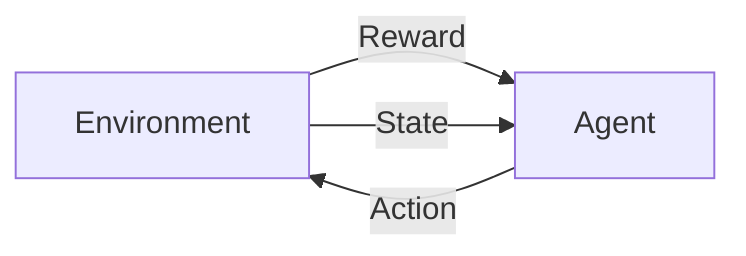

> 作业内容：
>
> 找到至少一篇论文，该论文采用人工智能的方法进行网络的自动管理。阅读并理解该论文，然后写出阅读报告：该论文使用的人工智能算法是什么？该人工智能算法的输入是什么？输出是什么？其网络自动管理系统的框架和各模块功能是什么？采集的数据是什么？自动管理配置的参数是什么？结论和实验结果是什么？附上原论文和参考文献。注意：阅读报告不是原文翻译，而是阅读理解后的总结报告、横向对比、优缺点评估、关键问题探讨、应用价值和理论价值点评、未来发展展望等。
>
> - 网络自动管理参考网站：<https://www.etsi.org/technologies/experiential-networked-intelligence>
> - 论文全文搜索网站（从中大图书馆网站进去）：<https://ieeexplore.ieee.org/Xplore/home.jsp>
>
> search:
> experiential networked intelligence

选择的论文是《AuTO: scaling deep reinforcement learning for datacenter-scale automatic traffic optimization》，发表于 [SIGCOMM'18](https://conferences.sigcomm.org/sigcomm/2018/accepted-papers.html)，来自香港科技大学的 Kai Chen 团队。原论文的地址见 <https://dl.acm.org/authorize?N666848>。

## 该论文使用的人工智能算法是什么

依据数据中心流量的长尾分布，该文提出了一个端到端的自动流量优化系统 AuTO，可以收集网络信息、从过去的决策中学习并执行操作，以实现运维人员定义的目标。AuTO 是一个两级**强化学习**系统，通过模仿动物的外围和中枢神经系统，解决伸缩性问题：外围系统（PS）在所有终端主机上运行，收集流信息，并在本地对短流进行即时决策；中枢系统（CS）获取 PS 的决策，汇聚和处理全局数据流信息，进一步为长流做出各自的决策。

## 其网络自动管理系统的框架和各模块功能是什么

AuTO 的结构如下图，主要包含两个模块：PS 和 CS。PS 在每个终端上运行，收集流量信息，并能够在只有本地信息的情况下以最小延迟对短流做出决策。CS 对能够容忍更长处理延迟的长流做出个人决策。此外，PS 的决策由 CS 通知，在 CS 中汇总和处理全局流量信息。

PS 有两个模块：实施模块和监控模块。实施模块为了实现上述目标，采用 MLFQ（Multi-Level Feedback Queueing）来调度流，而无需对每个流进行集中控制。具体而言，PS 在每个终端主机的 IP 数据包的 DSCP 字段中执行数据包标记，如下图所示。所有交换机被配置为基于 DSCP 字段的严格优先队列。在终端主机上，当一个新的流被初始化时，它的数据包被标记为 P1，使它们在网络中具有最高的优先级。当发送更多字节时，它在网络中的优先级会降低。

监控模块用于 CS 生成阈值，监控模块收集所有完成流的流大小和完成时间，以便 CS 可以更新流大小分布。监控模块还报告在其终端主机上降到最低优先级的正在进行的长流，以便 CS 可以做出单独的决策。

而 CS 由两个 DRL Agents（RLA）构成，分别用于处理短流（sRLA）和长流（lRLA）。sRLA 用于优化 MLFQ 的阈值，而长流 RLA（lRLA）用于确定长流的速率、路由和优先级。sRLA 使用一种深度确定的策略梯度算法解决 FCT 最小化问题，而 lRLA 使用 PG 算法生成操作。下面会更详细介绍 sRLA 和 lRLA 的情况。

## 该人工智能算法的输入、输出是什么

强化学习算法通常是下述模式：Agent 根据自己在当前环境（Environment）下的状态（State）做出动作（Action），并受到环境的反馈（Reward），并以此修正下一次动作的决策。很显然，当前的 State 与上一轮的 Reward 是该类算法的输入，而 Action 是该类算法的输出。

对于 sRLA：

- 状态表示为当前时间步长内整个网络中所有完成流的集合。流可以由 5 元组表示：源/目标 IP、源/目标端口号和传输协议。由于只报告完成的流，因此还将 FCT（flow completion time）和流大小添加进流的属性。因此每个流总共有 7 个特征（feature）。
- 在时刻 $t$，动作表示为一个 MLFQ 阈值的集合 $\lbrace a_i^t\rbrace$。
- 反馈：反馈被建模为两个连续时间步长的目标函数之间的比率，以表示其在前一个时间步的行为是否导致了较低的平均 FCT，或者是否降低了整体性能。

对于 lRLA：

- 行动空间：每个活动流 $f$,在时间 $t$,其相应的行动是$\lbrace \text{Prio}_t(f);\text{Rate}_t(f);\text{Path}_t(f)\rbrace$，分别表示流的优先级、速率限制、路径。
- 状态空间：状态表示为当前时间点整个网络中所有活动流的集合和所有完成流的集合。类似于 sRLA 的状态空间，完成流的集合有七个特征，活动流有五个。
- 反馈：对完成的流量进行反馈。反馈函数的选择可以是：发送率、链路利用率和连续时间步长的吞吐量的差异或比率，但对于链路速度至少为 10Gbps 的现代数据中心来说，获取主动流的及时流级信息并不容易。因此，此处选择只计算完成流的反馈，并建模为两个连续时间步长的平均吞吐量之间的比值。

## 采集的数据是什么

如前文所说，需要采集的是前时间点整个网络中所有活动流的信息和所有完成流的信息作为环境状态空间。对于活动流，需要一个五元组：源/目标 IP、源/目标端口号和传输协议，而对于完成流还需要额外增加 FCT 和流的大小。

## 自动管理配置的参数是什么

对于强化学习来说，一个好的特性是算法是自动伸缩到对应的问题规模上去的，换言之，不需要针对特定流量模式设定参数。可以参照实验部分。

## 结论和实验结果是什么

- 对于具有固定流量大小分布和负载的流量，AuTO 生成的阈值收敛，与标准启发式算法相比表现出类似或更好的性能，平均 FCT 减少高达 48.14%。
- 定期更改集群的流大小分布和负载。对于随时间变化的流量大小分布和交通负荷，AuTO 表现出学习和适应行为。与仅适用于特定流量设置组合的固定启发式相比，所有组合的性能都有稳步提高
- AuTO 平均可以在 10 毫秒内响应状态更新。在 CPU 利用率和吞吐量降低方面，AuTO 还表现出最小的终端主机开销。

## 我的想法

这篇文章用 DRL 做数据中心网络的流量调度。讲了一个“Peripheral & Central Nervous Systems”的好故事，但实际感觉像是一个两级调度，第一级使用两个强化学习 Agent，第二级使用 MLFQ（这个似乎也不怎么仿生，看起来很工程）。当然，实验效果确实看起来很好，感觉这是文章被接受的一个主要原因。

AuTO 可以看作是自动化数据中心的一步，许多软件组件可以在数据中心的其他 DRL 项目中重用。对于未来的工作，这篇文章重点考虑如何使用 RL 来执行流调度和负载平衡，同时可以开发用于拥塞控制和任务调度的 RL 算法；数据中心以外的 RL 应用也是值得考虑的，如 WAN 带宽管理。在我看来，这种利用基于 RL 自动构建优化问题的启发式策略似乎近些年在一些系统领域的文章（ML for SYS）也能常见到，例如用 RL 做缓存控制一类的文章，算是一种研究思路。
