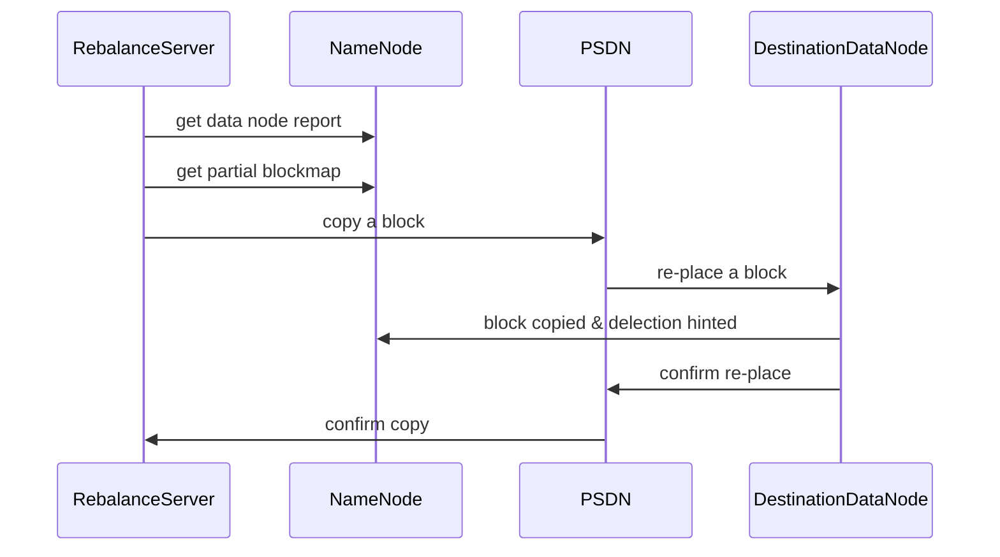
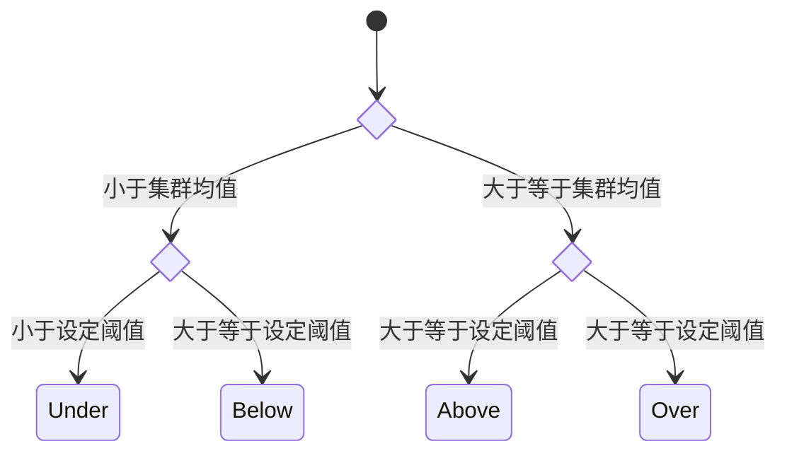

> 选择一个开源的分布式系统，对其关键代码进行分析。分布式系统的类型不限，可以是分布式文件系统、分布式集群/云计算系统、分布式计算框架平台等，如 K8S、Hadoop，或者是开发者自行发布的系统，如 github 上的优秀项目。源码分析不需要对整个软件系统所有源码全覆盖。可以参照课程讲授过的分布式计算关键问题，选取目标软件的一项或几项关键技术或功能进行分析，如系统中的服务器状态机制、同步机制、通讯机制、容错机制等。要结合对照课程讲授的相关知识和原理进行对照分析。分析相应功能或技术的实现方案、关键代码理解等。基于源码分析的结果，编写书面的分析报告，主要内容应该包括相应功能的实现方案与关键代码解释说明，优缺点及可能的改进思路。尽量图文并茂，直观易读。

[课堂展示](https://Mizuno-Ai.wu-kan.cn/assets/image/2022/06/20/1.pdf)

## 选题背景

HDFS（Hadoop Distributed File System）是 Hadoop 项目的核心子项目，是分布式计算中数据存储管理的基础，是基于流数据模式访问和处理超大文件的需求而开发的，旨在运行于廉价的设备上提供高容错、高可靠性、高可扩展性、高获得性、高吞吐率等特征的存储能力。在 HDFS 中，节点故障被认为是一种事件而非异常。

HDFS 很容易出现节点间磁盘利用率不平衡的情况，例如集群新增、删除节点，或是某个机器存储达到饱和值；在这种情况下，Map 任务可能会被分配没有存储数据的机器从而降低本地计算效率、浪费网络带宽。因此 HDFS 需要定期进行负载均衡，对各节点数据的存储分布进行调整让数据均匀分布，均衡 IO 性能，避免热点发生。

## 实现负载均衡需要满足的原则

基于对 HDFS 文档的阅读及查找相关资料，此处总结 HDFS 负载均衡过程在设计上的几个原则：

- 数据平衡不能导致数据块减少，数据块备份丢失
- 管理员可以中止数据平衡进程
- 每次移动的数据量以及占用的网络资源，必须是可控的
- 数据均衡过程，不能影响 NameNode 的正常工作

## 负载均衡原理与流程

上图展示了 HDFS 负载均衡的原理与流程：

1. NameNode 生成 DataNode 数据分布与磁盘使用情况报告
2. 汇总待移动的数据分布情况，计算具体数据块迁移路线图
3. 开始数据块迁移，PSDN（Proxy Source Data Node）复制一块待移动数据块
4. 将复制的数据块复制到目标 DataNode 上并删除原始数据块
5. 目标 DataNode 向 PSDN 确认该数据块迁移完成
6. PSDN 向 Rebalancing Server 确认本次数据块迁移完成
7. 继续执行这个过程，直至集群达到数据均衡标准

## 数据块分组与迁移策略

如下图，HDFS 根据集群均值与设定的阈值将节点划分为 Over、Above、Below、Under 四个组，负载均衡时将 Over 组、Above 组中的块向 Below 组、Under 组移动。

## 源码分析

见 [https://github.com/apache/hadoop/blob/release-3.3.3-RC1/hadoop-hdfs-project/hadoop-hdfs/src/main/java/org/apache/hadoop/hdfs/server/balancer/Balancer.java##L659](https://github.com/apache/hadoop/blob/release-3.3.3-RC1/hadoop-hdfs-project/hadoop-hdfs/src/main/java/org/apache/hadoop/hdfs/server/balancer/Balancer.java##L659)，相关源码调用链为 `Balancer.main`、`Balancer.run`、`Balancer.doBalance`、`runOneIteration`。可以看到其在获取 `reports` 后考虑了各种可能的异常情况；若正常则启动一个新的线程用于数据块的迁移任务。

## 总结与可能的改进方案

HDFS 负载均衡过程的核心是一个数据均衡算法，不断迭代数据均衡逻辑直至集群内数据均衡为止；合理选取参数与均衡的时机可以有效提升系统性能。不足之处是，阈值需要管理员手动指定：阈值越小，理论上负载越均衡，但开销也会变大。因此一个可能的改进方案是，设计自适应、自启动的的数据均衡算法，避免流量激增的突发情况。
